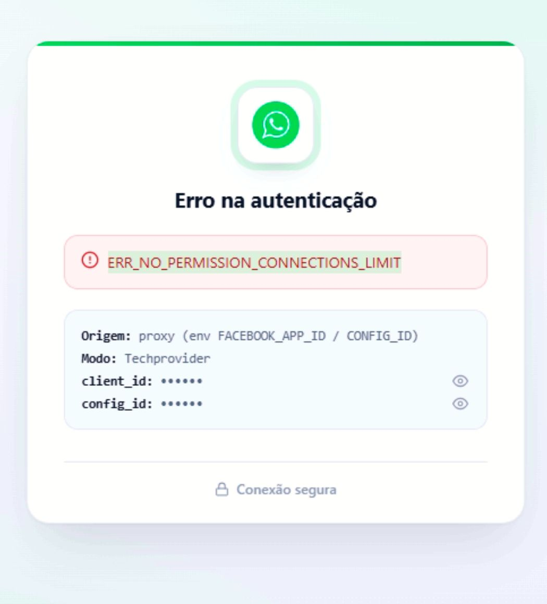

Copiar

Nesta página

1. [Avançado - Recursos técnicos](/avancado-recursos-tecnicos)

# Erro de Autenticação no app Whatsapp Oauth

Checklist para investigar o erro "PERMISSION CONNECTIONS LIMITED" na hora de se conectar ao tech provider

Se ao conectar um número WhatsApp pela API Oficial (via App Techprovider/compartilhado da Prisma Telecom) você recebeu a tela de erro **"Erro na autenticação"** com o código `ERR_NO_PERMISSION_CONNECTIONS_LIMIT`, siga este checklist na ordem abaixo.

---

### Como funciona

Esse erro aparece na etapa de autenticação OAuth, quando o Prismabot tenta conectar um número à API Oficial usando o **Login Incorporado (Oauth)**. O nome do erro indica uma restrição de **conexões**, não necessariamente uma permissão isolada faltando.

[**Saiba mais sobre o cálculo de Score do APP Tech Provider Compartilhado**](/configuracao-superadmin/tenants-e-licenca/gerenciar-licenca-z-pro/score-do-app-tech-provider)

---

### Caso esteja usando o App Tech Provider Prisma Telecom: Verifique seu Score (causa mais comum no modo compartilhado)

Quando uma licença acumula números de baixa reputação (amarelos/vermelhos) no App compartilhado da Prisma Telecom, ela **perde a permissão de conectar novos números** por esse App — o que gera exatamente um erro de "sem permissão" por limite de conexões.

1. Acesse **Superadmin → Tenants e Licença → Gerenciar Licença → Score do App Tech Provider**.
2. Verifique se a licença está com o **score baixo** (faixa "Alerta" ou "Crítico") ou se aparece algum aviso de **bloqueio de conexão de novos números**.
3. Se estiver bloqueada, siga os passos de **limpeza dos números ruins** e **desbloqueio (cortesia ou manual)** descritos no artigo completo: 👉 Score do App Tech Provider

Se a sua licença estiver saudável (score 90-100, sem bloqueio ativo), esse **não** é o seu caso — siga para a Etapa 2.

---

### Caso esteja usando App Próprio: Verifique as permissões do Meta App

Se a licença está com o Score saudável e o erro persiste, confirme a configuração do lado da Meta:

1. Acesse o **Painel do Meta for Developers**, selecione o seu App.
2. Confirme que o **Usuário do Sistema** (ou token) tem, explicitamente, as permissões:

   * `whatsapp_business_management`
   * `whatsapp_business_messaging`

#### Desconecte e reconecte

1. No Prismabot, desconecte o canal do WhatsApp Cloud afetado.
2. Limpe o cache do navegador.
3. Reautorize a conexão (Cadastro Incorporado / OAuth) do zero, para renovar os tokens e garantir que as permissões acima sejam herdadas corretamente.

#### Verifique o status da WABA

1. Acesse o **Meta Business Suite → WhatsApp Manager**.
2. Confirme que a conta está **verificada**, o número está **ativo** (não restrito/banido) e há um **cartão de crédito válido** vinculado para cobrança das mensagens.

---

### Possíveis Erros e Soluções

#### `ERR_NO_PERMISSION_CONNECTIONS_LIMIT` com licença que já teve números banidos/vermelhos

**Causa:** gate de proteção do Score do App Tech Provider ativo. **Solução:** siga a Etapa 1 — limpar números ruins e desbloquear a licença antes de tentar conectar o número novo novamente.

[AnteriorComo diagnosticar o erro "servidor temporariamente off-line"](/avancado-recursos-tecnicos/como-diagnosticar-o-erro-servidor-temporariamente-off-line)[PróximoComo liberar espaço em disco na servidor em nuvem do Prismabot](/avancado-recursos-tecnicos/como-liberar-espaco-em-disco-na-servidor em nuvem-do-z-pro)

Atualizado há 1 mês

Isto foi útil?