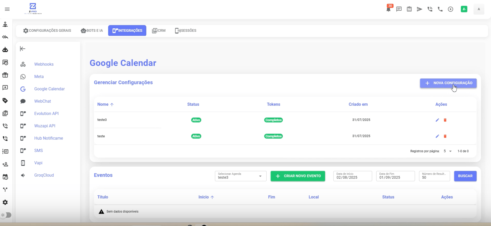
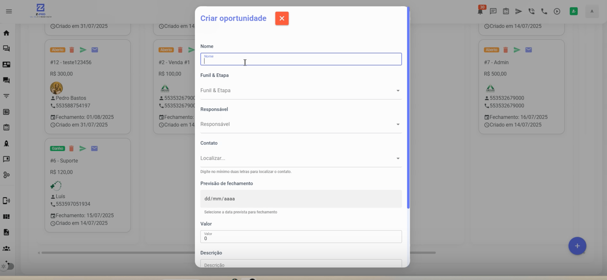
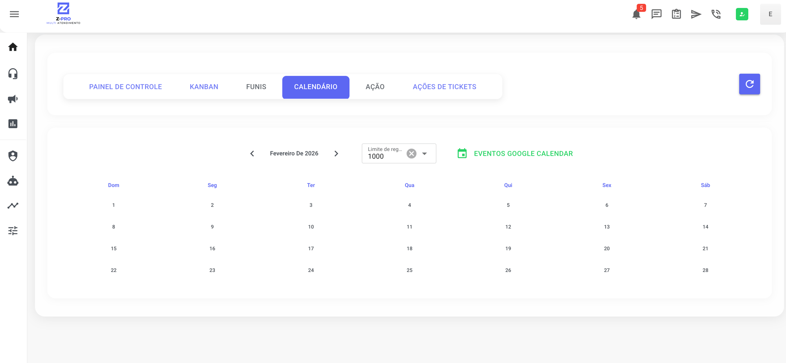
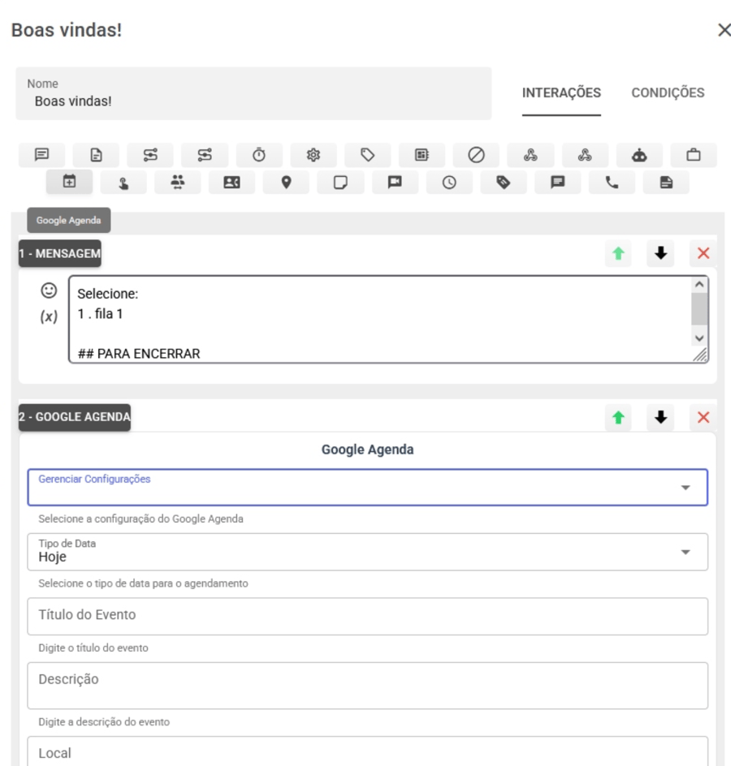

Copiar

Nesta página

1. [Avançado - Recursos técnicos](/avancado-recursos-tecnicos)

# Integração Google Calendar

### Vídeo Tutorial

### Etapa 1: Criação do Projeto no Google Cloud

Para começar, precisamos criar um projeto no Google e ativar a API de calendário.

1. **Acesse o Google Cloud Console:** Faça login com sua conta Google em [console.cloud.google.com](https://www.google.com/url?sa=E&q=https%3A%2F%2Fconsole.cloud.google.com%2F).
2. **Crie um Novo Projeto:**

   * No topo da página, clique no seletor de projetos e selecione **"Novo Projeto"**.
   * Dê um nome ao projeto (ex: "Integração Prismabot Calendar") e clique em **Criar**.
3. **Ative a API:**

   * No menu lateral, vá em **"APIs e Serviços" > "Biblioteca"**.
   * Na barra de pesquisa, digite Google Calendar API.
   * Selecione o resultado e clique no botão **"Ativar"**.

---

### Etapa 2: Configurando a Tela de Permissão OAuth

Antes de gerar as chaves de acesso, é necessário configurar como o aplicativo aparecerá para o usuário.

1. No menu lateral de "APIs e Serviços", clique em **"Tela de permissão OAuth"**.
2. Selecione o tipo de usuário como **"Externo"** e clique em **Criar**.
3. **Preencha as informações do App:**

   * **Nome do App:** Ex: "Calendar Prismabot".
   * **E-mail para suporte do usuário:** Selecione seu e-mail.
   * **Dados de contato do desenvolvedor:** Insira seu e-mail novamente.
4. Clique em **Salvar e Continuar** nas próximas etapas (Escopos e Usuários de Teste) até finalizar.
5. **Publicar o App:**

   * Na tela de resumo (Visão Geral), clique no botão para **"Publicar Aplicativo"** (ou tirar do modo de teste). Isso é importante para evitar limitações de expiração do token.

---

### Etapa 3: Criando as Credenciais de Acesso

Agora vamos gerar o ID e o Segredo que conectam o Prismabot ao Google.

1. No menu lateral, clique em **"Credenciais"**.
2. Clique em **"Criar Credenciais"** e selecione **"ID do cliente OAuth"**.
3. **Configuração da Credencial:**

   * **Tipo de aplicativo:** Selecione **"Aplicativo da Web"**.
   * **Nome:** Ex: "Conexão Prismabot".
4. **URIs de Redirecionamento Autorizados (Passo Crítico):**

   * Role até a seção "URIs de redirecionamento autorizados" e clique em **"Adicionar URI"**.
   * Você deve inserir a URL do seu sistema Prismabot seguida do caminho de callback.

**ATENÇÃO À URL DE REDIRECIONAMENTO**

A URL deve seguir estritamente o formato abaixo, substituindo pelo domínio do seu sistema:

https://seu-subdominio-zpro.com.br/google-callback.html

Exemplo: Se você acessa seu painel em https://app.minhaempresa.com, a URI será https://app.minhaempresa.com/google-callback.html

1. Clique em **Criar**.
2. Uma janela abrirá com o **"ID do cliente"** e a **"Chave secreta do cliente"**. Copie essas informações ou mantenha a janela aberta.

---

### Etapa 4: Conectando no Prismabot

Com as credenciais em mãos, vamos finalizar a configuração dentro do Prismabot.

1. Acesse o painel do Prismabot e vá em **Configurações > Integrações**.
2. Localize a opção **Google Calendar** e clique em **Adicionar**.
3. Preencha os campos:

   * **Nome da Sessão:** Dê um nome para identificar (ex: Minha Agenda).
   * **ID do Cliente:** Cole o código gerado na Etapa 3.
   * **Secret (Segredo):** Cole o código gerado na Etapa 3.
4. Clique em **"Obter Token"** ou **"Salvar"**.

#### Autorizando o Acesso

Ao salvar, o sistema abrirá uma janela pop-up do Google para você fazer login:

1. Selecione a conta Google que deseja integrar.
2. **Tela de Aviso do Google:** Como seu app não foi verificado pela Google (processo normal para apps internos), aparecerá um aviso de segurança.

   * Clique em **"Avançado"**.
   * Clique em **"Acessar [Nome do seu App] (não seguro)"**.
3. Marque as caixas de permissão para que o Prismabot possa ver, editar e criar eventos na sua agenda.
4. Clique em **Continuar**.

Se tudo der certo, o sistema retornará a mensagem de "Conexão Estabelecida".

---

### Etapa 5: Utilizando a Integração

Após conectado, você pode utilizar o calendário diretamente no seu funil de vendas.

#### 1. Criando Eventos no Kanban

Dentro do menu **Kanban (CRM)**:

1. Abra ou crie uma Oportunidade.
2. Na criação da oportunidade, localize a opção de **Agendamento**.
3. Selecione a **Conexão** (a conta do Google que você acabou de integrar).
4. Defina a data, hora e detalhes do evento.
5. Ao salvar, o evento será criado automaticamente na sua Google Agenda.

#### 2. Visualizando a Agenda

No menu lateral do Prismabot, acesse a aba **Calendário**.

* Selecione a conexão desejada.
* Clique em **Buscar** para visualizar todos os seus compromissos sincronizados.
* Você também pode criar novos eventos clicando diretamente nas datas deste calendário.

#### 3. Automatizando no Chatbot

Você pode criar agendamentos automáticos durante uma conversa do bot com seu cliente.

1. Acesse o menu **Chatbot** e edite o fluxo desejado.
2. Na barra de ferramentas, clique no ícone de **Calendário** (Google Agenda) para adicionar o elemento ao fluxo.

1. Configure o elemento com as seguintes informações:

* **Configuração:** Selecione a conta do Google Calendar que você integrou anteriormente.
* **Tipo de Data:** Defina quando o evento será marcado (ex: "Hoje", "Amanhã" ou uma data específica).
* **Título do Evento:** Digite o nome que aparecerá na agenda (Ex: Reunião com Cliente).
* **Descrição:** Detalhes adicionais sobre o agendamento.
* **Local:** Onde ocorrerá o evento

[AnteriorIntegrando o chat GPT](/avancado-recursos-tecnicos/integrando-o-chat-gpt)[PróximoInfraestrutura](/avancado-recursos-tecnicos/infraestrutura)

Atualizado há 6 meses

Isto foi útil?