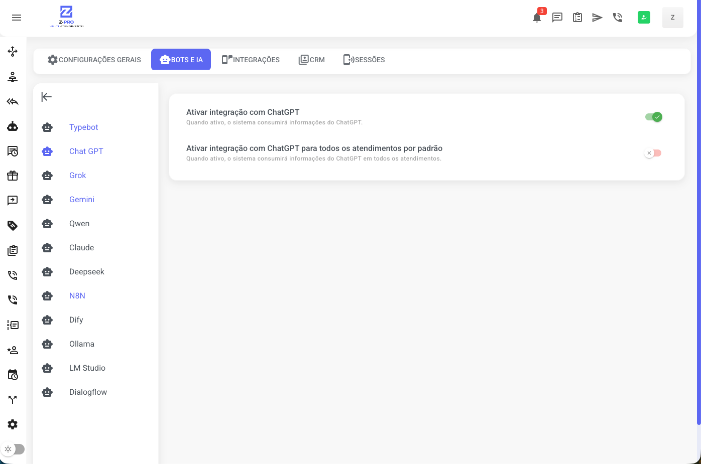
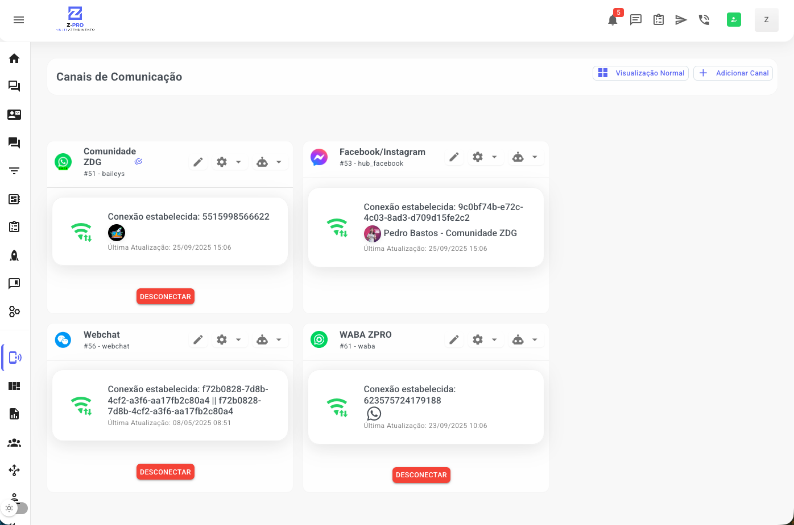
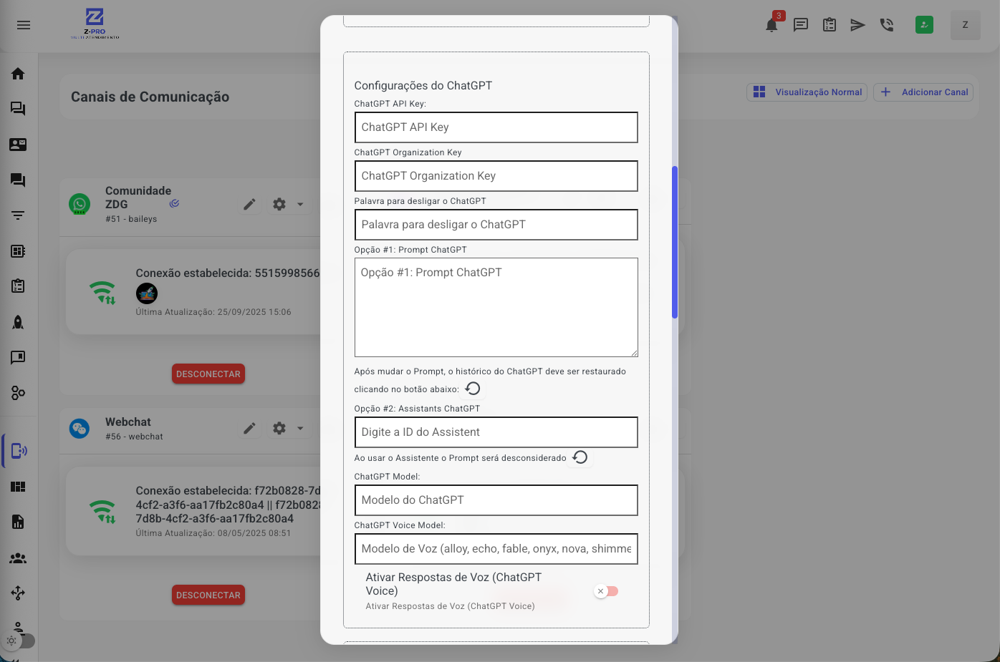

# Integrando o ChatGPT

## Integrando o chat GPT

Este tutorial irá guiá-lo pelo processo de integração do ChatGPT em sua plataforma Prismabot, permitindo que você automatize conversas e utilize o poder da inteligência artificial da OpenAI em seus canais

### PRÉ-REQUISITOS

**Vídeo configurando a sua conta na Open IA:**

**Pré-requisitos: Configurando sua conta na OpenAI**

Antes de iniciar a integração no Prismabot, é indispensável que você tenha uma conta configurada na plataforma de desenvolvedores da OpenAI.

1. **Crie sua Conta:** Acesse o site da API da OpenAI em [https://openai.com/pt-BR/api/](https://www.google.com/url?sa=E\&q=https%3A%2F%2Fopenai.com%2Fpt-BR%2Fapi%2F) e crie sua conta.
2. **Adicione Créditos:** A utilização da API da OpenAI é um serviço pago. Você precisará adicionar créditos à sua conta para que as requisições funcionem.
3. **Gere sua Chave de API (API Key):** Dentro do painel da OpenAI, navegue até a seção de chaves de API e gere uma nova chave. **Guarde esta chave em um local seguro, pois você precisará dela para configurar a integração no Prismabot.**

Com a chave de API em mãos, você está pronto para configurar a integração.

### INTEGRAÇÃO NO Prismabot

**Vídeo integrando o ChatGPT no Prismabot:**

**Passo 1: Ativando a Integração no Prismabot**

A primeira etapa é habilitar a funcionalidade do ChatGPT dentro do seu sistema Prismabot.

1. No menu lateral esquerdo, acesse **Configurações**.
2. Clique na aba **Bots e IA**.
3. No menu secundário que aparecerá, selecione a opção **Chat GPT**.
4. Ative a opção **"Ativar integração com ChatGPT"**.

_Opcional: Você também pode ativar a chave "Ativar integração com ChatGPT para todos os atendimentos por padrão" se desejar que o bot responda em todos os canais automaticamente. Caso contrário, você configurará canal por canal, como mostrado no próximo passo._

**Passo 2: Configurando o ChatGPT em um Canal de Comunicação**

Após ativar a integração, você precisa configurar sua chave de API e as instruções do seu assistente em cada canal que desejar.

1. No menu principal, acesse **Canais de Comunicação**.
2. Localize o canal desejado (ex: WhatsApp, Webchat) e clique no ícone de **Configurações (engrenagem)**.
3. Caso não tenha nenhum canal criado ainda. Clique no botão + Adicionar Canal. Uma janela de configurações se abrirá.

**Passo 3: Integrando o chat GPT no seu canal**

**Para conectar o canal do prismabot com sua api da openIA, você precisa inserir:**

* **ChatGPT API Key:** Cole a chave de API que você gerou na plataforma da OpenAI.
* **ChatGPT Organization Key:** Cole a chave de ID da sua organização.

Você tem duas opções principais para definir como seu assistente de IA irá se comportar:

* **Opção 1: Prompt direto no Prismabot (Prompt ChatGPT)**
  * Use este campo para escrever as instruções do seu assistente diretamente no Prismabot. Defina sua personalidade, o tom de voz, as regras de negócio e como ele deve interagir com os usuários.
* **Opção 2: Usar um Assistant da OpenAI (AssistantId ChatGPT)**
  * Se você já criou e configurou um "Assistant" na interface (Playground) da própria OpenAI, basta colar o **ID do Assistant** neste campo. O Prismabot utilizará todas as configurações que você já definiu por lá.
  * **Importante:** Ao usar um Assistant ID, as instruções do campo "Prompt ChatGPT" serão desconsideradas.

**Passo 4: Configurações Adicionais (Opcional)**

Ainda na mesma janela, você pode refinar a integração:

* **Palavra para desligar o ChatGPT:** Defina um termo específico (ex: "falar com atendente") que, ao ser enviado pelo cliente, desativará o bot e transferirá a conversa para um atendente humano.
* **ChatGPT Model:** Escolha o modelo de linguagem (LLM) que deseja utilizar (ex: gpt-4, gpt-3.5-turbo).
* **ChatGPT Voice Model:** Caso opte por respostas em áudio, selecione o modelo de voz desejado (ex: alloy, onyx, nova).
* **Ativar Respostas de Voz (ChatGPT Voice):** Ative esta opção para que o bot responda às mensagens com áudios em vez de texto.

Após preencher as informações, salve as configurações. Seu canal estará pronto para utilizar o ChatGPT nos atendimentos.

 18 dias
