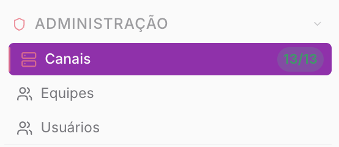
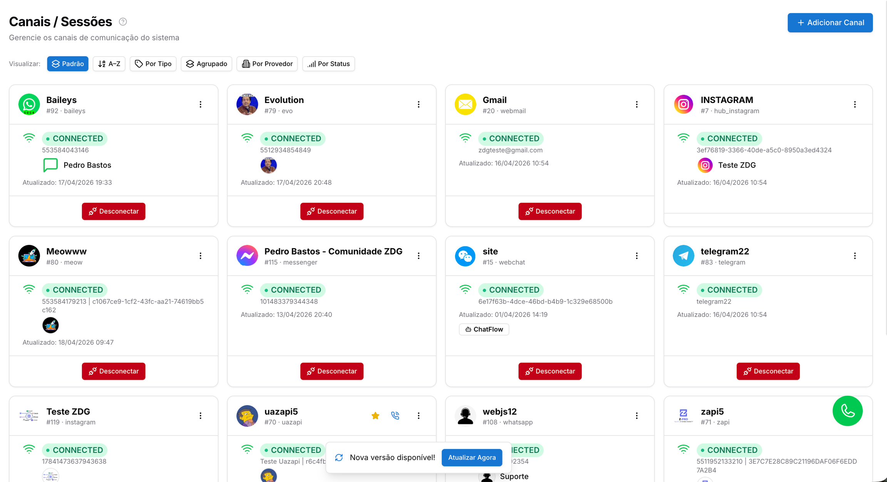
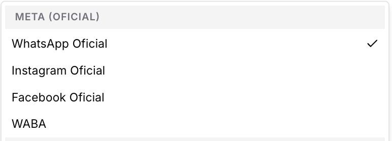
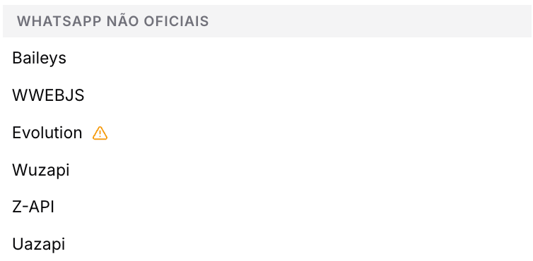
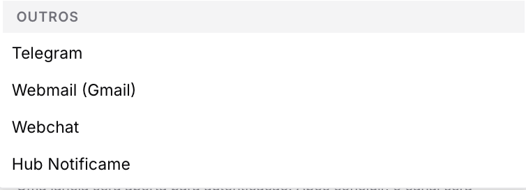
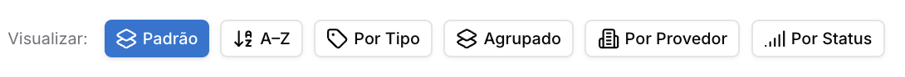
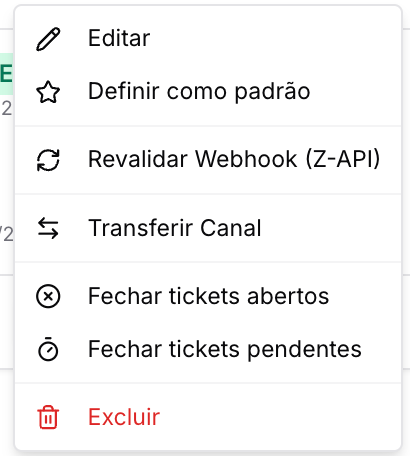

# Canais de comunicação

**Disponível para o perfil: Administrador e supervisor**

A capacidade de centralizar múltiplos canais de comunicação em uma única plataforma é uma das principais funcionalidades do Prismabot. Esta documentação oferece uma visão geral sobre os tipos de canais que você pode conectar, ajudando você a decidir quais são os mais adequados para a sua operação.

#### Como acessar a página

Para acessar, clique no Menu **Administração** e selecione a aba **Canais**.

#### Você verá a seguinte tela:

---

### Opções de Conexão- Tipo de Canal

O Prismabot oferece suporte a múltiplos canais simultâneos. Abaixo, listamos as tecnologias disponíveis para conexão:

#### 1. Meta Oficial

[**WhatsApp Oficial (OAuth):**](canais-de-comunicacao/whatsapp-oficial-oauth-app-prismabot-com-coexistencia.md) Conexão na API oficial via QR-CODE, com coexistência entre Whatsapp business e o prismabot, usando o app de integração nativo do Prismabot. É a conexão mais prática e segura disponível. Necessário ter um número WhatsApp business.

[**Instagram Direct** e **Facebook Messenger**](canais-de-comunicacao/instagram-e-facebook-messenger-via-oauth-login.md) via API Oficial (Login do Facebook), sem necessidade de hubs externos (BETA)

[**Waba: WhatsApp Oficial - Cloud API**](canais-de-comunicacao/whatsapp-oficial-via-api-cloud-waba.md)**:** Conexão via app próprio, que deve ser configurado no facebook developers. Não depende de celular ligado e oferece risco reduzido de banimento. Ideal para médias e grandes operações.

#### 2. Whatsapp não oficial

Simula o WhatsApp Web/Desktop. Depende de um aparelho celular conectado. O Prismabot disponibiliza diversos "motores" para garantir compatibilidade com diferentes tipos de chip:

* **Baileys**
* **WebJs**
* **Evolution**
* **Wuzapi**
* **Z-API**
* **Uazapi**

**Qual a diferença técnica?**
Para entender profundamente os prós e contras de cada tipo de conexão e decidir qual é a melhor para o seu negócio, leia nosso artigo comparativo:
👉 [**API Oficial vs. APIs Não Oficiais: Guia Completo**](../../diretrizes-e-politicas/api-oficial-vs-api-nao-oficial.md)

#### 3. Outros

* **Telegram:** Conexão via Bot Token oficial. Extremamente estável e funciona 100% na nuvem.
* **WebMail:** Conexão via protocolo IMAP/SMTP para transformar e-mails recebidos em tickets de atendimento.
* **WebChat:** Widget de chat ao vivo para instalar no seu site institucional.
* **Hub Notificame:** API terceira para **Instagram Direct** e **Facebook Messenger**.

---

### Ações Gerais da Tela

No topo da página, você encontra dois botões principais para a organização do seu painel:

1. **Alterar Ordem de Visualização:** Permite reorganizar a disposição dos cards na tela podendo organizar por: Padrão, A–Z, por tipo, Agrupado, por provedor ou por status

1. **Adicionar Canal:** Botão para iniciar uma nova conexão.

* [👉 **Clique aqui para ver o passo a passo de como conectar um novo canal**](canais-de-comunicacao/como-conectar-um-canal-sessao-numero.md)

---

### Gerenciando um Canal Conectado

Após a ativação de uma conexão, o sistema disponibiliza um menu de ações rápidas para a gestão técnica e operacional do canal. Estas opções permitem o controle de fluxo de mensagens e a manutenção da integridade da comunicação.

**Opções Gerais (Disponíveis para todos os canais)**

* **Editar:** Permite alterar o nome de identificação da conexão e ajustar parâmetros técnicos internos.
* **Definir como padrão:** Estabelece o canal como a conexão prioritária para o envio de mensagens automáticas e notificações do sistema.
* **Transferir Canal:** Possibilita a migração da gestão do canal entre diferentes estruturas do painel.
* **Fechar tickets abertos:** Executa o encerramento em lote de todos os atendimentos ativos (status "Aberto") vinculados exclusivamente a este canal.
* **Fechar tickets pendentes:** Executa o encerramento em lote de todos os atendimentos que aguardam aceite (status "Pendente") nesta conexão.
* **Excluir:** Remove permanentemente a conexão do sistema.

**Funções Específicas e Exclusividades**

O sistema exibe ícones e funções adicionais de acordo com a tecnologia do canal conectado:

* **Revalidar Webhook:** Esta função é essencial para restabelecer a sincronia de dados entre a plataforma de origem e o Prismabot.

  + **Canais compatíveis:** Disponível para **Evolution, Hub, Meow, Instagram, Messenger, UAZAPI e Z-API**.
  + **Canais WABA (Meta):** Para conexões oficiais, o menu exibe as opções específicas **Revalidar Webhook Waba** e **Revalidar Webhook Secundário Waba**, garantindo a redundância e estabilidade do recebimento de mensagens oficiais.

**Qual a diferença do webhook do aplicativo para o do telefone?**

O webhook principal é o do aplicativo, e o secundário é o do telefone.

Funciona assim: imagine que você tem um único aplicativo na Meta e dentro dele conecta 3 números diferentes.

Na Meta, o aplicativo permite apenas 1 webhook principal cadastrado — esse é o chamado webhook de aplicativo.

Porém, cada número pode precisar ser utilizado em um tenant diferente dentro da plataforma.

Como o webhook principal é único, não seria possível direcionar cada número diretamente para tenants diferentes usando apenas ele.

Por isso utilizamos o webhook secundário: ele mantém a assinatura e a validação do webhook principal do aplicativo, mas faz o redirecionamento das mensagens de cada telefone para o tenant correto.

Assim, conseguimos usar vários números do mesmo aplicativo em tenants diferentes sem conflito.

* **Gerar Widget:** Botão exclusivo para conexões do tipo **Site**. Permite gerar o código de integração para embutir o chat em páginas web externas.

**Atenção:** As ações de "Fechar tickets" são irreversíveis e afetam o histórico imediato do dashboard. Utilize estas funções apenas para limpezas de fila ou manutenções operacionais.

---

Atualizado há 3 meses

Isto foi útil?