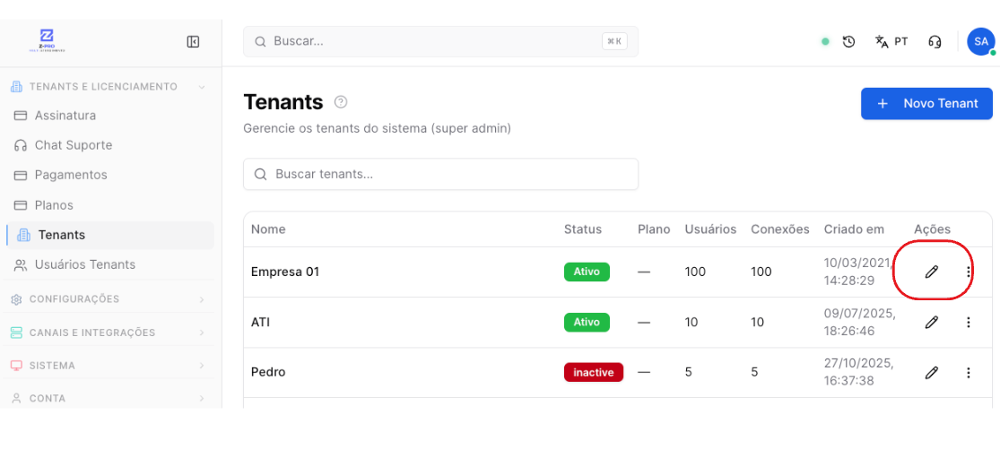
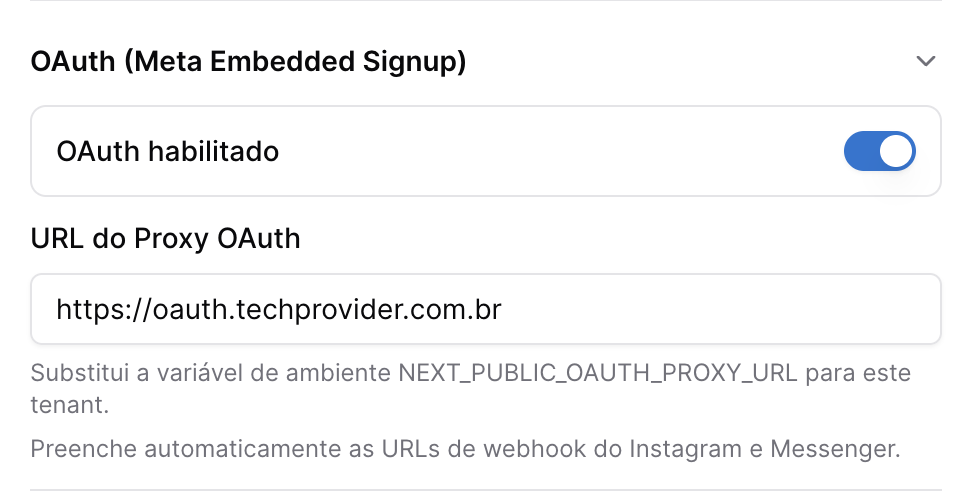
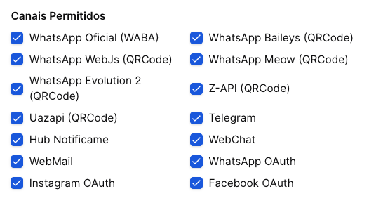
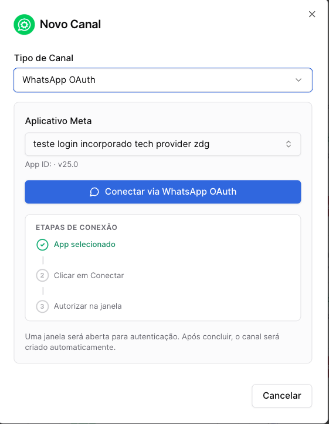
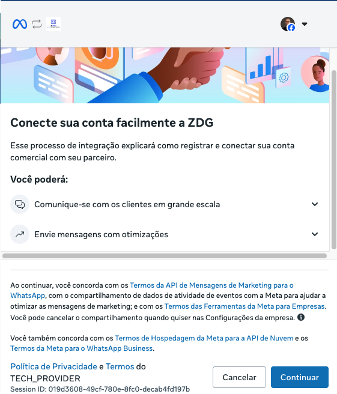

Copiar

Nesta página

1. [Configuração Administrador](/configuracao-administrador)
2. [Administração - Painel Admin](/configuracao-administrador/administracao-painel-admin)
3. [Canais de comunicação](/configuracao-administrador/administracao-painel-admin/canais-de-comunicacao)

oauthcoexistência

# WhatsApp Oficial OAuth APP Prismabot com coexistência

Passo a passo para conectar um número WhatsApp Business pela API Oficial usando o app da ZDG (Tech Provider) com modo de coexistência.

Números com alto índice de denúncias (status Red na Meta) podem ser desconectados do App compartilhado da ZDG para proteger os demais assinantes. Veja: [Score do App Tech Provider](/configuracao-superadmin/tenants-e-licenca/gerenciar-licenca-prismabot/score-do-app-tech-provider)

#### O que é o Modo de Coexistência?

Ao utilizar este método, você conecta o seu número à API Oficial da Meta sem precisar desconectá-lo do seu aparelho celular. O WhatsApp passará a funcionar **simultaneamente** no aplicativo WhatsApp Business do seu smartphone e no painel do Prismabot. É a união da estabilidade da API Oficial com a praticidade de manter o celular ativo.

**NOVA URL OAUTH:** [**https://oauth.techprovider.com.br**](https://oauth.techprovider.com.br)

---

### Etapa 0: Ativação do Canal no Painel Super Admin

A liberação do recurso OAuth é feita por empresa (Tenant). Se você é o assinante do Prismabot, siga estes passos. Se você é um cliente ou está usando apenas o acesso demo do sistema, solicite essa liberação ao suporte e pule para a etapa 1.

Faça login no sistema com seu usuário **Super Admin**.

No menu lateral, acesse **Tenants** (Empresas) e clique em **Editar** na empresa desejada.

Role a página até encontrar a opção **OAuth (Login Incorporado)** e ative a chave.

**NOVA URL OAUTH:** [**https://oauth.techprovider.com.br**](https://oauth.techprovider.com.br)

Volte mais acima, na seção de liberação de canais, certifique-se de que o **WhatsApp**, **Facebook** e **Instagram** estão habilitados para este tenant.

**Metal URL:** https://oauth.techprovider.com.br

**Instagram Webhook**

• URL: https://oauth.techprovider.com.br/instagram-webhook

• Segredo: 2f5b5b457e2febbc3c2333e2ebc84df926a45c36f76f3bedc0d1994f749413f1

**Messenger Webhook**

• URL: https://oauth.techprovider.com.br/messenger-webhook

• Segredo: 2f5b5b457e2febbc3c2333e2ebc84df926a45c36f76f3bedc0d1994f749413f1

Clique em **Salvar**.

### Etapa 1: Criando a Conexão no Painel Admin

Com o recurso liberado, acesse a conta da empresa (Admin normal) para realizar a conexão.

1. No menu lateral, acesse **Administração > Canais**.
2. Clique no botão **Adicionar Canal**.
3. No campo "Tipo de Canal", selecione a opção **WhatsApp OAuth**.
4. **Selecione o Aplicativo Meta:** Você verá um menu suspenso para escolher o aplicativo.

   * Selecione o aplicativo nativo fornecido pela plataforma (ex: teste login incorporado tech provider zdg ou ZDG App).
   * (Nota: Caso sua empresa seja um Tech Provider aprovado pela Meta, você poderá selecionar seu próprio App configurado previamente).
5. Clique no botão azul **Conectar via WhatsApp OAuth**.

### Etapa 2: Autenticação com a Meta e Leitura do QR Code

Ao clicar em conectar, uma janela pop-up oficial do Facebook/Meta será aberta. **Atenção:** Tenha o seu celular com o WhatsApp Business em mãos.

1. Na janela da Meta, clique em **Continuar** e faça o login com seu Facebook.
2. Siga as instruções da tela para selecionar ou criar a sua conta do WhatsApp Business e seu Gerenciador de Negócios.
3. **Insira o Número:** Digite o número de telefone exato que está no seu WhatsApp Business.
4. **Aprovação no Celular:**

   * Abra o aplicativo WhatsApp Business no seu celular.
   * Você receberá uma notificação da Meta solicitando a conexão.
   * Aceite a notificação. O aplicativo solicitará que você faça a **leitura de um QR Code** (ou aprove o compartilhamento de conversas) diretamente na tela do computador.
5. Após confirmar no celular, a janela da Meta será finalizada e o canal aparecerá como **Conectado** no Prismabot.

Pronto! Seu número já está operando em Modo de Coexistência. As mensagens chegarão tanto no seu celular quanto na tela de atendimento do Prismabot. Como esta é uma conexão via API Oficial, você não sofrerá com bloqueios relacionados ao uso de sistemas de terceiros.

### Etapa 3: Configuração de Pagamento na Meta

Embora a conexão já esteja funcionando para receber e responder mensagens dentro da janela de 24 horas, há um passo final recomendado pela Meta.

Ao conectar seu WhatsApp Business, a Meta realizará uma análise final da sua empresa. Após isso, para que você possa enviar **mensagens ativas (templates/campanhas de massa)** fora da janela de 24 horas, é obrigatório cadastrar uma forma de pagamento na Meta.

1. Acesse o seu painel do **Gerenciador de Negócios da Meta**.

   1. <https://business.facebook.com/billing_hub/accounts>
2. Vá nas configurações de conta do WhatsApp Business.
3. Encontre a conta de WhatsApp que foi conectada e adicione um **Cartão de Crédito**.
4. A partir desse momento, sua conta estará 100% apta para receber, responder e iniciar novas conversas (disparos) através do Prismabot.

Para testar, envie uma mensagem de outro número para o seu WhatsApp Business. Você verá a mensagem chegando instantaneamente no seu celular e na aba "Pendentes" na tela de atendimento do seu Prismabot!

**AVISO: Reputação do Número e Restrições de Uso** [**(Score)**](/configuracao-superadmin/tenants-e-licenca/gerenciar-licenca-prismabot/score-do-app-tech-provider)

Ao conectar através do **App compartilhado da ZDG**, seu número passa a integrar nosso ecossistema. Para proteger a estabilidade de todos os assinantes, monitoramos rigorosamente a qualidade dos canais conectados.

* **Status Red (Vermelho):** Números com alto índice de denúncias ou bloqueios (SPAM) na Meta caem para este status.
* **Desconexão Forçada:** Se o número permanecer no status *Red*, ele será desconectado irreversivelmente do nosso App.
* **Bloqueio da Licença:** Acumular números no status vermelho bloqueia a sua licença, impedindo a conexão de qualquer novo número pelo aplicativo da ZDG.

**Recomendação para operações de risco:** Se o seu modelo de negócio gera denúncias frequentes e números no status *Red*, **não utilize o App compartilhado**. A orientação é configurar um **App Próprio (Tech Provider)** no Facebook Developers. Isso isola a sua reputação, permitindo gerenciar seus números sob a sua própria responsabilidade na Meta.

No modo coexixtência não é possível fazer ligações. Para fazer ligações pela API Oficial precisa ser Cloud API Nativa

### Verificação

[AnteriorDistribuição Automática de Atendimentos](/configuracao-administrador/administracao-painel-admin/canais-de-comunicacao/como-conectar-um-canal-sessao-numero/distribuicao-automatica-de-atendimentos)[PróximoModo híbrido - Como conectar](/configuracao-administrador/administracao-painel-admin/canais-de-comunicacao/modo-hibrido-como-conectar)

Atualizado há 15 dias

Isto foi útil?