Copiar

Nesta página

1. [Configuração Administrador](/configuracao-administrador)
2. [Administração - Painel Admin](/configuracao-administrador/administracao-painel-admin)
3. [Canais de comunicação](/configuracao-administrador/administracao-painel-admin/canais-de-comunicacao)

# Whatsapp Oficial via API Cloud WABA

Como criar um app no facebook developers para usar a api oficial da Meta

Esta documentação detalha o processo completo para configurar a API Oficial do WhatsApp (também conhecida como WABA ou Cloud API) e conectá-la à plataforma Prismabot.

Seguir os passos na ordem correta é fundamental para garantir uma instalação bem-sucedida.

### Live - Criação de App no facebook developers e integração com a API Oficial, Instagram e Facebook

## Tutorial passo-a-passo:

### Vídeo 1: Criar número de telefone

### Vídeo 2: Configurando número na Meta

### Vídeo 3: Configurando WABA no Prismabot

### Vídeo 4: Configurando Webhook de callback

### Vídeo 5: Registrar o número e criar templates de mensagens

---

## Documentação das etapas:

## Etapa 1: Pré-requisitos e Preparação

Antes de começar, você precisará de dois itens essenciais:

1. **Uma conta no Facebook.**
2. **Um número de telefone** (pode ser virtual ou um chip físico).

**AVISO SOBRE O NÚMERO DE TELEFONE**

* Você **não pode** usar o mesmo número no aplicativo normal do WhatsApp e na API Oficial.
* Se você deseja usar um número que já possui uma conta de WhatsApp, é **obrigatório excluir permanentemente a conta** de WhatsApp associada a ele antes de continuar. Não basta apenas deletar o aplicativo.
* Para testes, recomendamos fortemente a compra de um número virtual.

---

## Etapa 2: Criação e Configuração do Aplicativo na Meta

Nesta etapa, vamos criar o aplicativo no ambiente da Meta que será responsável por gerenciar a API.

1. **Acesse o Facebook for Developers:** Faça o login com sua conta do Facebook em <https://developers.facebook.com/>

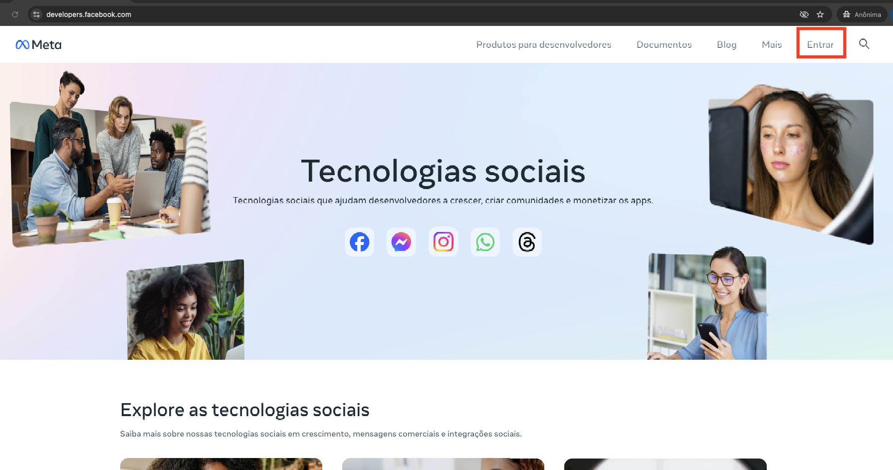

1. **Crie um Novo Aplicativo:**

* Clique em "Criar Aplicativo".

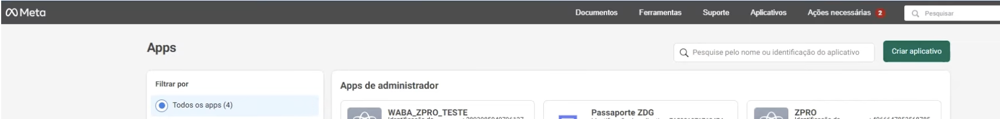

* Selecione "Outros"
* Selecione o tipo **"Business"**.

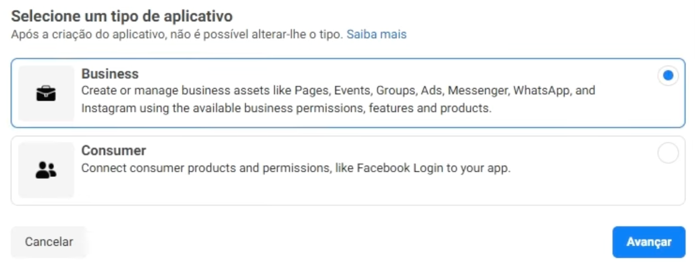

* Dê um nome ao seu aplicativo (ex: "Waba Cloud API") e associe-o à sua conta do Gerenciador de Negócios (BM).

1. **Adicione o Produto WhatsApp:** No painel do seu novo aplicativo, encontre e adicione o produto "WhatsApp".

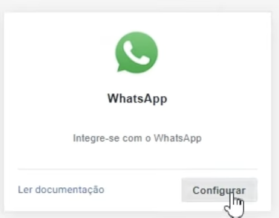

1. **Configure as Informações Básicas:**

* Acesse **"Configurações do app" > "Básico"**.

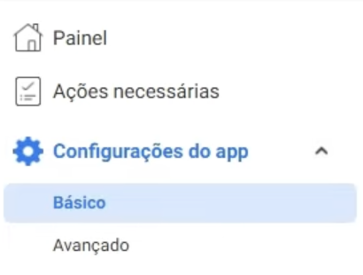

* Preencha os campos **"URL da Política de Privacidade"** e **"URL dos Termos de Serviço"**.

1. **Ative o Aplicativo:** No topo da página, mude o status do aplicativo de "Em desenvolvimento" para **"Ao vivo"**.

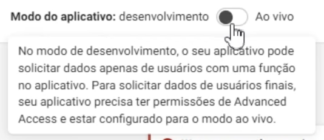

---

## Etapa 3: Cadastrando e Verificando seu Número de Telefone

Agora, vamos adicionar e verificar o número de telefone que será usado pela API.

1. No menu do seu aplicativo, vá para **"WhatsApp" > "Configuração da API"**.

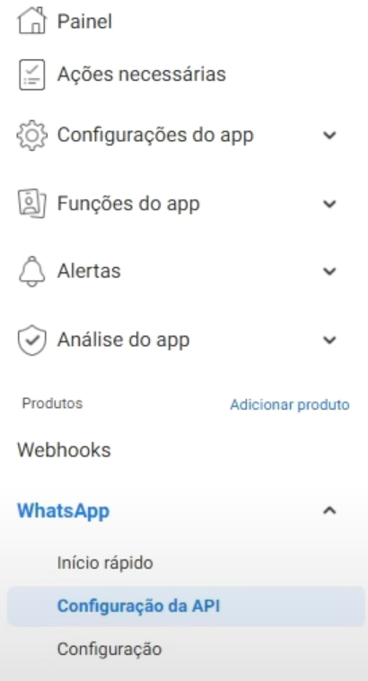

1. **Adicione um Número de Telefone:** Clique no botão para adicionar um novo número.

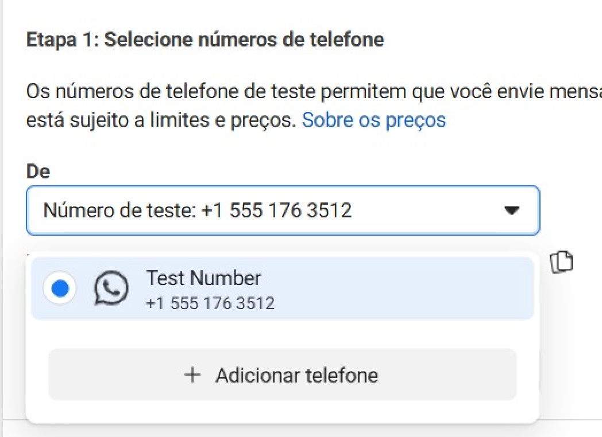

1. **Preencha os Dados:** Insira as informações da sua empresa e o número de telefone que você preparou na Etapa 1.
2. **Verifique o Número:** Escolha receber o código de verificação por SMS ou ligação telefônica e insira o código recebido.
3. **Adicione a forma de pagamento**

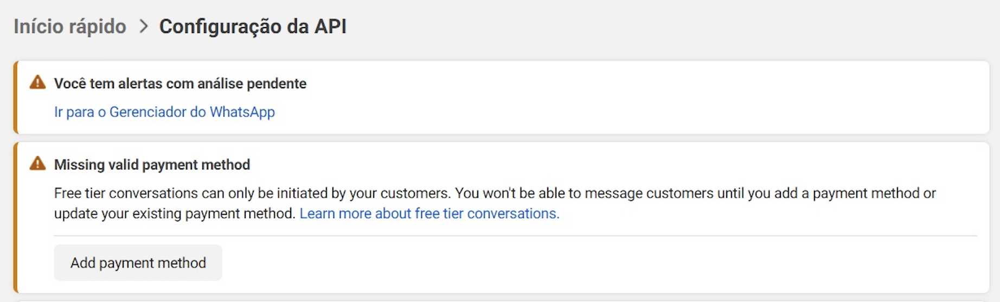

1. **Registre o Número com PIN (Passo Obrigatório):**

* Após a verificação, a Meta exige um registro de segurança com um PIN de 6 dígitos. Este passo é realizado via API. (token provisório)

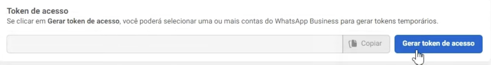

* Utilize uma ferramenta como o **Postman** e o endpoint **"Registrar Fone"** (disponível em nossa coleção) para enviar o PIN de 6 dígitos ao seu número. <https://www.postman.com/meta/whatsapp-business-platform/request/kkn2spv/register-phone>
* Este passo é crucial para que o número seja ativado com sucesso.

A explicação detalhada da etapa do postman está no vídeo <https://www.youtube.com/watch?v=sLp5P9Qb50w>

---

## Etapa 4: Gerando um Token de Acesso Permanente

O token gerado pelo painel do desenvolvedor é temporário e expira em 24 horas. Para uma conexão estável com o Prismabot, você precisa de um token permanente.

1. **Acesse as Configurações do Negócio:** Navegue até seu **Gerenciador de Negócios** (BM).
2. Vá para **"Usuários" > "Usuários do sistema"**.

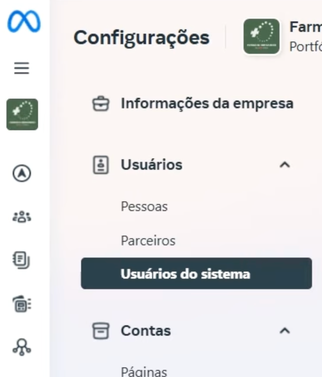

1. **Crie um Usuário do Sistema:** Adicione um novo usuário do sistema com a função de **"Admin"**.
2. **Atribua Ativos:** Com o novo usuário selecionado, clique em **"Atribuir Ativos"**.
3. Selecione **"Aplicativos"**, escolha o aplicativo que você criou na Etapa 2 e conceda a permissão de **"Gerenciar App"**.
4. **Gere o Token:** Ainda com o usuário selecionado, clique em **"Gerar novo token"**.

   * Selecione o seu aplicativo.
   * Defina a expiração como **"Nunca"**.
   * Marque as permissões necessárias (pelo menos `whatsapp_business_management` e `whatsapp_business_messaging`).
   * Clique em "Gerar Token", copie o código e **guarde-o em um local seguro**, pois ele não será exibido novamente.

---

## Etapa 5: Conectando a API no Prismabot e Ativando Webhooks

Com tudo pronto no ambiente da Meta, o passo final é configurar a conexão dentro do Prismabot.

Vídeo detalhado na nossa área de membros: [https://prismatelecomservicos.com/ class="gb-icon ml-0.5 inline size-3 links-accent:text-tint-subtle" fill="currentColor" style="overflow:visible" viewbox="0 0 384 512">](https://prismatelecomservicos.com/ rel=)

1. **Conecte o Canal no Prismabot (Para Enviar Mensagens):**

   * No painel Admin do Prismabot, acesse **"Canais"** e adicione um novo canal do tipo **"WABA"**.

   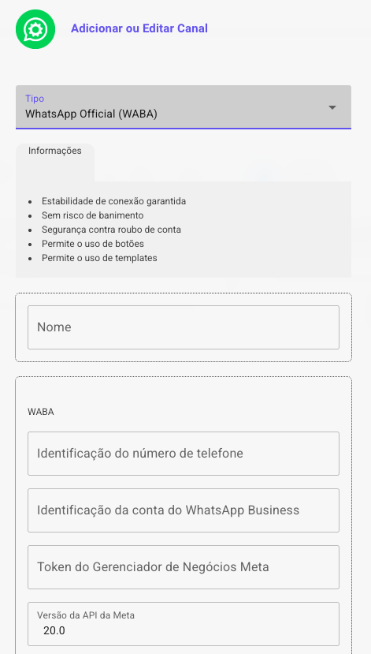

   * Preencha os campos com as informações obtidas no painel da Meta: Whatsapp - Configuração da API

     + **ID do número de telefone**
     + **ID da conta do WhatsApp Business**
     + O **Token Permanente** que você gerou na Etapa 4.
   * Clique em Salvar. Neste momento, você já estará apto a **enviar** mensagens.
2. **Ative os Webhooks no Prismabot (Para Receber Mensagens):**

   * No painel Admin do Prismabot, vá para **"Configurações" > "Integração Meta"**.
   * Copie a **URL do Webhook** e o **Token de Verificação**.
   * Volte ao painel do seu aplicativo na Meta, em **"WhatsApp" > "Configuração da API"**.

   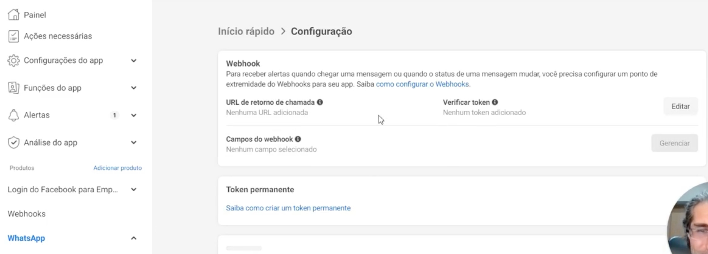

   * Clique em "Editar" na seção de Webhooks.
   * Cole a **URL** e o **Token** copiados do Prismabot e clique em "Verificar e Salvar".
   * Após verificar, clique em **"Gerenciar"** e assine (**subscribe**) todos os eventos de webhook disponíveis (especialmente `messages`).

   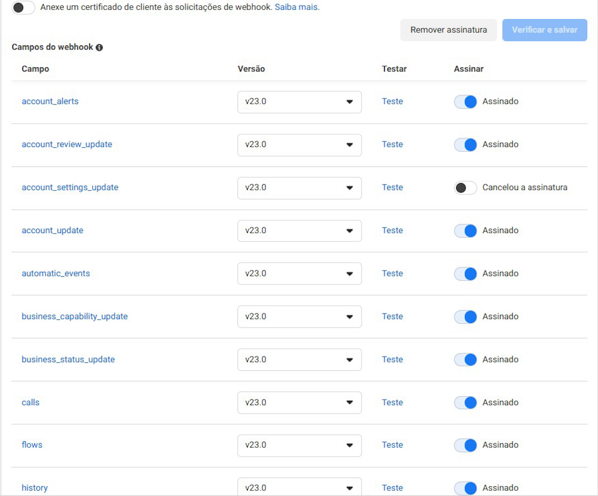

### Encerramento

Com os webhooks ativos, sua plataforma está pronta para enviar e receber mensagens através da API Oficial do WhatsApp. Esta é a conexão mais estável e segura, recomendada para todas as operações.

### Possíveis erros

**Solução de Problemas: Evite falhas de comunicação com o Webhook da Meta (Erro ETIMEDOUT)**

Os erros `AxiosError` do tipo **"ETIMEDOUT"** registrados no log indicam que a comunicação com o servidor da Meta (Webhook) está sofrendo atraso de resposta — geralmente causado por alta latência de rede.

Isso ocorre quando o ping entre nuvem e o domínio `graph.facebook.com` ultrapassa 40 ms, resultando em falhas do tipo TIMEDOUT nas requisições.

Para prevenir esse problema, é importante definir uma rota pública estável em nuvem. Se você utiliza a **Hostinger**, por exemplo, o caminho é:

1. Acesse o painel da Hostinger.
2. Vá até **Configurações → Rede → DNS**.
3. Defina um DNS fixo recomendado, como:

   * `1.1.1.1` (Cloudflare)
   * `8.8.8.8` (Google)

Essas configurações ajudam a garantir uma rota mais direta e estável entre a servidor e a infraestrutura da Meta, reduzindo atrasos e eliminando o erro de timeout nos logs.

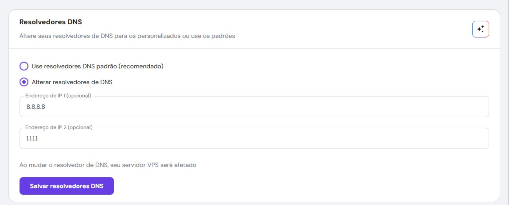

## Links de apoio - Meta API

**Guia Verificação do app (tech provider)**

[Como Aprovar Seu App Da Meta (Passo A Passo) - Comunidade Prisma TelecomComunidade Prisma Telecom](https://prismatelecomservicos.com/)

[Coexistência WhatsApp + Cadastro Incorporado: Tutorial DEFINITIVO! - Comunidade Prisma TelecomComunidade Prisma Telecom](https://prismatelecomservicos.com/)

**Guia Configuração coexistência:**

[https://prismatelecomservicos.com/ class="text-base">ajuda.zdg.com.br](https://prismatelecomservicos.com/ rel=)

**Configuração login incorporado:**

[https://prismatelecomservicos.com/ class="text-base">ajuda.zdg.com.br](https://prismatelecomservicos.com/ rel=)

**Configuração instagram nativo:**

[https://prismatelecomservicos.com/ class="text-base">ajuda.zdg.com.br](https://prismatelecomservicos.com/ rel=)

**Configuração facebook messenger nativo:**

[https://prismatelecomservicos.com/ class="text-base">ajuda.zdg.com.br](https://prismatelecomservicos.com/ rel=)

**Guia da Meta para configuração do login incorporado:**
<https://developers.facebook.com/docs/facebook-login/facebook-login-for-business/>**Guia da Meta para configuração da coexistência:**
<https://developers.facebook.com/documentation/business-messaging/whatsapp/embedded-signup/onboarding-business-app-users>

**Central de ajuda e suporte técnico meta:**

<https://developers.facebook.com/support/>

[AnteriorInstagram e Facebook Messenger via OAuth (login)](/configuracao-administrador/administracao-painel-admin/canais-de-comunicacao/instagram-e-facebook-messenger-via-oauth-login)[PróximoCanal whatsapp Baileys](/configuracao-administrador/administracao-painel-admin/canais-de-comunicacao/canal-whatsapp-baileys)

Atualizado há 1 mês

Isto foi útil?