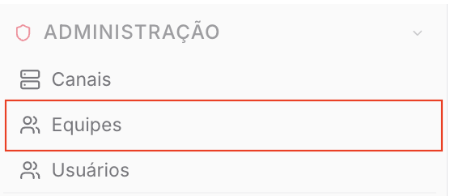
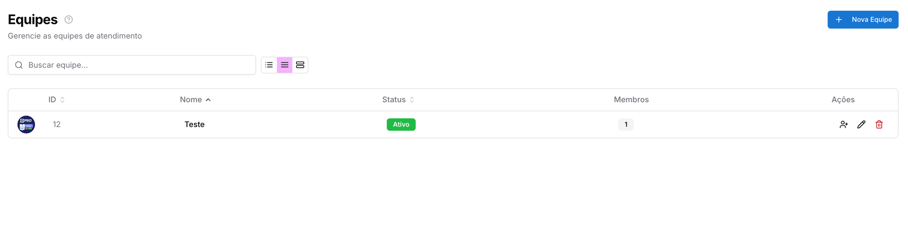
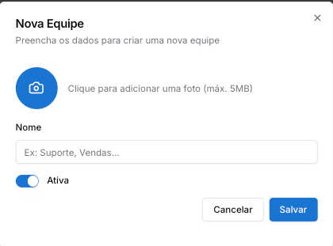
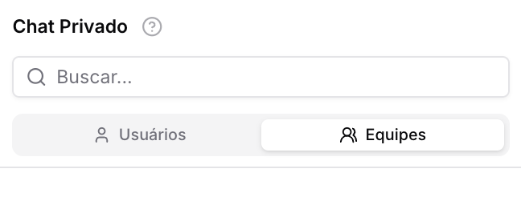

Copiar

Nesta página

1. [Configuração Administrador](/configuracao-administrador)
2. [Administração - Painel Admin](/configuracao-administrador/administracao-painel-admin)

# Equipes

Equipes Chat

**Disponível para o perfil: Administrador e supervisor**

A página de **Equipes** é o local central para a organização dos agentes de atendimento. Através dela, o administrador segmenta os colaboradores por especialidade, departamento ou função, permitindo uma distribuição de tickets mais eficiente e organizada.

#### Principais funções

* **Segmentação de Atendimento:** Criação de departamentos (ex: Comercial, Suporte, Financeiro).
* **Gestão de Membros:** Vinculação de usuários específicos a cada equipe.
* **Controle de Visibilidade:** Ativação ou desativação de equipes conforme a demanda.
* **Organização Visual:** Personalização de cada equipe com fotos identificadoras.

#### Caso de uso

Uma empresa que possui diferentes fluxos de atendimento utiliza a página de Equipes para separar o setor de **Suporte Técnico** do **Setor de Vendas**. Assim, ao realizar a transferência de um Ticket, o sistema direciona a demanda apenas para os Usuários vinculados à equipe selecionada, otimizando o tempo de resposta.

#### Como acessar a página

Para acessar, clique no Menu **Administração** e selecione a aba **Equipes**.

#### Você verá a seguinte tela:

**Explicação dos campos e ícones**

* **Campo de Busca:** Permite localizar uma equipe específica pelo nome.
* **Botão + Nova Equipe:** Abre o formulário para criação de um novo grupo de atendimento.
* **ID:** Identificador único da equipe no banco de dados.
* **Nome:** Nome atribuído à equipe (ex: Suporte, Vendas).
* **Status:** Indica se a equipe está **Ativa** (apta a receber tickets) ou **Inativa**.
* **Membros:** Exibe a quantidade de usuários vinculados àquela equipe.
* **Ações:**

  + **Ícone Gerenciar Membros (Usuário com +):** Abre a tela para adicionar ou remover atendentes da equipe.
  + **Ícone Editar (Lápis):** Permite alterar o nome, foto ou status da equipe.
  + **Ícone Excluir (Lixeira):** Remove a equipe permanentemente do sistema.

---

#### Passo a passo de uso

**Criar uma nova equipe**

1. Acesse o menu **Equipes** e clique no botão **+ Nova Equipe**.
2. Insira o **Nome** da equipe no campo correspondente.
3. Mantenha a chave **Ativa** habilitada para que a equipe fique disponível para uso imediato.
4. Clique em **Salvar**.

**Gerenciar membros da equipe**

1. Na listagem de equipes, identifique a equipe desejada e clique no ícone **Gerenciar Membros** (ícone de usuário com um sinal de "+").
2. Selecione os Usuários que farão parte deste time.
3. Confirme a operação para salvar as alterações.

#### Detalhamento

As equipes criadas nesta página serão refletidas diretamente no [Chat Privado](/ferramentas-do-atendimento/atendimento/chat-privado)

#### Avisos e precauções

**Atenção:** Ao excluir uma equipe, certifique-se de que não existam tickets pendentes vinculados a ela, pois isso pode causar inconsistência na distribuição dos atendimentos em aberto.

A foto da equipe deve respeitar o limite de **5MB**. Formatos recomendados: PNG ou JPG.

[AnteriorCanal WooCommerce](/configuracao-administrador/administracao-painel-admin/canais-de-comunicacao/canal-woocommerce)[PróximoUsuários](/configuracao-administrador/administracao-painel-admin/usuarios)

Atualizado há 3 meses

Isto foi útil?