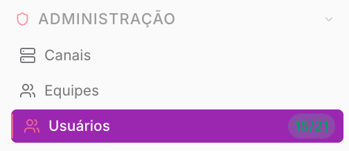
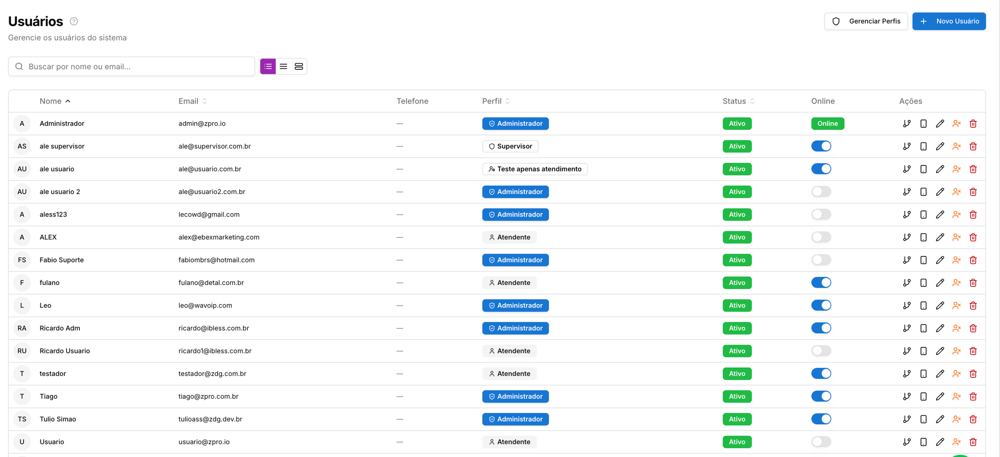
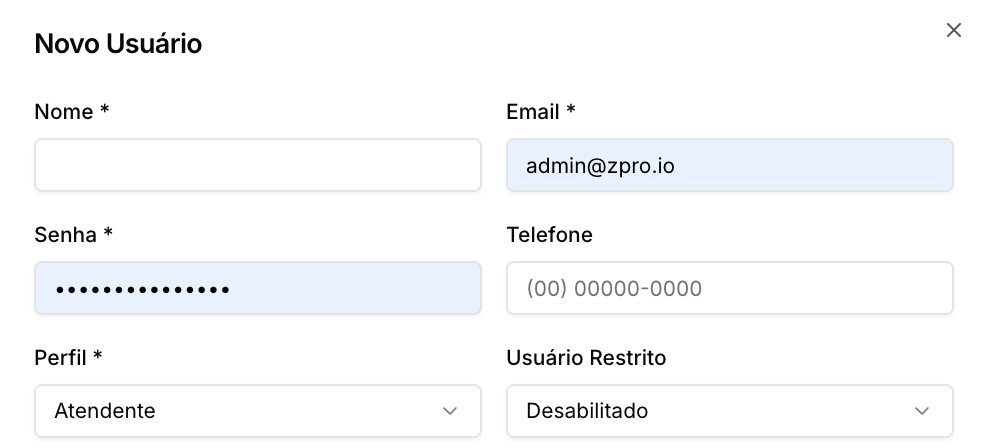
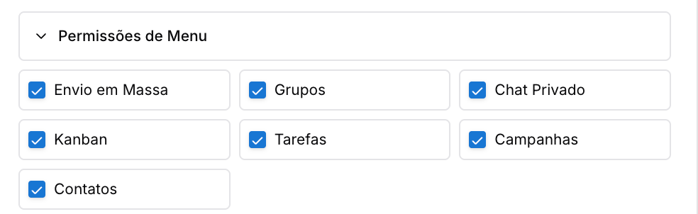
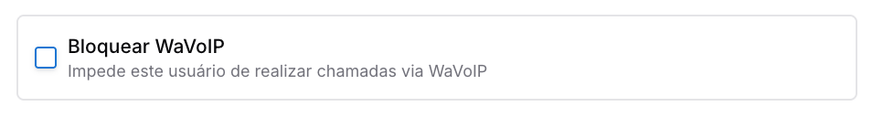
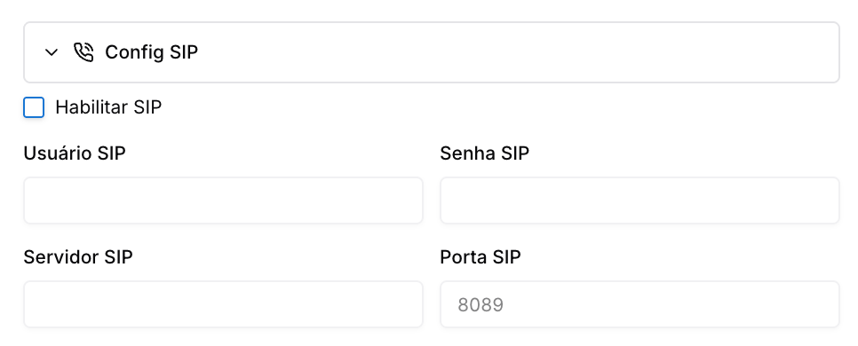
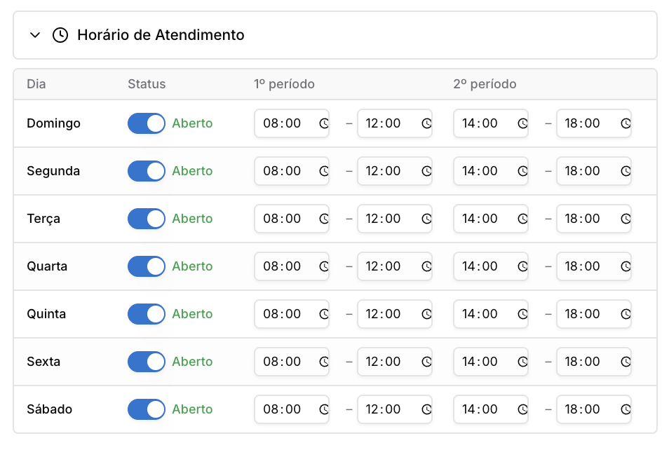
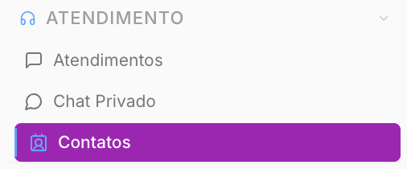
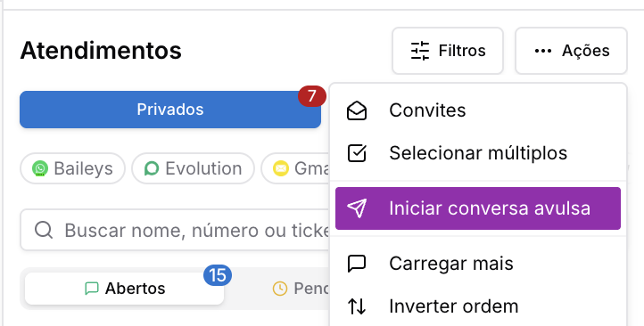

Copiar

Nesta página

1. [Configuração Administrador](/configuracao-administrador)
2. [Administração - Painel Admin](/configuracao-administrador/administracao-painel-admin)

# Usuários

Gestão de Usuários

**Disponível para o perfil: Administrador**

A página de **Usuários** é o centro de gestão de acessos do sistema Prismabot. Nela, o administrador realiza o cadastro de novos colaboradores, define níveis de hierarquia através de perfis, controla permissões de visibilidade de módulos e estabelece jornadas de trabalho por meio da configuração de horários.

#### Principais funções

* **Gestão de Identidade:** Cadastro e edição de credenciais de acesso (e-mail e senha).
* **Hierarquia de Acesso:** Atribuição de perfis (Administrador, Supervisor, Atendente ou Personalizado).
* **Controle de Módulos:** Definição manual de quais menus cada usuário pode visualizar.
* **Integração de Telefonia:** Configuração de ramais SIP e permissões para chamadas via WaVoIP.
* **Jornada de Trabalho:** Estabelecimento de horários de atendimento individuais por usuário.

#### Caso de uso

Uma empresa contrata um novo colaborador para o setor de suporte. O administrador cria o usuário e, em vez de dar acesso total, seleciona o perfil **Atendente**. Nas **Permissões de Menu**, ele habilita apenas "Chat Privado", "Tarefas" e "Contatos". Além disso, configura o **Horário de Atendimento** para que o sistema impeça o recebimento de novos Tickets fora do expediente do colaborador.

#### Como acessar a página

Caminho clicando no Menu **Administração** e na aba **Usuários**.

#### Você verá a seguinte tela:

**Explicação dos campos e ícones**

**Colunas da Tabela:**

* **Nome/E-mail:** Identificação do colaborador e sua credencial de login.
* **Perfil:** Badge que indica o nível de acesso (Admin, Supervisor, Atendente ou Perfis Customizados).
* **Status:** Indica se o usuário está **Ativo** ou **Inativo** no sistema.
* **Online:** Chave seletora que mostra se o usuário está logado no momento.

**Ações (Ícones):**

* **Ícone Gerenciar Filas (Vínculo):** Permite vincular o usuário às Filas de Atendimento.
* **Ícone Canais (Smartphone):** Define quais Canais de Comunicação o usuário pode operar.
* **Ícone Editar (Lápis):** Abre o modal completo de edição de dados e permissões.
* **Ícone Equipes (Pessoa com x):** Inativa o usuário
* **Ícone Excluir (Lixeira):** Remove o usuário permanentemente do sistema.

---

#### Passo a passo de uso

**1. Criar um novo usuário**

1. Clique no botão **+ Novo Usuário** no canto superior direito.
2. Preencha os dados básicos: **Nome**, **E-mail**, **Senha** e **Telefone**.
3. **Perfil:** Escolha entre as opções fixas ou a opção **Personalizado** (ver detalhamento abaixo).

**Usuário Restrito:** Quando esta opção está ativa para um usuário, a experiência dele na plataforma será limitada. Explicação mais abaixo.

**Permissões de Menu:** Marque os módulos que o colaborador terá acesso (Ex: Envio em Massa, Kanban, Campanhas).

**2. Configurar Telefonia (Opcional)**

**Bloquear WaVoIP:**se desejar impedir que o usuário realize chamadas pela plataforma.

**Config SIP:** habilite a chave se houver integração com telefonia IP.

Preencha os dados do servidor, usuário e senha fornecidos pelo seu provedor VoIP.

**3. Definir Horário de Atendimento**

1. Expanda a seção **Horário de Atendimento**.
2. Defina para cada dia da semana se o usuário está "Aberto" ou "Fechado".
3. Configure os turnos (1º e 2º período). O usuário só aparecerá como disponível para novos atendimentos dentro destes intervalos.

---

### Detalhamento

#### Perfis de Acesso

O Prismabot permite uma granularidade avançada através dos **Perfis de Acesso**:

* **Administrador:** Possui acesso total e irrestrito a todas as configurações e dados.
* **Supervisor:** Nível intermediário, focado em monitoramento e gestão de filas/relatórios.
* **Atendente:** Focado na operação direta de chats e contatos.
* **Personalizado:** Ao selecionar esta opção, surge o campo **Perfil de Acesso**, onde você pode escolher um template de permissões pré-criado.

[**Gerenciar Perfis**](/configuracao-administrador/administracao-painel-admin/usuarios/perfis-de-acesso)

Ao clicar no botão **Gerenciar Perfis** no topo da tela, o sistema abre uma área exclusiva para a criação de novos templates de permissões reutilizáveis

### Usuário Restrito

Quando esta opção está ativa para um usuário, a experiência dele na plataforma será limitada da seguinte forma:

**Menu de Contatos Oculto:** O usuário não terá acesso ao menu "Contatos", impedindo a visualização ou exportação da lista completa de contatos.

**Proibido Iniciar Novas Conversas**

* O botão "Iniciar Conversa Avulsa" na tela de Atendimentos será ocultado.

#### Na Tela de Atendimento (Chat)

Dentro de um ticket, o usuário restrito sofrerá as seguintes limitações visuais e funcionais:

* **Nome do Contato:** Será exibido parcialmente (apenas os 5 primeiros caracteres).
* **Foto do Perfil:** Receberá um forte efeito de desfoque (blur).
* **Dados Sensíveis:** Todos os campos de detalhes do contato na barra lateral (como Telefone, E-mail, CPF, etc.) serão ocultados.
* **Botão Editar Contato:** O ícone de lápis para editar o contato será ocultado.
* **Opções de Telefonia:** Os botões de telefonia serão desabilitados.
* **Ações de Mensagem:** As opções "Encaminhar" e "Marcar" serão desabilitadas para impedir o vazamento de dados.

**Objetivo da Restrição**

Esta funcionalidade é desenhada para proteger os dados sensíveis dos seus clientes, limitando o acesso apenas ao necessário para a função do atendente e alinhando sua operação às melhores práticas de segurança e à LGPD.

---

#### Avisos e precauções

**Atenção:** Ao inativar um usuário, ele perderá o acesso imediato ao painel, porém seus dados e histórico de atendimentos permanecem salvos no banco de dados para auditoria.

[AnteriorEquipes](/configuracao-administrador/administracao-painel-admin/equipes)[PróximoPerfis de Acesso](/configuracao-administrador/administracao-painel-admin/usuarios/perfis-de-acesso)

Atualizado há 3 meses

Isto foi útil?