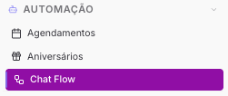
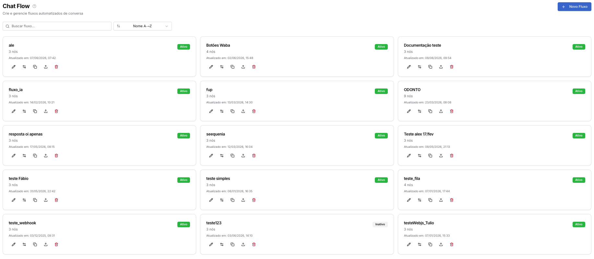
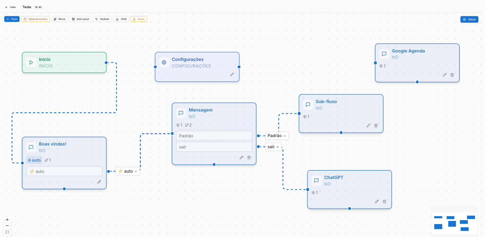
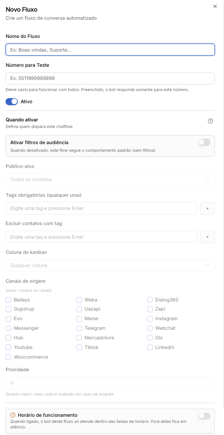
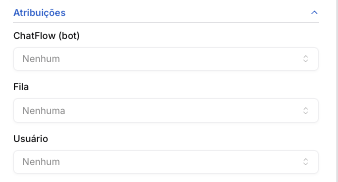

Copiar

Nesta página

1. [Configuração Administrador](/configuracao-administrador)
2. [Automação](/configuracao-administrador/automacao)

# ChatFlow (chatbot)

**Disponível para o perfil:** Administrador e Supervisor

O Chat Flow é o construtor nativo de chatbots do Prismabot que permite criar jornadas de atendimento automático de forma visual. Você pode montar a jornada completa — enviar mensagens, coletar dados, aplicar etiquetas, integrar com sistemas externos e direcionar clientes para filas ou atendentes — sem precisar de ferramentas externas.

#### Como acessar

Acesse **Automação → Chat Flow**.

---

### Tela de gerenciamento de fluxos

Cada cartão exibe: nome, quantidade de nós, status (Ativo/Inativo) e data de atualização.

---

### Conceitos fundamentais

Elemento

Definição

Exemplo

**Fluxo**

O chatbot completo com todas as etapas, mensagens e regras

"Atendimento Inicial", "Pós-venda"

**Bloco (Etapa / Nó)**

Um elemento no canvas que representa um momento da conversa. Blocos são arrastados do painel lateral esquerdo para o canvas

"Boas-vindas", "Menu principal"

**Interação**

Ação executada pelo bot dentro de um bloco

Enviar mensagem, aplicar etiqueta, chamar webhook

**Conexão**

Linha que liga dois blocos, definindo para onde o fluxo segue após a resposta do cliente

"Se responder 1 → vai para Vendas"

**Interação ≠ Conexão:** a interação define **o que o bot faz**; a conexão define **para onde o cliente vai** depois de responder. Um bloco de menu precisa de conexões configuradas para cada opção — sem elas, o fluxo não avança.

---

### Como criar conexões entre blocos

Com o novo editor visual estilo N8N, as conexões são criadas diretamente no canvas, arrastando de um bloco para outro.

#### Passo a passo

1. Passe o mouse sobre o bloco de origem — um ponto de saída aparece na borda direita
2. Arraste esse ponto até o bloco de destino
3. O modal **Nova conexão** será exibido — escolha o tipo de conexão:

Tipo

Comportamento

Quando usar

**Padrão (qualquer resposta)**

O fluxo avança assim que o cliente envia qualquer mensagem

Após mensagens informativas onde não há escolha a fazer

**⚡ Automático (sem aguardar resposta)**

O fluxo avança imediatamente, sem esperar o cliente responder

Encadeamento automático de etapas, ações internas sem interação do cliente

**Por palavras-chave**

O fluxo avança somente se a resposta do cliente contiver uma das palavras configuradas (separe por vírgula)

Menus de opções — ex: "1, comercial, vendas"

Cada bloco pode ter **várias saídas** apontando para destinos diferentes. As conexões aparecem como pontos rotulados na borda direita do bloco. A conexão **Automático** é representada pelo ícone ⚡.

**Ordem de avaliação das conexões:** o sistema avalia as conexões por palavras-chave antes da conexão Padrão. Se o cliente responder algo que bate em uma palavra-chave, esse caminho é seguido. A conexão Padrão funciona como fallback para respostas que não batem em nenhuma palavra-chave.

---

### O canvas — editor visual

O canvas é a área onde você monta visualmente o fluxo.

#### Painel lateral de blocos

No lado esquerdo do canvas, os blocos estão organizados por categoria. Arraste qualquer bloco para o canvas para adicioná-lo ao fluxo:

* **MENSAGENS** — Mensagem, Mídia, Botões, Lista, Template (HSM), Sticker, Contato, Localização, Vídeo Conferência, Botão PIX
* **ROTEAMENTO** — Transferir, Sub-fluxo, Atraso, Bloquear Chatbot
* **INTEGRAÇÕES** — Webhook, Webhook Avançado, ChatGPT, Typebot, n8n, VAPI, SMS
* **CRM E AÇÕES** — Etiqueta, Kanban, Oportunidade, Notas, Agendamento, Consulta Agenda, Google Agenda

#### Barra de ferramentas

Botão

Função

**+ Passo**

Adiciona um novo bloco vazio ao canvas

**Tabela de horários**

Define horários de funcionamento do fluxo

**Blocos**

Abre/fecha o painel lateral de blocos

**Auto Layout**

Organiza automaticamente os blocos no canvas

**Desfazer**

Desfaz a última ação

**JSON**

Exporta ou importa o fluxo em formato JSON

**Avisos**

Lista conexões faltando e problemas de configuração no fluxo

**Salvar**

Salva todas as alterações

#### Blocos fixos (sempre presentes)

Todo fluxo começa com três blocos que não podem ser removidos:

* **Início** — ponto de entrada do fluxo
* **Configurações** — painel de controle global do fluxo (fallback, timeout, palavra-gatilho etc.)
* **Boas-vindas** — primeira etapa da conversa com o cliente

---

### Editando um bloco

Clique em qualquer bloco para abrir o painel de edição lateral. Cada bloco tem três seções:

**Interações** — ações executadas em sequência (de cima para baixo) quando o cliente chega nesta etapa. Use o botão "Adicionar interação" para incluir novos itens.

**Variáveis** *(opcional)* — captura a resposta do cliente nesta etapa e armazena em uma variável nomeada para usar em etapas seguintes com `{{nome_variavel}}`.

As **conexões** (condições de saída) são configuradas diretamente no canvas, arrastando do bloco para o destino — não mais dentro do painel de edição.

---

### Variáveis disponíveis

Use `{{variável}}` em qualquer mensagem de texto para personalizar a conversa:

Variável

O que retorna

`{{name}}`

Nome completo do contato

`{{firstName}}`

Primeiro nome do contato

`{{protocol}}`

Número do protocolo de atendimento

`{{greeting}}`

Saudação automática (Bom dia / Boa tarde / Boa noite)

`{{user}}`

Nome do atendente responsável

`{{email}}`

E-mail do contato

`{{phoneNumber}}`

Telefone do contato

`{{kanban}}`

Coluna do kanban do contato

Além dessas, qualquer variável capturada em uma etapa fica disponível com `{{nome_que_você_definiu}}`.

---

### Criando um novo fluxo

Na tela de gerenciamento, clique em **+ Novo Fluxo** e configure:

* **Nome do fluxo** — identificação interna
* **Número para teste** — número isolado para testar o bot sem afetar contatos reais
* **Status** — Ativo ou Inativo
* **Filtros de audiência** — controle quem entra no fluxo: tipo de contato (todos, novos, recorrentes), tags obrigatórias, tags excluídas, colunas do kanban, canais de origem e nível de prioridade

---

### Vinculando o fluxo a um canal

Um fluxo criado não funciona até ser conectado a um canal:

1. Acesse o menu **Canais**
2. Localize o canal desejado
3. Clique no ícone **Chatbot**
4. Selecione o fluxo na lista
5. Salve

A partir daí, toda nova conversa iniciada naquele canal será gerenciada pelo fluxo.

---

### Páginas relacionadas

* [Boas práticas e solução de problemas](/configuracao-administrador/automacao/chat-flow/chat-flow-boas-praticas-e-solucao-de-problemas)
* [Interações disponíveis](/configuracao-administrador/automacao/chat-flow/chat-flow-interacoes-disponiveis)
* [Configurações do Fluxo](/configuracao-administrador/automacao/chat-flow/chat-flow-configuracoes-do-fluxo)
* [Exemplo: Menu de departamentos](/configuracao-administrador/automacao/chat-flow/chat-flow-exemplo-menu-departamentos)
* [Exemplo: Qualificação de lead com captura de dados](/configuracao-administrador/automacao/chat-flow/chat-flow-exemplo-qualificacao-de-lead-com-captura-de-dados)
* [Exemplo: Fluxo com horário de atendimento](/configuracao-administrador/automacao/chat-flow/chat-flow-exemplo-fluxo-com-horario-de-atendimento)

[AnteriorAniversários](/configuracao-administrador/automacao/aniversarios)[PróximoChat Flow - Boas práticas e solução de problemas](/configuracao-administrador/automacao/chat-flow/chat-flow-boas-praticas-e-solucao-de-problemas)

Atualizado há 1 mês

Isto foi útil?