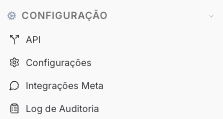

Copiar

Nesta página

1. [Configuração Administrador](/configuracao-administrador)

# Configuração Admin

A seção de **Configuração** reúne as ferramentas técnicas e operacionais do painel Admin: integração com sistemas externos via API, gestão dos canais oficiais da Meta, rastreabilidade de ações da equipe e as configurações globais de comportamento da plataforma.

---

### [API - Configurações](/configuracao-administrador/configuracao/api)

Geração e gestão de tokens de acesso para integração do Prismabot com sistemas externos (CRMs, ERPs, automações). Também oferece documentação interativa dos endpoints, sandbox para testes de requisições e configuração de webhooks para disparos automáticos de eventos.

---

### [Integrações Meta](/configuracao-administrador/configuracao/integracoes-meta)

Centro de comando para todos os canais oficiais do ecossistema Meta conectados ao tenant. Agrupa autenticação OAuth, gestão de contas e templates em um único lugar:

* **Configurações gerais** — visão geral e parâmetros globais das integrações Meta
* **WhatsApp — Contas Meta** — gerenciar números WABA conectados, limites de envio e status de qualidade
* **Facebook — Contas Meta** — gerenciar páginas e contas do Facebook vinculadas
* **Instagram — Contas Meta** — gerenciar contas do Instagram conectadas via OAuth
* **Login OAuth** — configuração do fluxo de autenticação OAuth para conexão de contas
* **Templates** — criar, editar e submeter templates HSM para aprovação da Meta

---

### [Log de Auditoria](/configuracao-administrador/configuracao/log-auditoria-admin)

Rastreamento detalhado de todas as ações realizadas na plataforma: quem executou, quando, de qual IP e qual recurso foi afetado. Permite filtrar eventos por usuário, período ou tipo de entidade, e exportar registros para auditorias externas.

---

### [Configurações Gerais](/configuracao-administrador/configuracoes-painel-admin)

Centro de controle global do painel Admin. Define as regras que regem o comportamento da plataforma: visibilidade de tickets, tipo de listagem de mensagens, transbordo automático, carência pós-atendimento, autenticação em dois fatores e importação de histórico de conversas.

[AnteriorWaVoIP - Gestão comercial](/configuracao-administrador/gestao-comercial/analises-e-registros/wavoip)[PróximoAPI - Configurações](/configuracao-administrador/configuracao/api)

Atualizado há 1 mês

Isto foi útil?