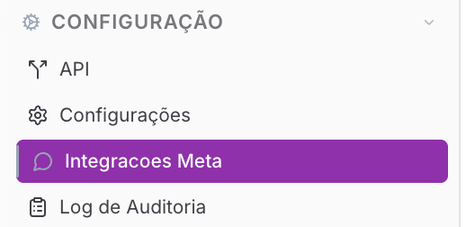
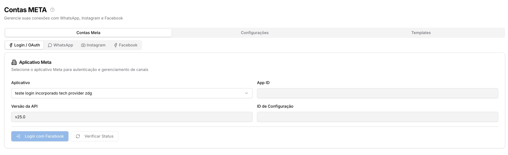
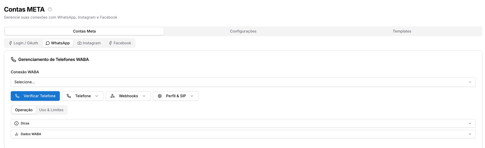
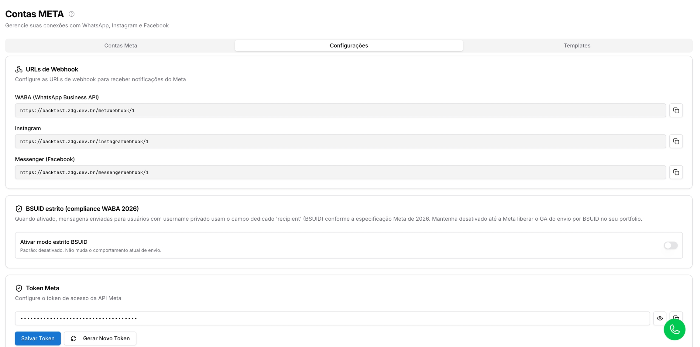
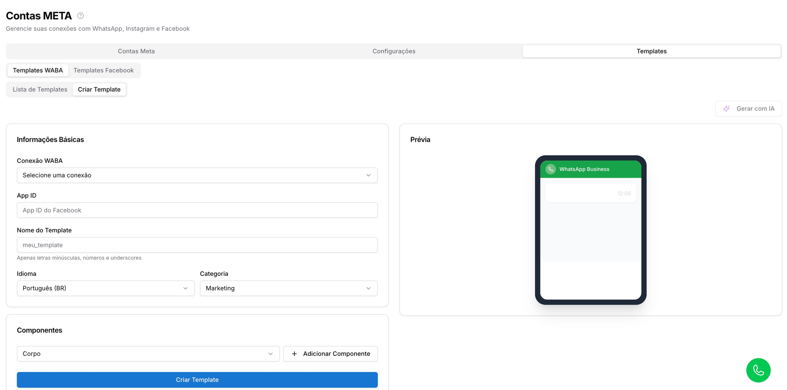

# Integrações Meta

**Disponível para o perfil:** Administrador

A página de **Integrações Meta** é o centro de comando para todos os canais oficiais do ecossistema Meta (WhatsApp Business API, Instagram Business e Facebook Messenger). Através desta interface, o administrador realiza a autenticação via OAuth, gerencia números de telefone (WABAs), configura webhooks técnicos e administra modelos de mensagens (Templates).

#### Como acessar a página

No menu lateral, clique no Menu **Configurações**, selecione a aba **Integrações Meta**.

Você também pode acessar por Configurações - Integrações - Meta

---

#### Você verá a seguinte tela:

A interface é organizada em três grandes abas superiores que dividem as responsabilidades de gerenciamento: **Contas Meta**, **Configurações** e **Templates**.

---

## Sessões da página

Clique no link para ver o detalhamento de cada uma das páginas

### 1. Contas Meta

Esta aba centraliza a conexão e o gerenciamento operacional das contas autenticadas. Ela é subdividida em quatro sub-abas:

[**1.1 Login / OAuth: Autenticação e Aplicativo Meta**](integracoes-meta/login-oauth-contas-meta-configuracoes.md)

Esta sub-aba serve como a porta de entrada para a integração, permitindo que o Prismabot receba autorização da Meta para gerenciar suas mensagens.

* **Proxy OAuth:** Caso selecione o "OAuth Proxy (techprovider)", o sistema gerencia as credenciais automaticamente, dispensando configurações locais complexas.
* **App Próprio:** Se você utiliza um aplicativo de desenvolvedor próprio, deverá preencher manualmente o **App ID**, **Versão da API** e **ID de Configuração**.
* **Ação:** Clique em **Login com Facebook** para autorizar as permissões. Após o retorno, use o botão **Verificar Status** para confirmar se o token foi gerado (Status: *Success*).

[**1.2 WhatsApp: Gerenciamento de Telefones WABA**](integracoes-meta/whatsapp-contas-meta.md)

Esta seção serve para a gestão completa do ciclo de vida dos números oficiais. Ela permite registrar novos telefones, validar webhooks e monitorar a saúde financeira e operacional da conta.

* **Operação:** Permite **Registrar Telefone** (via código SMS/Voz) e **Verificar Código**. Contém o botão **Diagnosticar conexão**, que valida se o Token, o WABA e o Webhook estão operando sem erros.
* **Uso & Limites:** Puxa dados da Business Manager para exibir o **Faturamento** das conversas e os **Limites de Envio (Tiers)**, informando quantos clientes únicos a conta pode contatar a cada 24 horas.
* **Análises:** Exibe métricas de performance de entrega e leitura para até 10 templates simultâneos.

[**1.3 Instagram: Integração de Direct Business**](integracoes-meta/instagram-contas-meta.md)

Esta aba serve para vincular e verificar a conexão com perfis profissionais do Instagram Business que estão associados a uma Página do Facebook.

* **Como usar:** Selecione o perfil no menu suspenso e clique em **Verificar Conta**.
* **Análise:** O status deve constar como **CONNECTED** para que as mensagens do Direct e menções em Stories sejam capturadas pelo sistema.

[**1.4 Facebook: Mensagens de Páginas e Identidade (Personas)**](integracoes-meta/facebook-contas-meta.md)

Serve para gerenciar a recepção de mensagens do Messenger e personalizar como a empresa se apresenta no chat oficial do Facebook.

* **Mensagem de Boas-vindas:** Permite configurar o texto automático (até 160 caracteres) exibido no início da interação.
* **Personas:** Serve para criar remetentes alternativos (ex: "Atendente João"). Com isso, o cliente visualiza o nome e foto do atendente específico no Messenger, em vez de apenas o nome da Página.
* **Como usar:** Selecione a página, clique em **Verificar Página** e salve as configurações de saudação ou personas.

#### [2. Aba: Configurações](integracoes-meta/configuracoes-integracoes-meta.md)

Área técnica destinada aos parâmetros de backend da integração.

* **URLs de Webhook:** Exibe os endereços para recebimento de notificações da Meta.
* **BSUID Estrito:** Configuração de conformidade para a especificação Meta 2026.
* **Token Meta:** Local para salvar e renovar o Token de acesso permanente à API.
* **Verificação WABA:** Ferramenta para validar a Business Manager (BM) e a versão da API utilizada.

#### [3. Aba: Templates](integracoes-meta/templates-integracoes-meta.md)

Central de modelos de mensagens para comunicações oficiais.

* **3.1 Templates WABA:** Permite visualizar a lista de modelos aprovados, sincronizar status com a Meta e criar novos templates diretamente pelo sistema Prismabot utilizando o Construtor de Templates.
* **3.2 Templates Facebook:** Espaço informativo, lembrando que modelos exclusivos de Facebook/Messenger devem ser gerenciados diretamente no Gerenciador de Negócios da Meta.

 2 meses
