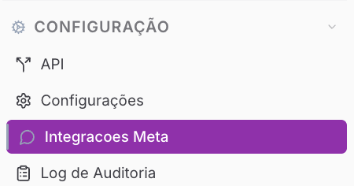
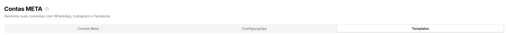
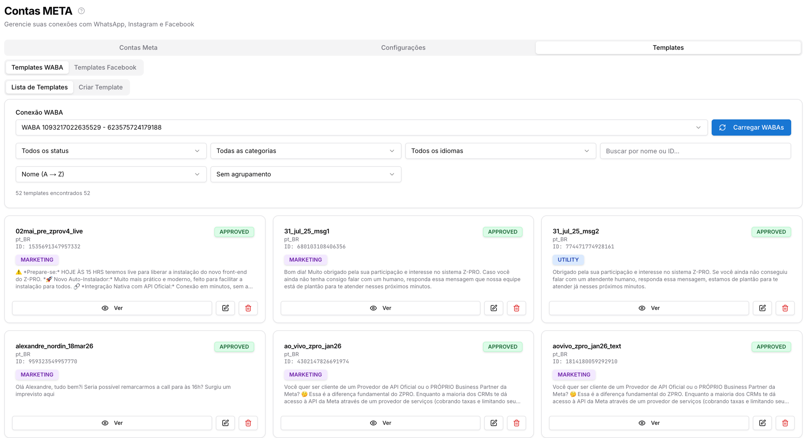
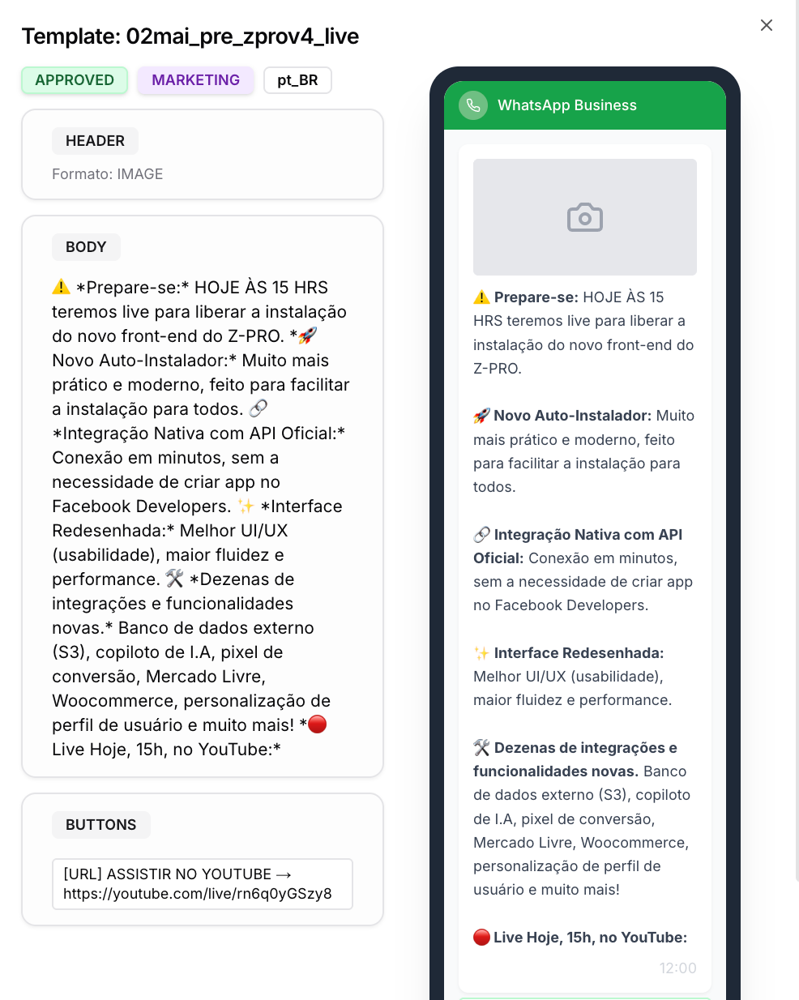
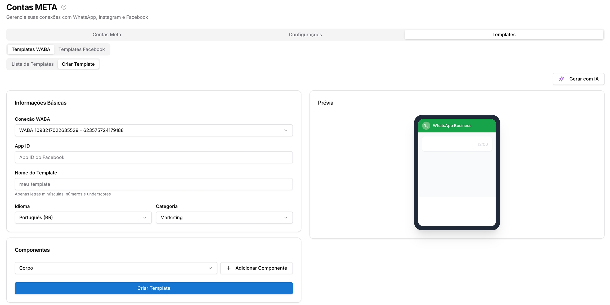
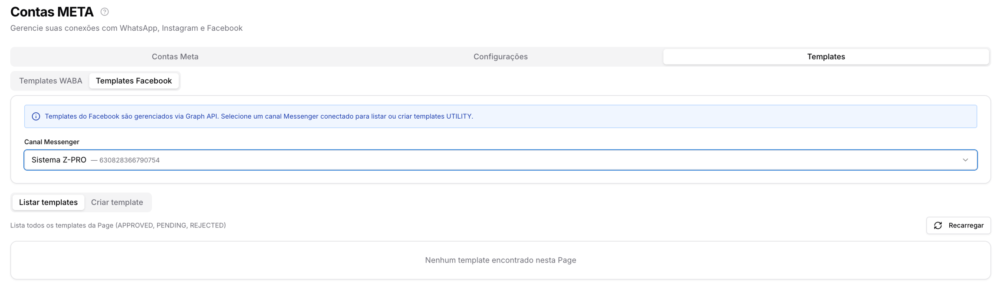
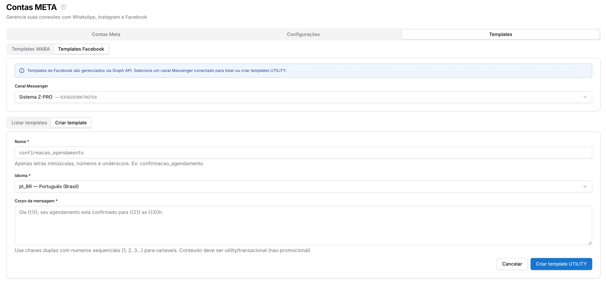

Copiar

Nesta página

1. [Configuração Administrador](/configuracao-administrador)
2. [Configuração Admin](/configuracao-administrador/configuracao)
3. [Integrações Meta](/configuracao-administrador/configuracao/integracoes-meta)

# Templates — Integrações Meta

**Disponível para o perfil: Administrador**

Esta página detalha a sub-aba Login / OAuth. Para uma visão geral das Integrações Meta, acesse [Integrações Meta.](/configuracao-administrador/configuracao/integracoes-meta)

A aba Templates centraliza a gestão de modelos de mensagens para WhatsApp (WABA) e Facebook Messenger. Templates são mensagens pré-aprovadas pela Meta utilizadas para iniciar conversas fora da janela de 24h ou em campanhas de marketing e utilidade.

**Templates geram custos.** O envio de templates WABA é cobrado diretamente pela Meta por conversa iniciada, com valores variando conforme a categoria (Marketing, Utilidade, Autenticação) e o país do destinatário. Consulte os detalhes em [Cobranças da Meta — WhatsApp Business Platform](https://prismatelecomservicos.com/ rel=).

### Como acessar

Acesse **Configurações → Integrações Meta → Templates**.

---

### Templates WABA

A sub-aba **Templates WABA** permite visualizar, gerenciar e criar templates oficiais do WhatsApp Business API.

#### Lista de Templates

1. Selecione a **Conexão WABA** desejada no seletor superior
2. Clique em **Carregar WABAs** para sincronizar os templates cadastrados na Meta
3. Use os filtros para localizar templates específicos:

Filtro

Opções

**Status**

Todos, Approved, Pending, Rejected

**Categoria**

Todas, Marketing, Utility, Authentication

**Idioma**

Todos os idiomas disponíveis

**Busca**

Buscar por nome ou ID do template

**Ordenação**

Nome (A→Z), Nome (Z→A), mais recentes, etc.

**Agrupamento**

Sem agrupamento ou agrupar por categoria

Cada card exibe: nome do template, idioma, ID, status e categoria. Use os botões no card para:

Ícone

Ação

**Ver**

Abre o preview completo do template com header, body, buttons e visualização no celular

Lápis

Editar o template

Lixeira

Excluir o template

#### Criar Template WABA

Clique em **Criar Template** para acessar o construtor.

**Informações Básicas:**

Campo

Descrição

**Conexão WABA**

Conta WABA à qual o template será vinculado

**App ID**

ID do aplicativo no Facebook (preenchido automaticamente quando usa TechProvider)

**Nome do Template**

Identificador único — apenas letras minúsculas, números e underscores (ex: `meu_template`)

**Idioma**

Idioma do template (ex: Português BR)

**Categoria**

Marketing, Utility ou Authentication

**Componentes:**

Clique em **+ Adicionar Componente** para incluir as partes do template. Os componentes disponíveis são:

Componente

Descrição

**Corpo**

Texto principal da mensagem — obrigatório. Use `{{1}}`, `{{2}}`... para variáveis dinâmicas

**Cabeçalho**

Texto, imagem, vídeo ou documento exibido acima do corpo

**Rodapé**

Texto complementar exibido abaixo do corpo

**Botões**

Botões de resposta rápida, URL ou ligação telefônica

A **Prévia** ao lado direito atualiza em tempo real conforme você preenche os componentes, mostrando como o template será exibido no WhatsApp.

Use o botão **Gerar com IA** para criar o conteúdo do template automaticamente com base em uma descrição.

Clique em **Criar Template** para submeter à aprovação da Meta.

Templates ficam com status **Pending** após a criação e precisam ser aprovados pela Meta antes de poderem ser utilizados. O prazo de aprovação varia, mas costuma ocorrer em minutos para templates de categorias de utilidade e em até algumas horas para marketing.

O nome do template não pode ser alterado após a criação. Se precisar mudar o nome, será necessário excluir e criar um novo template.

---

### Templates Facebook

A sub-aba **Templates Facebook** permite gerenciar templates do tipo UTILITY para o canal Messenger via Graph API.

#### Listar templates

1. Selecione o **Canal Messenger** conectado no seletor
2. Clique em **Listar templates** para carregar os modelos cadastrados
3. Clique em **Recarregar** para atualizar a listagem

A listagem exibe todos os templates da Page com status APPROVED, PENDING e REJECTED.

#### Criar template

Clique em **Criar template** para criar um novo modelo do tipo UTILITY.

Campo

Descrição

**Nome**

Identificador do template — apenas letras minúsculas, números e underscores (ex: `confirmacao_agendamento`)

**Idioma**

Idioma do template (ex: pt\_BR — Português Brasil)

**Corpo da mensagem**

Texto do template. Use `{{1}}`, `{{2}}`, `{{3}}`... para variáveis dinâmicas (ex: `Olá {{1}}, seu agendamento está confirmado para {{2}} às {{3}}h.`)

Clique em **Criar template UTILITY** para submeter.

Templates do Facebook Messenger devem ter conteúdo **utility ou transacional** — não são aceitos conteúdos promocionais nesta categoria. O campo exibe o aviso: *"Conteúdo deve ser utility/transacional (não promocional)"*.

Templates do Facebook são gerenciados via Graph API. Para listá-los ou criá-los pelo Prismabot, é necessário ter um canal Messenger conectado e autenticado na sub-aba Facebook — Contas Meta.

[AnteriorConfigurações — Integrações Meta](/configuracao-administrador/configuracao/integracoes-meta/configuracoes-integracoes-meta)[PróximoLog auditoria (admin)](/configuracao-administrador/configuracao/log-auditoria-admin)

Atualizado há 2 meses

Isto foi útil?