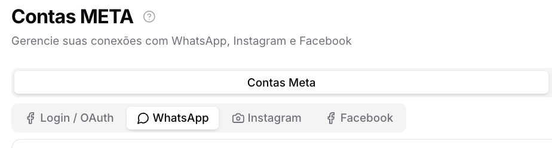
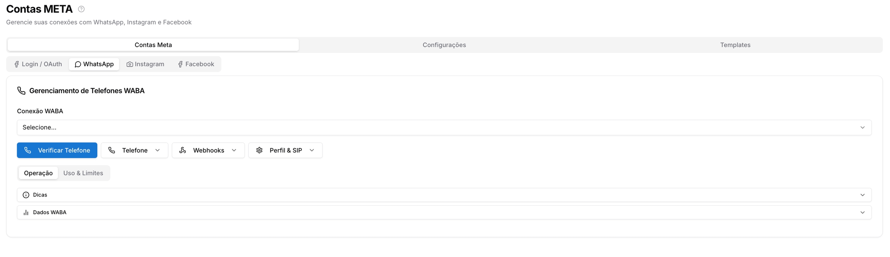
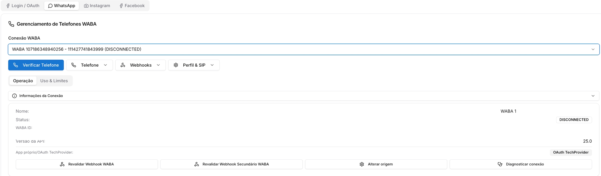
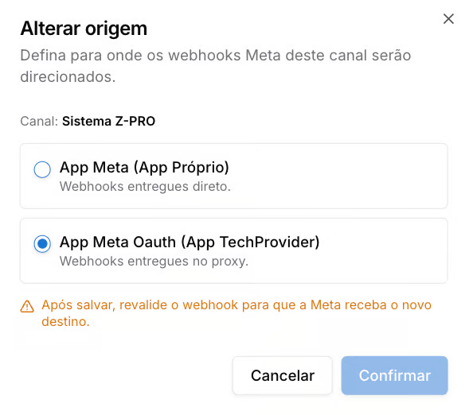
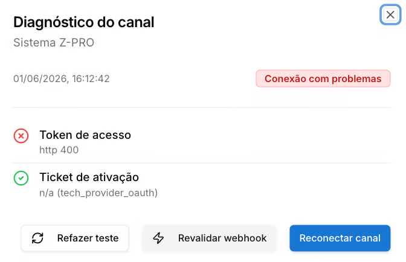

# WhatsApp — Contas Meta

**Disponível para o perfil: Administrador**

Esta página detalha a sub-aba Login / OAuth. Para uma visão geral das Integrações Meta, acesse [Integrações Meta.](../integracoes-meta.md)

A sub-aba WhatsApp centraliza o gerenciamento completo dos números oficiais (WABA) conectados ao sistema — registro de telefones, configuração de webhooks, perfil do número, limites de envio e diagnóstico da conexão.

[Tutorial de como conectar o whatsapp pela API Oficial](../../administracao-painel-admin/canais-de-comunicacao/whatsapp-oficial-oauth-app-prismabot-com-coexistencia.md)

### Como acessar

Acesse **Configurações → Integrações Meta → Contas Meta → WhatsApp**.

### Você verá a seguinte tela

### Selecionando a conexão

Use o seletor **Conexão WABA** no topo para escolher qual número gerenciar. O seletor exibe o WABA ID e o número de telefone de cada conexão cadastrada.

## Aba Operação

#### Informações da Conexão

Exibe os dados técnicos do número selecionado:

Campo

Descrição

**Nome**

Identificação da conexão

**Status**

Estado atual da conexão (CONNECTED / DISCONNECTED)

**WABA ID**

Identificador da conta WhatsApp Business

**Versão da API**

Versão da Graph API em uso

**App próprio / OAuth TechProvider**

Tipo de autenticação utilizada

#### Ações disponíveis

Botão

O que faz

**Verificar Telefone**

Inicia o processo de registro do número via código SMS ou Voz

**Revalidar Webhook WABA**

Reenvia a validação do webhook principal para a Meta

**Revalidar Webhook Secundário WABA**

Reenvia a validação do webhook secundário

**Alterar origem**

Define se os webhooks serão entregues via App Próprio ou via proxy TechProvider

**Diagnosticar conexão**

Executa um diagnóstico completo da conexão — verifica token, WABA e webhook

#### Telefone

Clique em **Telefone** para expandir as opções de registro:

* **Registrar Telefone** — inicia o processo de verificação do número via código SMS ou chamada de voz
* **Verificar Código** — insere o código recebido para concluir o registro

#### Webhooks

Clique em **Webhooks** para configurar:

* **Configurar Webhook** — define a URL e o token de verificação do webhook principal
* **Webhook Secundário** — configura um webhook adicional para redundância ou integrações específicas

#### Perfil & SIP

Clique em **Perfil & SIP** para acessar:

* **Atualizar Perfil** — edita nome, foto e descrição do perfil do número no WhatsApp Business
* **Configurar SIP** — configura o protocolo SIP para chamadas de voz via WhatsApp Business
* **Ativar chamadas WebRTC** — habilita chamadas de voz pelo navegador via WebRTC

#### Dicas

O painel de **Dicas** exibe orientações técnicas para manter a conexão estável:

* Certifique-se de que o número está verificado antes de registrar
* O webhook deve ser acessível publicamente via HTTPS
* Mantenha o token de acesso atualizado para evitar interrupções
* Configure o SIP para chamadas de voz pelo WhatsApp Business

### Aba Uso & Limites

#### Faturamento

Exibe o custo das conversas WABA no período selecionado. Defina a data de início e fim e clique em **Carregar WABAs** para carregar os dados da Business Manager.

#### Análises

Exibe métricas de entrega e leitura de templates. Selecione até 10 templates, defina o período e clique em **Carregar Métricas**.

#### Limites de Envio (Tiers)

Tabela com os níveis de envio da conta e o número de clientes únicos que podem ser contactados a cada 24 horas:

Tier

Clientes únicos / 24h

LIMITED\_ACCESS

50

TIER\_1

1.000

TIER\_2

10.000

TIER\_3

100.000

TIER\_4

Ilimitado

O tier e o quality rating atuais não são retornados pela Graph API. Para consultar esses dados, acesse o Meta Business Suite ou o WhatsApp Manager diretamente. A qualidade é baseada em como as mensagens foram recebidas (bloqueios, denúncias, etc.) e afeta a elegibilidade para aumento de limite.

### Diagnóstico da conexão

Clique em **Diagnosticar conexão** para abrir o painel de diagnóstico.

O diagnóstico verifica dois pontos:

Verificação

O que testa

**Token de acesso**

Valida se o token da Meta está ativo e com permissões corretas

**Ticket de ativação**

Confirma se o número está ativado no sistema

Se houver falhas, use os botões **Refazer teste**, **Revalidar webhook** ou **Reconectar canal** conforme indicado.

### Alterar origem dos webhooks

Clique em **Alterar origem** para definir como os webhooks da Meta serão entregues ao sistema.

Opção

Descrição

**App Meta (App Próprio)**

Webhooks entregues diretamente pelo app do licenciado

**App Meta Oauth (App TechProvider)**

Webhooks entregues via proxy Prismabot

Após salvar, revalide o webhook para que a Meta reconheça o novo destino. Use o botão **Revalidar Webhook WABA** após confirmar a alteração.

 2 meses
