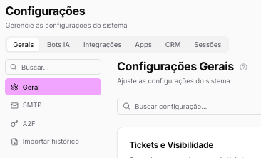

# Configurações Painel Admin

Copiar

Nesta página

1. [Configuração Administrador](../configuracao-administrador.md)

## Configurações Painel Admin

Configurações

A seção de **Configurações** reúne os ajustes operacionais do painel Admin: regras globais de comportamento da plataforma, integrações com ferramentas externas, configuração de apps, gestão de sessões ativas e recursos de CRM.

***

#### [Configurações Gerais](configuracoes-painel-admin/configuracoes-gerais.md)

Centro de controle global do painel Admin. Define as regras que regem o comportamento da plataforma para toda a equipe:

* **Visibilidade de tickets** — controle de quais atendimentos cada usuário pode visualizar
* **Tipo de listagem de mensagens** — ordem e formato de exibição das conversas
* **Transbordo de mensagem** — redistribuição automática de tickets quando o atendente está offline
* **Carência pós-atendimento** — tempo de espera antes de reabrir um ticket encerrado
* **Autenticação em 2 Fatores** — camada extra de segurança no login via WhatsApp ou SMS
* **Importar histórico de conversas** — migração de conversas anteriores para o sistema
* **SMTP** — configuração do servidor de e-mail do tenant para envios transacionais

***

#### [Bots e IA](configuracoes-painel-admin/bots-e-ia.md)

Gerenciamento centralizado de todas as ferramentas de automação e modelos de linguagem integrados ao sistema. Cada provedor é habilitado individualmente e pode ser configurado para responder automaticamente a todos os tickets ou ativado manualmente por canal.

**Construtores de Fluxo e Automação:**

* Typebot, N8N, Dify, Dialogflow — ferramentas para criação de fluxos conversacionais e automações externas integradas ao Prismabot

**Modelos de Inteligência Artificial (LLMs):**

* ChatGPT, Grok, Gemini, Qwen, Claude, Deepseek, Ollama, LM Studio — modelos de linguagem para automação de respostas e processamento de conversas

**Copiloto de IA:** Assistente em tempo real para apoio ao atendente. Oferece sugestões de resposta, tradução inline, resumo do contato, detecção de urgência e auxílio na criação de campanhas.

***

#### [Integrações](configuracoes-painel-admin/integracoes.md)

Habilitação e configuração das integrações com plataformas e serviços externos. Cada integração é ativada individualmente conforme a operação:

* BSP, Evolution API, UAZAPI, WuzAPI, Z-API — provedores de WhatsApp não oficial
* Hub NotificaMe — hub de canais (Facebook, Instagram, Webchat, E-mail)
* Webchat — chat embutido em sites
* SMS — envio de mensagens por SMS
* Google Calendar — sincronização de agendamentos
* GroqCloud — modelos de IA via Groq
* VAPI — integração de voz via VAPI
* Rocket.Chat — integração com Rocket.Chat
* Webhooks — disparos automáticos de eventos para URLs externas
* Rastreamento de conversões — integração com pixels e eventos de conversão

***

#### [Apps](configuracoes-painel-admin/apps-configuracoes.md)

Configuração dos aplicativos de marketplace e redes sociais conectados ao tenant:

* Google, LinkedIn, TikTok, YouTube
* Mercado Livre, OLX, WooCommerce, Nuvemshop
* Rocket.Chat

***

#### [Sessões](configuracoes-painel-admin/sessoes.md)

Visualização e gestão de todas as sessões ativas dos canais conectados ao tenant. Permite monitorar o status de conexão de cada canal em tempo real.

***

#### [CRM](configuracoes-painel-admin/crm.md)

Configurações dos recursos de CRM da plataforma: gestão de Kanbans, demandas e variáveis personalizadas para uso em automações e campos de contato.

Atualizado há 29 dias

Isto foi útil?