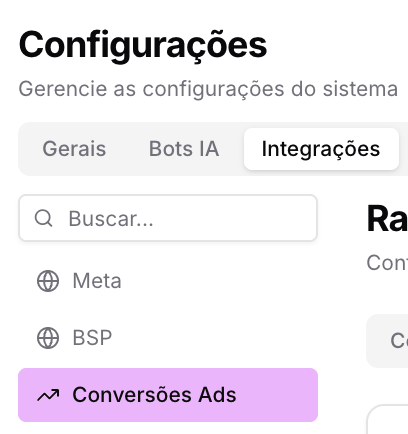
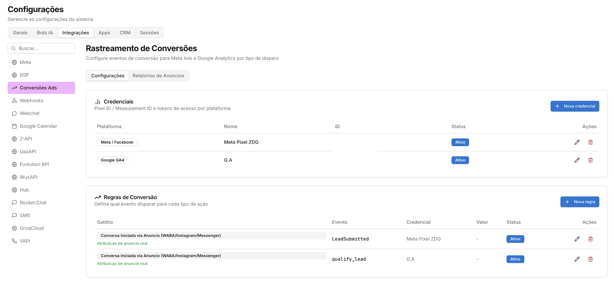
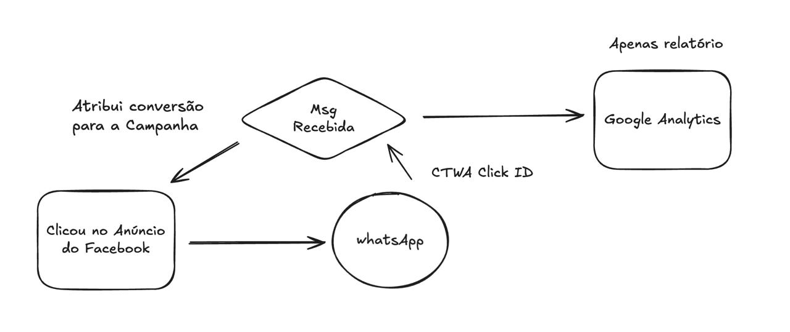
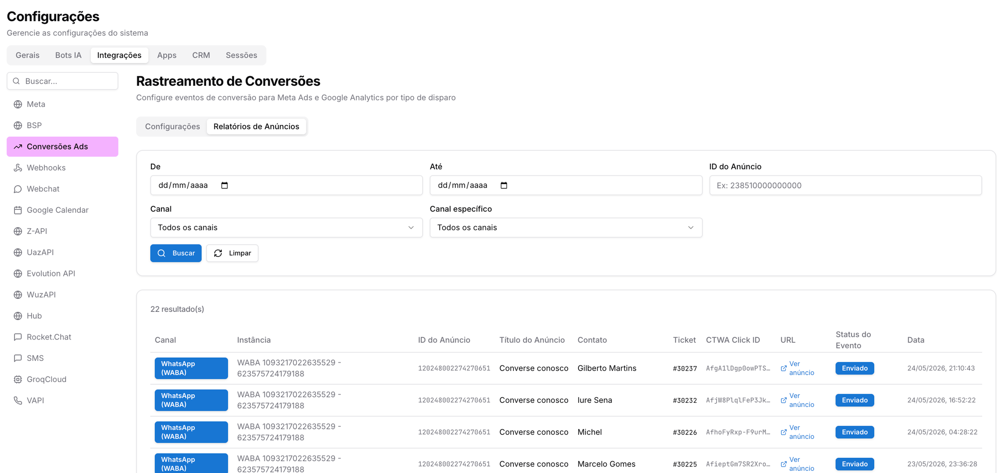
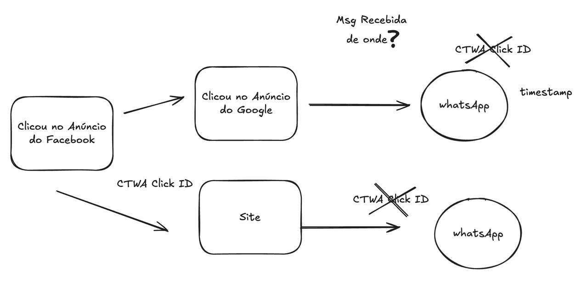

# Rastreamento de Conversões

**Disponível para o perfil:** Administrador

O **Rastreamento de Conversões** permite identificar e mensurar a eficácia dos seus anúncios pagos. Ele atribui as mensagens recebidas no Prismabot a campanhas específicas do **Meta Ads** (Facebook/Instagram) e gera relatórios para o **Google Analytics 4**. O sistema captura parâmetros técnicos, como o `CTWA Click ID`, permitindo que você saiba exatamente qual anúncio gerou cada atendimento e otimize o algoritmo da Meta para encontrar leads mais qualificados.

---

#### Como acessar a página

1. No menu principal, clique em **Configurações**.
2. Selecione a aba **Integrações**.
3. No submenu lateral esquerdo, clique em **Conversões Ads**.

---

#### Você verá a seguinte tela

A interface é dividida entre as abas de **Configurações**, onde são gerenciadas as chaves técnicas e regras, e a aba de **Relatórios de Anúncios**, onde as conversões processadas são listadas.

---

#### Vídeo Tutorial

---

#### Passo a passo de configuração e uso

**1. Configurar Credenciais de Plataforma**

Para que o sistema se comunique com as ferramentas de anúncio, você deve inserir as chaves de acesso:

* **Para Meta/Facebook:** Clique em **+ Nova credencial**, selecione a plataforma e insira o **Pixel ID** e o **Access Token** (gerado no Gerenciador de Eventos da Meta em Configurações > Conversions API).
* **Para Google GA4:** Clique em **+ Nova credencial**, selecione Google GA4 e insira o **Measurement ID** (ID de Mensuração) e a **API Secret** (Chave secreta do protocolo de mensuração).

**2. Definir Regras de Conversão**

Você precisa dizer ao sistema qual evento disparar quando uma mensagem chegar:

* Clique em **+ Nova regra**.
* **Gatilho:** Selecione "Conversa Iniciada via Anúncio (WABA/Instagram/Messenger)".
* **Evento (Meta):** Use preferencialmente o nome `LeadSubmitted` (ou `Lead`). Este nome é o que aparecerá no seu Gerenciador de Anúncios para otimização da campanha.
* **Evento (G.A):** Defina um nome como `qualify_lead` ou `generate_lead` para fins de relatório no Analytics.

**3. Configuração do Anúncio (Lógica CTWA)**

Para o rastreamento funcionar, a sua campanha na Meta deve ser do tipo **"Cliques para o WhatsApp"** (destino direto no WhatsApp).

* Quando o cliente clica no anúncio e envia a mensagem, a Meta anexa o parâmetro `CTWA Click ID`.
* O Prismabot identifica esse parâmetro automaticamente e devolve a conversão para a Meta e Google, confirmando que o clique resultou em uma conversa real.

**4. Consultar Relatórios de Anúncios**

Na aba **Relatórios de Anúncios**, você pode auditar os resultados em tempo real:

* **Filtros:** Busque por período, Canal específico ou pelo ID do Anúncio.
* **Análise de Dados:** A tabela exibirá o **Título do Anúncio**, o **Contato** vinculado, o número do **Ticket** e o código **CTWA Click ID**.
* **Status do Evento:** Verifique se o evento consta como "Enviado", confirmando que a plataforma de anúncios recebeu o dado de conversão.
* **URL:** Clique em "Ver anúncio" para visualizar a peça criativa que gerou aquele atendimento.

---

#### Avisos e Precauções

**Limitação de Atribuição:** O rastreamento **não funciona** se o anúncio enviar o cliente para um site/landing page intermediária. Quando o cliente clica em um botão de WhatsApp dentro de um site, o parâmetro original do anúncio (Click ID) se perde, impossibilitando a atribuição direta nesta página.

**Google Ads:** Diferente da Meta, o Google Ads não envia o ID de clique nativamente dentro da mensagem do WhatsApp. A integração com Google nesta página serve para alimentar o **Google Analytics (GA4)** com relatórios de volume, mas não otimiza lances de campanhas de pesquisa diretamente como ocorre no Facebook/Instagram.

**Conjunto de Dados:** Em alguns casos, a Meta cria um conjunto de dados automático para mensagens (ex: "Prismabot Event Data"). Verifique no seu Gerenciador de Eventos se o ID do Pixel que você está usando é o mesmo que está recebendo os eventos de mensagem.

Atualizado há 2 meses

Isto foi útil?