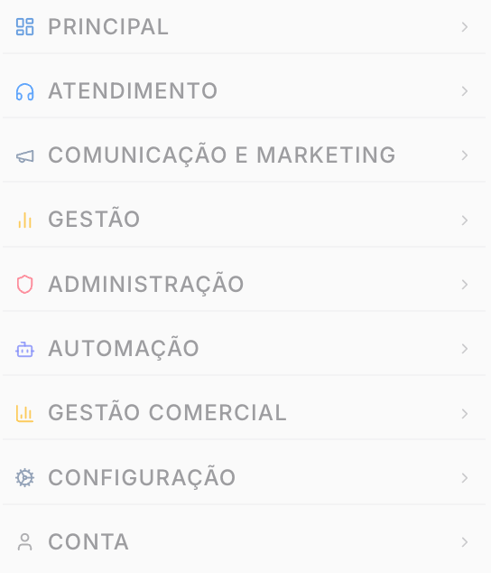

# Visão geral Admin

## Visão geral Admin

O **Painel Admin** é a interface utilizada pelos gestores e colaboradores de uma empresa que utiliza o Prismabot. Ele é segmentado para permitir tanto a operação diária quanto a configuração estratégica do negócio.

***

#### Entendendo os Níveis de Acesso

Para garantir a segurança dos dados e a organização da equipe, o painel do Tenant é dividido em três níveis hierárquicos de permissão:

**1. Administrador (Gestor)**

* **Função:** Responsável pela configuração estratégica da conta.
* **Permissões:** Tem acesso total e irrestrito a todos os menus e configurações. É o único que pode conectar canais (WhatsApp), gerenciar assinaturas e alterar configurações de API e Webhooks.

**2. Supervisor**

* **Função:** Perfil intermediário focado na gestão de pessoas e análise de métricas, sem poder alterar configurações estruturais críticas (como desconectar canais ou apagar a conta).
* **Regra de Visualização de Tickets:**
  * **Padrão:** O Supervisor visualiza todos os tickets e atendimentos (semelhante ao Admin).
  * **Restrito:** Existe uma configuração específica em Configurações > Geral chamada **"Remover privilégios de visualização do supervisor"**. Se ativada, o supervisor passa a ver apenas os tickets vinculados a ele ou à sua fila, comportando-se como um usuário comum neste aspecto.

**3. Usuário (Atendente)**

* **Função:** Focado exclusivamente na operação de atendimento.
* **Permissões:** Acesso restrito aos menus operacionais. Não visualiza relatórios gerenciais, configurações de sistema ou gestão de outros usuários.

***

#### Estrutura de Menus

O sistema Prismabot organiza as funcionalidades em oito menus principais. A visibilidade destes menus varia de acordo com o nível de acesso.

**1. Menus Operacionais (Visíveis para Todos)**

Estes menus são voltados para a execução do dia a dia.

1. **Principal**
   * **Home:** Tela inicial de boas-vindas.
   * **Dashboard:** Indicadores e métricas em tempo real.
2. **Atendimento**
   * **Atendimentos:** Central de chat e gestão de tickets.
   * **Chat Privado:** Comunicação interna entre membros da equipe.
   * **Contatos:** Lista e gestão de clientes.
3. **Comunicação e Marketing**
   * **Campanhas:** Criação de ações de marketing.
   * **Envio em Massa:** Disparos de mensagens para listas.
   * **Galeria:** Armazenamento de arquivos de mídia.
   * **Grupos:** Gestão de grupos de chat.
   * **Instagram / TikTok / YouTube:** Integrações com redes sociais.
   * **Mensagens Rápidas:** Atalhos para respostas padronizadas.
4. **Gestão**
   * **Agenda:** Compromissos e lembretes.
   * **Funil / Kanban:** Visualização do processo de vendas ou processos internos.
   * **Tarefas:** Gestão de atividades pendentes.
5. **Conta**
   * Informações do plano e perfil logado.

**2. Menus Administrativos (Restritos)**

Estes menus contêm configurações que alteram o comportamento do sistema. Por padrão, são visíveis apenas para **Admin** (e parcialmente para **Supervisor**, dependendo das permissões concedidas).

1. **Administração**
   * Canais: Configuração de conexões (WhatsApp, etc).
   * Equipes: Organização de departamentos.
   * Usuários: Cadastro e permissões de colaboradores.
2. **Automação**
   * **Agendamentos:** Mensagens programadas para envio futuro.
   * **Aniversários:** Automação de mensagens para datas comemorativas.
   * **Chat Flow:** Construtor de fluxos inteligentes de atendimento.
3. **Gestão Comercial**
   * **Avaliações:** Feedback dos atendimentos realizados.
   * **Etiquetas:** Tags para organização de conversas.
   * **Fechamento:** Registro de conclusão de tickets.
   * **Filas / Horário de Atendimento:** Regras de distribuição e disponibilidade.
   * **Log de Ligações / Notas / Protocolos:** Registros históricos e auditoria.
   * **Relatórios:** Extração de dados gerenciais.
   * **WaVoIP:** Recursos de telefonia integrada.
4. **Configuração**
   * **API:** Chaves de integração para sistemas externos.
   * **Configurações:** Ajustes globais do sistema.
   * **Log de Auditoria:** Histórico de ações realizadas no painel.

***

 3 meses
