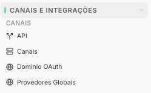

Copiar

Nesta página

1. [Configuração Superadmin](/configuracao-superadmin)

# Canais Superadmin

Esta seção reúne as configurações de canais e integrações que se aplicam a toda a instância — não a um tenant específico. São as credenciais e parâmetros globais que os tenants utilizam ao conectar seus próprios canais.

---

### [Tenant API (superadmin)](/configuracao-superadmin/canais-superadmin/tenant-api-superadmin)

Configurações da API expostas no nível da instância para integração e automação externas.

---

### [Canais Superadmin](/configuracao-superadmin/canais-superadmin)

Visão consolidada de todas as sessões de canais ativas em todos os tenants da instância. Permite monitorar o status de conexão de cada canal em tempo real sem precisar acessar cada tenant individualmente.

---

### [Domínio OAuth](/configuracao-superadmin/canais-superadmin/dominio-oauth-customizado)

Define o domínio próprio utilizado no fluxo de autenticação OAuth da instância. Necessário quando o Prismabot exige que o login via Meta seja feito através do domínio da sua marca.

---

### [Provedores de IA (Globais)](/configuracao-superadmin/canais-superadmin/provedores-de-ia-globais)

Cadastro das chaves de API de inteligência artificial (OpenAI, Gemini, Groq, etc.) no nível da instância. Quando configuradas aqui, ficam disponíveis para todos os tenants sem que cada um precise inserir suas próprias credenciais.

[AnteriorNotificações internas](/configuracao-superadmin/configuracoes/notificacoes-internas)[PróximoTenant API - Superadmin](/configuracao-superadmin/canais-superadmin/tenant-api-superadmin)

Atualizado há 26 dias

Isto foi útil?