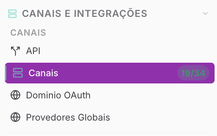
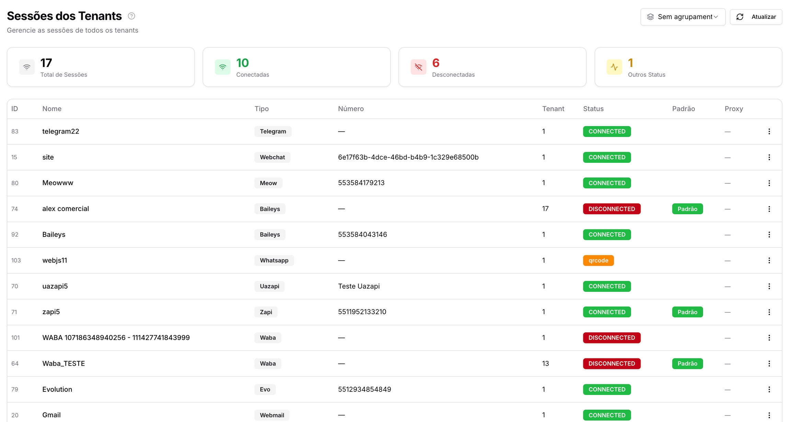
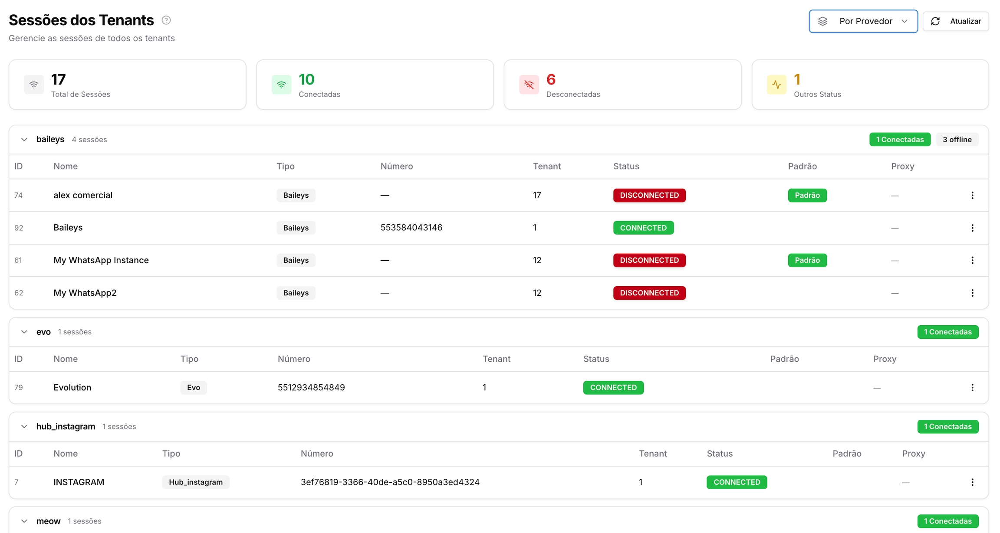

Copiar

Nesta página

1. [Configuração Superadmin](/configuracao-superadmin)
2. [Canais Superadmin](/configuracao-superadmin/canais-superadmin)

# Canais Superadmin (Sessões dos Tenants)

Gerencie as sessões/canais de todos os tenants

**Disponível para o perfil: Superadministrador**

A página de **Sessões dos Tenants** é o centro de monitoramento técnico do Superadministrador. Ela oferece uma visão macro e em tempo real de todas as conexões (instâncias) ativas na plataforma, independentemente do tenant ao qual pertencem. Através desta tela, é possível auditar a saúde das conexões de WhatsApp, Telegram, Webchat e outros canais.

As principais funções da supervisão de canais são:

* **Monitoramento de Uptime:** Identificação imediata de quantas sessões estão online ou offline em toda a infraestrutura;
* **Diagnóstico de Falhas:** Verificação de erros de conexão (ex: QR Code pendente ou desconexão) sem precisar acessar o painel individual do cliente;
* **Gestão de Recursos:** Exclusão de sessões inativas ou desnecessárias para otimização do servidor;
* **Organização por Provedor:** Agrupamento de sessões por tecnologia (Baileys, WABA, Evolution, etc.) para análise de estabilidade por tipo de canal.

**Caso de Uso:** Se um Superadministrador percebe uma instabilidade em uma tecnologia específica (ex: Evolution), ele pode utilizar o agrupamento por provedor nesta página para verificar se todas as sessões daquele tipo caíram simultaneamente, facilitando a identificação de problemas globais de API ou servidor.

---

#### 1. Indicadores de Status (Dashboard)

No topo da página, quatro cards fornecem um resumo quantitativo da operação:

* **Total de Sessões:** Soma de todas as conexões criadas no sistema;
* **Conectadas:** Sessões que estão online e operacionais (Status: `CONNECTED`);
* **Desconectadas:** Sessões que perderam o vínculo ou foram desconectadas manualmente (Status: `DISCONNECTED`);
* **Outros Status:** Sessões em estados intermediários, como aguardando leitura de QR Code ou em processo de inicialização.

---

#### 2. Visualização e Agrupamento

Dada a grande volumetria de dados, o sistema oferece três modos de exibição através do botão de **Agrupamento**:

1. **Sem Agrupamento:** Exibe uma lista linear de todas as sessões por ordem de criação;
2. **Por Tenant:** Agrupa as conexões dentro de blocos correspondentes a cada empresa cliente. Ideal para verificar a saúde de um cliente específico;
3. **Por Provedor:** Organiza as sessões pelo tipo de tecnologia (ex: Baileys, Meow, Telegram, Webchat). Útil para auditorias técnicas de infraestrutura.
4. 

---

#### 3. Entendendo a Tabela de Sessões

A listagem detalha as seguintes informações técnicas:

* **ID:** Identificador numérico da sessão;
* **Nome:** Nome atribuído à conexão pelo usuário;
* **Tipo:** A tecnologia/provedor utilizada (Waba, Baileys, Zapi, Telegram, etc.);
* **Número:** O identificador do canal (número de telefone ou ID da conta);
* **Tenant:** O ID da empresa proprietária daquela sessão (ex: Tenant 1 é a conta mestre);
* **Status:** Estado atual da conexão (ex: `CONNECTED`, `DISCONNECTED`, `qrcode`);
* **Padrão:** Indica se aquela é a conexão principal definida para o tenant;
* **Proxy:** Exibe se a sessão está utilizando um túnel de IP específico para a conexão.

---

#### 4. Ações Administrativas

* **Atualizar:** O botão **"Atualizar"** no canto superior direito recarrega o status de todas as sessões, garantindo que o administrador veja a situação exata do momento.
* **Excluir Sessão:** Ao clicar no menu de **três pontos (⋮)** ao final de cada linha, o administrador pode excluir a sessão permanentemente.

  + **Importante:** Esta ação é definitiva e removerá a instância do banco de dados, sendo necessário que o tenant configure o canal novamente caso deseje restabelecê-lo.

---

[AnteriorTenant API - Superadmin](/configuracao-superadmin/canais-superadmin/tenant-api-superadmin)[PróximoDomínio OAuth Customizado](/configuracao-superadmin/canais-superadmin/dominio-oauth-customizado)

Atualizado há 25 dias

Isto foi útil?