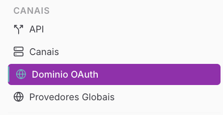
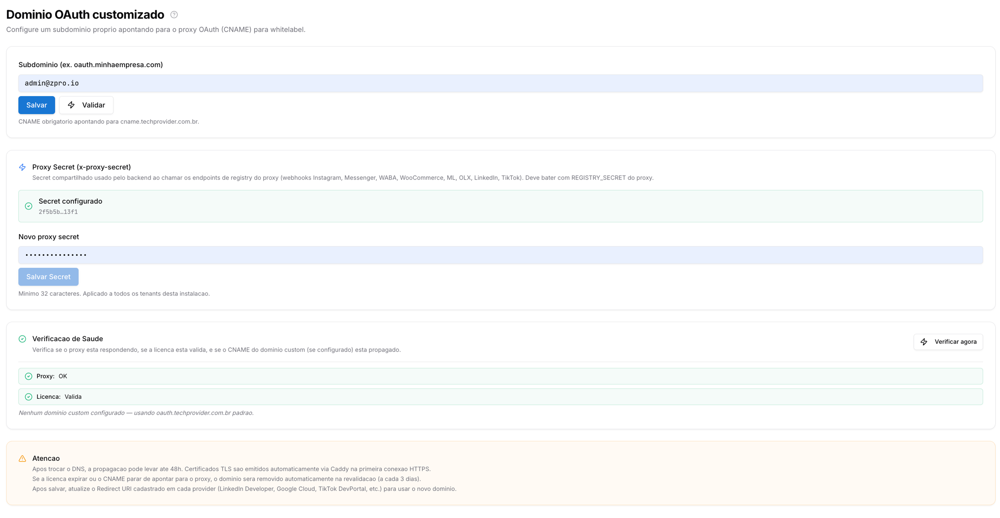

Copiar

Nesta página

1. [Configuração Superadmin](/configuracao-superadmin)
2. [Canais Superadmin](/configuracao-superadmin/canais-superadmin)

# Domínio OAuth Customizado

**Disponível para o perfil:** Superadmin

A página de **Domínio OAuth Customizado** permite que a empresa personalize a URL de redirecionamento utilizada nos processos de autorização de aplicativos externos. Esta é uma funcionalidade permite que os usuários finais visualizem o domínio da sua própria marca (ex: `oauth.suaempresa.com.br`) na barra de endereços ao autorizar integrações em vez de utilizar o domínio padrão do sistema.

#### Caso de uso

Uma empresa que revende a solução Prismabot como um serviço próprio (Prismabot) deseja que, ao conectar um Canal oficial, o cliente veja a URL da revendedora no modal de login do Facebook. Ao configurar o domínio customizado, a empresa elimina referências técnicas externas, aumentando a credibilidade e a confiança do usuário final no processo de autenticação.

#### Como acessar a página

Clique no Menu **Configurações**, subitem **Administração** e na aba **Domínio OAuth**.

---

#### Detalhamento e Passo a Passo por Seção

Abaixo, os campos e procedimentos estão divididos conforme a organização da tela:

**1. Configuração de Subdomínio**

Esta seção é responsável pelo apontamento técnico do seu endereço customizado.

* **Campo Subdomínio:** Insira o subdomínio completo que você deseja utilizar (Exemplo: `oauth.minhaempresa.com`).
* **Procedimento de Uso:**

  1. Antes de preencher este campo, acesse o seu provedor de DNS (Cloudflare, GoDaddy, etc.).
  2. Crie um registro do tipo **CNAME** apontando o subdomínio escolhido para `cname.techprovider.com.br`.
  3. No painel Prismabot, insira o endereço no campo e clique no botão **Validar**.
  4. Após a validação bem-sucedida, clique em **Salvar**.

**2. Proxy Secret (x-proxy-secret)**

Configura a chave de segurança compartilhada essencial para o registro de webhooks em provedores externos.

* **Campos Secret Configurado / Novo Proxy Secret:** Exibe o status da chave atual e permite a inserção de uma nova sequência.
* **Procedimento de Uso:**

  1. Crie uma chave de segurança forte (mínimo de 32 caracteres).
  2. Insira no campo **Novo proxy secret**.
  3. Clique em **Salvar Secret**.
  + **Importante:** Este valor deve ser idêntico ao definido na variável `REGISTRY_SECRET` do seu servidor proxy. Ele é usado ao chamar endpoints de registro do WABA, Instagram, Messenger, WooCommerce, entre outros.

**3. Verificação de Saúde**

Área de diagnóstico para garantir que todas as camadas da integração estão operacionais.

* **Campos Proxy e Licença:** Exibem "OK" e "Válida" quando o sistema está operando corretamente.
* **Procedimento de Uso:**

  1. Sempre que realizar uma alteração ou notar falhas em autorizações OAuth, clique no botão **Verificar agora**.
  2. O sistema checará se o proxy está respondendo, se o CNAME está propagado e se a licença do tenant permite o uso do domínio customizado.

---

#### Detalhamento Técnico e Avisos

**Atualização de Redirect URIs:** Após salvar e validar seu novo domínio nesta página, você deve obrigatoriamente acessar os consoles de desenvolvedor de cada provedor (LinkedIn Developer, Google Cloud, TikTok DevPortal, etc.) e atualizar o campo **Redirect URI** para utilizar o seu novo domínio customizado.

**URLs padrão para configuração no App da Meta**

Ao configurar o App no Facebook Developers (Meta), insira os seguintes valores nos campos correspondentes:

**URIs de redirecionamento do OAuth válidos**

* `https://oauth.techprovider.com.br/waba-signup`
* `https://oauth.techprovider.com.br/instagram-signup`
* `https://oauth.techprovider.com.br/facebook-signup`

**Domínios permitidos para o SDK do JavaScript**

* `https://oauth.techprovider.com.br`

Se você configurou um **domínio OAuth customizado**, substitua `oauth.techprovider.com.br` pelo seu próprio subdomínio em todas as URLs acima e atualize esses campos no console do Facebook Developers.

**Atenção:**

1. A propagação do DNS pode levar até **48 horas**.
2. Os certificados TLS (HTTPS) são emitidos automaticamente na primeira conexão.
3. Se a sua licença expirar ou o CNAME parar de apontar para o proxy, o domínio customizado será removido automaticamente na revalidação periódica (feita a cada 3 dias).

[AnteriorCanais Superadmin (Sessões dos Tenants)](/configuracao-superadmin/canais-superadmin/canais-superadmin-sessoes-dos-tenants)[PróximoProvedores de IA (Globais)](/configuracao-superadmin/canais-superadmin/provedores-de-ia-globais)

Atualizado há 23 dias

Isto foi útil?