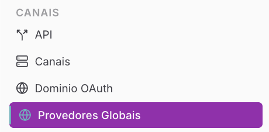
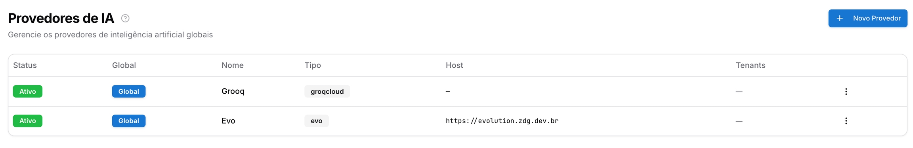
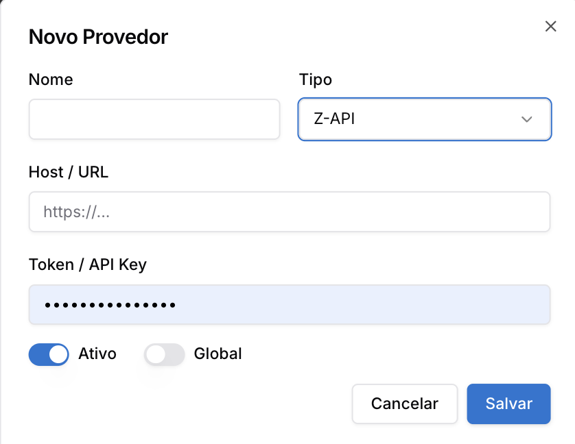
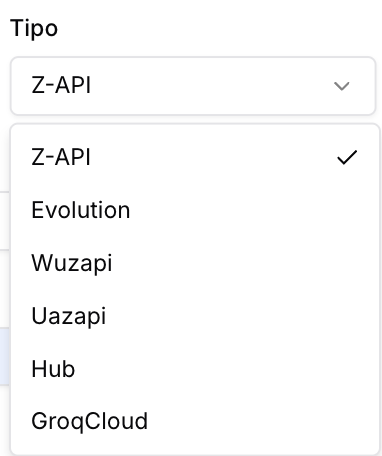
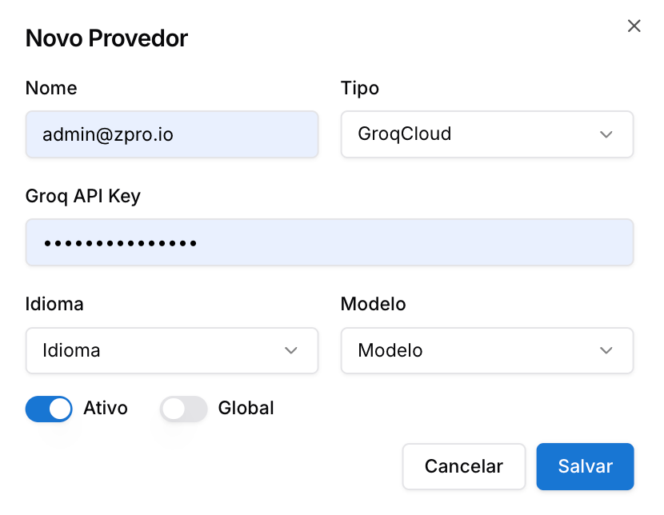

Copiar

Nesta página

1. [Configuração Superadmin](/configuracao-superadmin)
2. [Canais Superadmin](/configuracao-superadmin/canais-superadmin)

# Provedores de IA (Globais)

**Disponível para o perfil: Superadministrador**

O módulo de **Provedores de IA** permite que o Superadministrador centralize e gerencie as integrações com serviços de Inteligência Artificial que serão utilizados em toda a plataforma. Essas configurações são essenciais para habilitar recursos avançados como a transcrição de áudio em tempo real e o processamento de linguagem para chatbots.

O principal objetivo desta funcionalidade é garantir a **segurança e a praticidade**: ela evita que você exponha dados sensíveis (como URLs de Host e Tokens) no painel de cada cliente. Você configura a integração uma única vez no Superadmin e apenas libera o uso para as empresas (Tenants).

As principais funções dos provedores de IA são:

* **Transcrição de Áudio:** Conversão automática de mensagens de voz em texto;
* **Chatbots Inteligentes:** Integração com modelos de linguagem (LLMs) para respostas automatizadas;
* **Automações:** Processamento de comandos e dados via IA nos fluxos de atendimento;
* **Distribuição Flexível:** Possibilidade de oferecer o recurso de forma global ou apenas para clientes específicos.

**Caso de Uso:** Um administrador pode configurar uma chave da GroqCloud como "Global". Com isso, todos os tenants (clientes) do sistema ganham automaticamente o recurso de transcrição de áudio, melhorando a produtividade dos atendentes que não precisam ouvir áudios longos.

---

#### 1. Acessando a Página de Provedores

No menu lateral do painel Superadmin, localize a sessão de integrações e selecione a aba **"Provedores de IA"**. A tela exibe a listagem de todos os serviços configurados, indicando o status de atividade e a abrangência (Global ou por Tenant).

#### Formas de Conexão

O sistema permite que a conexão de canais (como Uazapi, Z-API ou Evolution) seja feita de duas formas distintas:

1. **Com Provedor Global:** Você (Superadmin) cadastra o Host e o Token único do serviço de API uma única vez nesta tela. Quando o cliente (Tenant) for adicionar um número no painel dele, ele apenas selecionará o provedor configurado, dará um nome ao canal e lerá o QR Code. O cliente não precisa preencher configurações avançadas nem tem acesso ao seu Token.
2. **Sem Provedor Global (Configuração Individual):** Caso não utilize um provedor global, o Administrador de cada empresa (Tenant) precisará inserir manualmente a URL do Host e o Token correspondente na tela de criação de canais, para só então realizar a leitura do QR Code.

---

#### 2. Cadastrando um Novo Provedor

Para adicionar uma nova integração de IA:

1. Clique no botão **"+ Novo Provedor"** no canto superior direito.
2. Preencha os campos obrigatórios:

* **Nome:** Identificação interna do provedor (ex: "Servidor Uazapi Principal").
* **Tipo de Provider:** Selecione o canal ou serviço correspondente (ex: Z-API, Uazapi, WABA, GroqCloud, etc.).

* **Host:** A URL base ou endereço do servidor da API externa.
* **Token:** A chave de segurança fornecida pelo serviço externo.
* **Ativo:** Define se o provedor está ligado ou desligado.
* **Disponível para todos os tenants:**

  + **Ativado:** Todos os clientes cadastrados na sua plataforma poderão utilizar esta conexão.
  + **Desativado:** A configuração será restrita e você precisará definir manualmente quais tenants terão acesso (veja a seção de Gerenciamento abaixo).

  3 Clique em **"Salvar"**.

---

#### 3. Configuração Específica: GroqCloud (Transcrição)

O **GroqCloud** possui um formulário específico para lidar com modelos de linguagem e transcrição de áudios (ex: Whisper). Ao selecionar "GroqCloud" no campo *Tipo de Provider*, a tela exibirá os seguintes campos:

* **GroqCloud Habilitado:** Chave principal para ligar ou desligar a integração.
* **API Key do GroqCloud:** Insira a chave gerada no painel de desenvolvedor da Groq.
* **Idioma do GroqCloud:** Defina o idioma padrão para as transcrições (ex: `pt`, `en`, `es`).
* **Modelo do GroqCloud:** Especifique o modelo que realizará o processamento (ex: `whisper-large-v3`, `whisper-large-v2`).

As opções de "Ativo" e "Disponível para todos os tenants" seguem o mesmo comportamento dos provedores de comunicação.

---

#### 4. Gestão e Ações (Menu ⋮)

Ao final de cada linha na listagem de provedores, o menu de **três pontos (⋮)** oferece as seguintes opções de gerenciamento:

* **Editar:** Permite alterar o nome, a URL do host ou atualizar o Token/API Key do provedor;
* **Gerenciar Tenants:** Esta opção fica disponível quando o provedor **não é global**. Ela permite que o administrador selecione manualmente quais tenants específicos terão permissão para utilizar aquele provedor de IA;
* **Excluir:** Remove permanentemente o provedor do sistema. **Atenção:** Caso o provedor esteja em uso em chatbots ou automações, essas funções deixarão de operar imediatamente após a exclusão.

---

#### Importante: Múltiplos Provedores

O sistema permite cadastrar múltiplos provedores do mesmo tipo. Isso possibilita, por exemplo, ter uma chave da GroqCloud para uso global e outras chaves específicas para tenants que possuem alto volume de tráfego e desejam arcar com seus próprios custos de API.

---

[AnteriorDomínio OAuth Customizado](/configuracao-superadmin/canais-superadmin/dominio-oauth-customizado)[PróximoRedes Sociais e Marketplaces](/configuracao-superadmin/redes-sociais-e-marketplaces)

Atualizado há 2 meses

Isto foi útil?