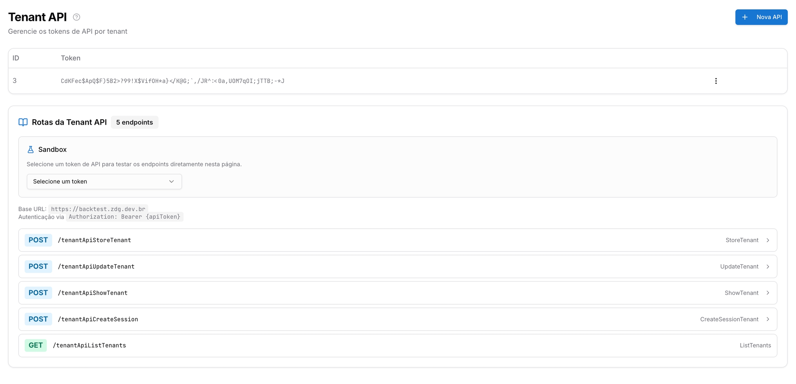
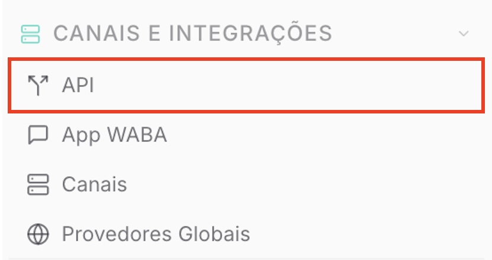
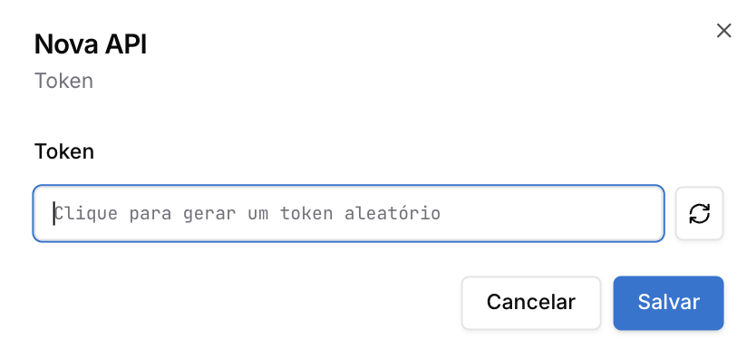
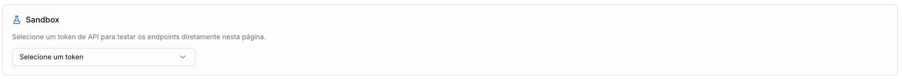
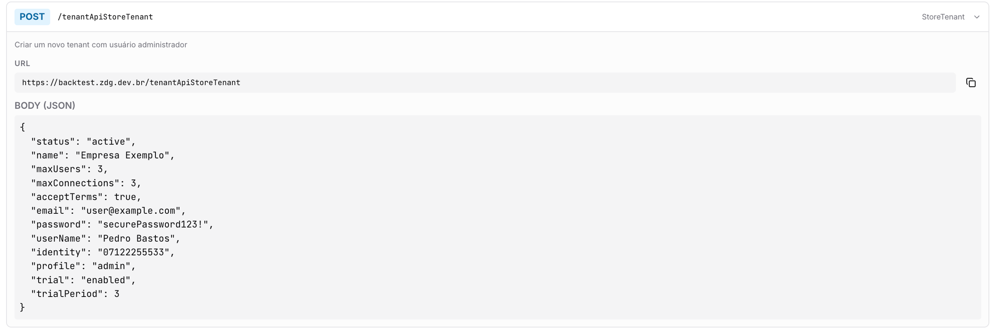

Copiar

Nesta página

1. [Configuração Superadmin](/configuracao-superadmin)
2. [Canais Superadmin](/configuracao-superadmin/canais-superadmin)

# Tenant API - Superadmin

API para Criação de Tenants

**Disponível para o perfil: Superadministrador**

A **Tenant API** é uma interface que permite ao Superadministrador gerenciar a criação e a manutenção de instâncias (tenants) de forma programática, sem a necessidade de intervenção manual no painel. Através desta API, sistemas externos podem se comunicar com o Prismabot para automatizar o ciclo de vida dos clientes.

As principais funções da Tenant API são:

* **Provisionamento Automático:** Criação de novos tenants e usuários administradores;
* **Gestão de Sessões:** Geração de chaves de acesso para instâncias específicas;
* **Sincronização de Dados:** Atualização e listagem de tenants para auditoria externa;
* **Integração com Billing:** Ativação ou suspensão de clientes via sistemas de cobrança terceiros.

**Caso de Uso:** Uma empresa que utiliza um CRM ou uma plataforma de vendas (como Hotmart, Kiwify ou site próprio) pode configurar um Webhook para que, assim que um novo pagamento for aprovado, o sistema chame a **Tenant API** do Prismabot. Isso garante que o cliente receba seus dados de acesso instantaneamente, sem que o Superadministrador precise criar a conta manualmente.

---

#### 1. Gerenciando Tokens de API

Para utilizar os endpoints, é necessário gerar um token de autenticação seguro.

1. No menu lateral do painel Superadmin, localize a sessão **"TENANTS E LICENCIAMENTO"** e acesse a aba **"Tenant API"**.

1. Clique no botão **"+ Nova API"** no canto superior direito.
2. Na janela pop-up, clique no ícone de **"Sincronizar/Gerar"** (setas circulares) para que o sistema crie um token aleatório e seguro.

1. Clique em **"Salvar"**.

**Aviso de Segurança:** O token gerado é a chave de acesso à infraestrutura do seu sistema. Copie e armazene-o em um local seguro. Ele será exibido de forma ofuscada na listagem por motivos de segurança.

---

#### 2. Sandbox e Testes de Endpoints

O sistema oferece um ambiente de **Sandbox** integrado para que o administrador realize testes de requisição diretamente na interface antes de implementar o código em produção.

* **Seleção de Token:** No campo "Sandbox", selecione o token que você acabou de criar.
* **Base URL:** O sistema exibirá a URL base da sua instalação para as chamadas de API (ex: `https://api.seusistema.com.br`).
* **Autenticação:** Todas as chamadas devem conter o header `Authorization: Bearer {apiToken}`.

---

#### 3. Rotas Disponíveis (Endpoints)

A API disponibiliza 5 endpoints principais para a gestão de tenants:

**[POST] /tenantApiStoreTenant**

Utilizado para criar um novo tenant e, simultaneamente, o seu usuário administrador inicial.

* **Campos obrigatórios no Body (JSON):** Nome da empresa, e-mail do admin, senha, CPF/CNPJ (identity) e perfil.
* **Configurações de limites:** Permite definir via API o `maxUsers` (limite de usuários) e `maxConnections` (limite de conexões de WhatsApp) que o cliente terá.

**[POST] /tenantApiUpdateTenant**

Permite atualizar os dados de um tenant existente, como alterar o status para `inactive` em caso de inadimplência ou aumentar seus limites de uso.

**[POST] /tenantApiShowTenant**

Retorna os detalhes técnicos de um tenant específico através de sua identificação.

**[POST] /tenantApiCreateSession**

Gera uma sessão de acesso para o tenant, permitindo integrações de login único ou comandos diretos na instância.

**[GET] /tenantApiListTenants**

Lista todos os tenants cadastrados no sistema, facilitando a conferência de dados e status de toda a base.

---

#### 4. Implementação Técnica

Ao expandir qualquer uma das rotas na interface, o Prismabot exibe o exemplo exato do **Body (JSON)** necessário para a requisição. Certifique-se de que o sistema externo envie os dados exatamente conforme o modelo proposto para evitar erros de validação.

#### Tópicos Relacionados

* [Gerenciamento de Tenants](https://ajuda.zdg.com.br/configuracao-superadmin/tenants-e-licenca/gestao-de-clientes-tenants)
* [Configuração de Planos e Trial](https://ajuda.zdg.com.br/configuracao-superadmin/tenants-e-licenca/planos-e-trial)

[AnteriorCanais Superadmin](/configuracao-superadmin/canais-superadmin)[PróximoCanais Superadmin (Sessões dos Tenants)](/configuracao-superadmin/canais-superadmin/canais-superadmin-sessoes-dos-tenants)

Atualizado há 4 meses

Isto foi útil?