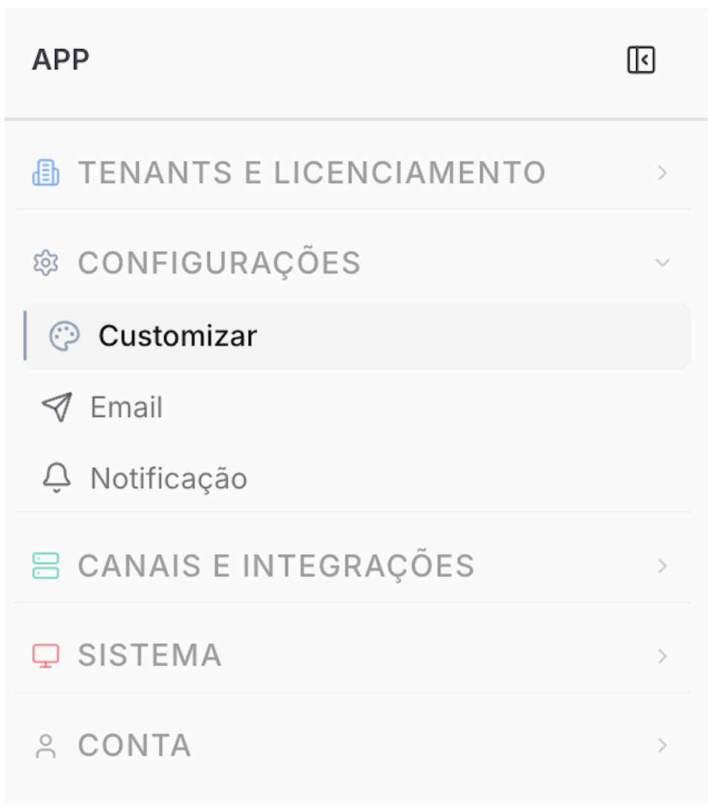

Copiar

Nesta página

1. [Configuração Superadmin](/configuracao-superadmin)

# Configurações Superadmin

A seção de **Configurações** reúne os ajustes globais da instância feitos pelo Superadministrador: a identidade visual da plataforma, o servidor de e-mail para envios transacionais e o sistema de notificações internas para os usuários.

---

### [Customizar (Prismabot)](/configuracao-superadmin/configuracoes/customizar-Prismabot)

Personalização completa da identidade visual da plataforma. Permite aplicar logotipo, cores e nome de marca próprios em toda a interface — transformando o Prismabot em um produto com a identidade do assinante ou revendedor. Os tenants (clientes) visualizarão apenas a marca definida aqui.

---

### [E-mail — SMTP](/configuracao-superadmin/configuracoes/e-mail-smtp-do-tenant)

Configuração do servidor de e-mail utilizado pela plataforma para envios transacionais automáticos. Necessário para que os usuários consigam recuperar a própria senha pelo sistema. Sem esta configuração, o fluxo de redefinição de senha não funcionará.

---

### [Notificações Internas](/configuracao-superadmin/configuracoes/notificacoes-internas)

Central de comunicados do Superadministrador para todos os usuários da plataforma. Permite enviar avisos, alertas e mensagens em tempo real, com monitoramento de entrega e leitura por usuário.

[AnteriorArtigo: Usando o Prismabot para Vários Clientes](/configuracao-superadmin/tenants-e-licenca/artigo-usando-o-Prismabot-para-varios-clientes)[PróximoCustomizar (Prismabot)](/configuracao-superadmin/configuracoes/customizar-Prismabot)

Atualizado há 29 dias

Isto foi útil?