Copiar

Nesta página

1. [Configuração Superadmin](/configuracao-superadmin)
2. [Configurações Superadmin](/configuracao-superadmin/configuracoes)

# Customizar (Prismabot)

Personalize a aparência e configurações do sistema

**Disponível para o perfil: Superadministrador**

O módulo de customização permite que o Superadministrador aplique a identidade visual de sua própria marca em toda a interface do sistema Prismabot. Através do modelo **Prismabot**, é possível transformar a plataforma em um produto proprietário, garantindo que os tenants (clientes) visualizem apenas os logotipos, cores e nomes definidos pelo administrador.

As principais funções da customização são:

* **Identidade Visual:** Padronização de cores e logos em todos os níveis de acesso;
* **Branding Móvel:** Configuração de ícones para instalação via PWA (Progressive Web App);
* **Experiência de Usuário:** Definição de estilos de tela de login e alertas sonoros personalizados;
* **Gestão Educacional:** Inclusão de tutoriais em vídeo para autoatendimento dos clientes;
* **Administração Avançada:** Ferramentas de acesso emergencial (Masterkey) e encerramento de sessões (Force Logout).

**Importante:** As configurações realizadas neste módulo possuem caráter global. Isso significa que todas as alterações de cores, branding, estilos de login e tutoriais serão aplicadas automaticamente a todos os tenants (clientes) cadastrados na plataforma, garantindo a padronização da sua marca em toda a infraestrutura do sistema.

---

#### 1. Acessando o Painel de Customização

Para iniciar as alterações, acesse o menu lateral do painel Superadmin e selecione a opção **"Customizar"**. O painel é dividido em abas que organizam cada aspecto da personalização.

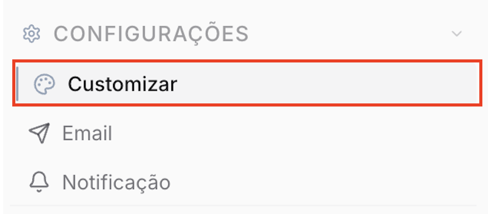

---

#### 2. Aba Cores

Nesta aba, define-se a paleta cromática que será aplicada em botões, menus e fundos do sistema.

* **Paletas Pré-definidas:** Opções de combinações de cores testadas (ex: Azul Padrão, Oceano, Floresta) para aplicação rápida.
* **Cores do Sistema (Manual):** Permite inserir códigos hexadecimais para cores específicas:

  + **Primária:** Cor principal de botões e links;
  + **Secundária:** Cor de menus e elementos de apoio;
  + **Destaque:** Cor para notificações e itens ativos;
  + **Status (Aviso, Positiva, Negativa):** Cores para alertas, sucessos e erros;
  + **Neutra e Clara:** Cores de fundos e textos.
* **Ação:** Clique em "Salvar" para aplicar ou "Resetar" para voltar ao padrão original.

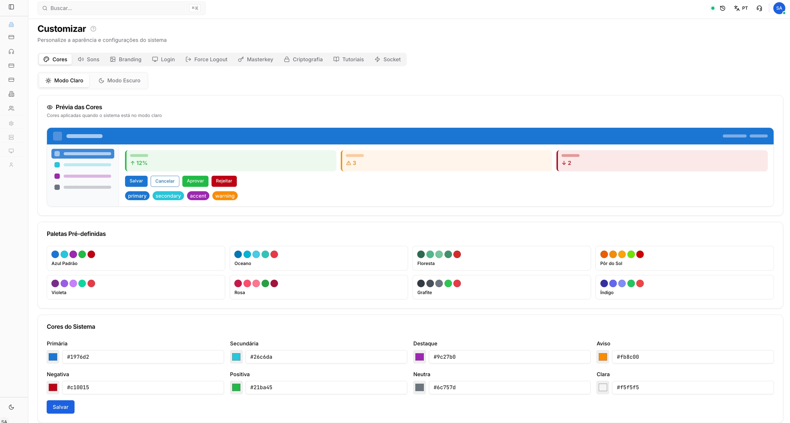

---

#### 3. Aba Sons

Configuração dos alertas sonoros emitidos pelo sistema para diferentes tipos de interações.

* **Chat / Atendimento:** Som ao receber novos tickets ou mensagens de clientes;
* **Chat Interno:** Som para mensagens entre colaboradores da empresa;
* **Chat Suporte:** Som para mensagens diretas no canal de suporte.
* **Formatos aceitos:** MP3, OGG e WAV.
* **Importante:** Utilize arquivos leves (recomendado até 500 KB) para não impactar o carregamento das páginas.

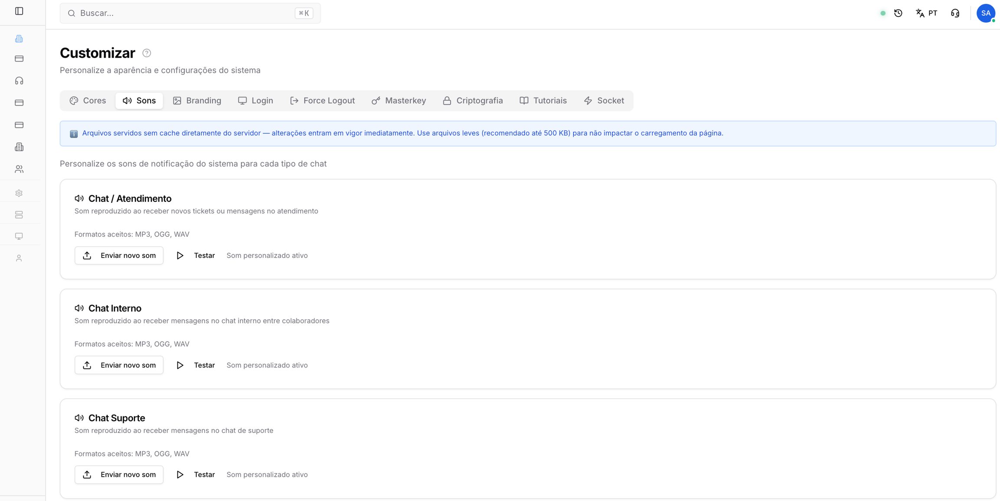

---

#### 4. Aba Branding

Define a identidade da marca e a presença do aplicativo em navegadores e dispositivos móveis.

* **Nome do Aplicativo:** Nome exibido na aba do navegador e em notificações de sistema;
* **Logotipo (Claro/Escuro):** Versões da marca para exibição nos respectivos temas visuais do sistema;
* **Favicon:** Pequeno ícone exibido ao lado do título na aba do navegador;
* **Ícone PWA:** Imagem quadrada (mínimo 512x512 px) usada ao instalar o app no celular ou desktop. O sistema gera automaticamente os tamanhos necessários para Android e iOS.

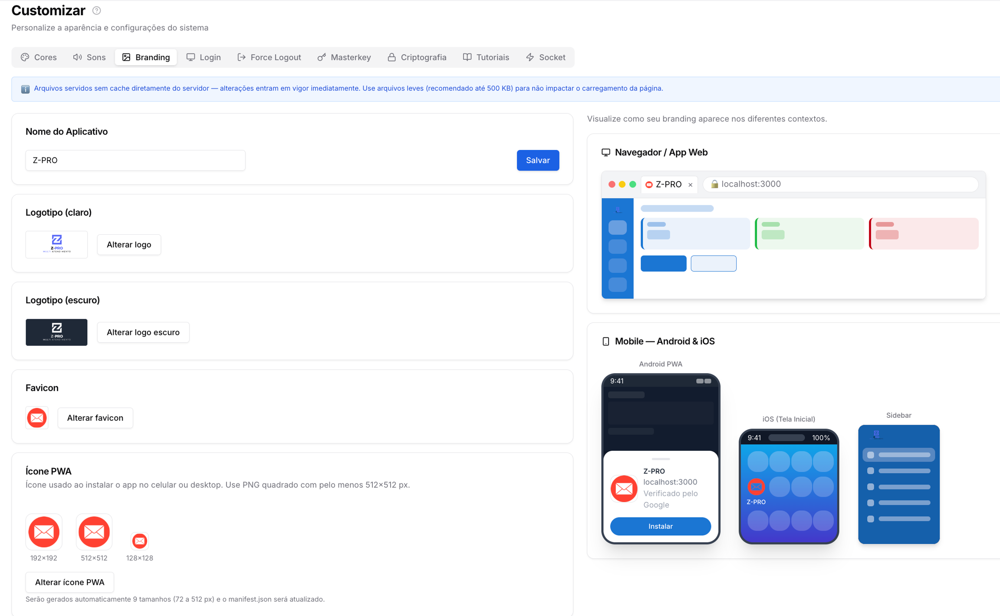

---

#### 5. Aba Login

Personalização visual da porta de entrada do sistema para todos os usuários.

* **Estilo de Tela:** Seleção entre **8 variantes visuais** (ex: Minimalista, Corporativo, Bold Hero, Glassmorphism).
* **Mídia Lateral:** Possibilidade de inserir uma imagem ou vídeo (JPG, PNG, MP4) que ocupará a lateral da tela de login nos estilos *Split Screen* ou *Bold Hero*.
* **Texto sobre a mídia:** Chave para habilitar a exibição do logotipo e descrição sobre o vídeo ou imagem lateral.

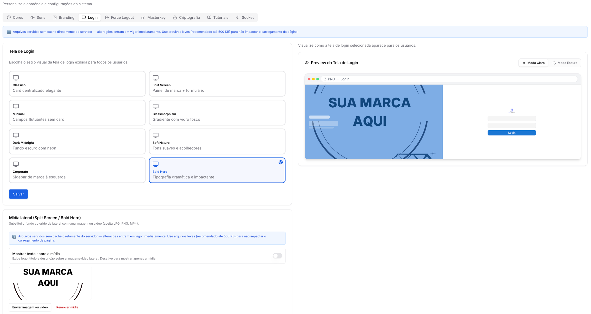

---

#### 6. Abas de Ferramentas Administrativas

Configurações técnicas e de segurança para o Superadministrador.

* **Force Logout:** Permite selecionar um tenant específico e desconectar obrigatoriamente todos os seus usuários ativos. Útil após atualizações ou mudanças de política.

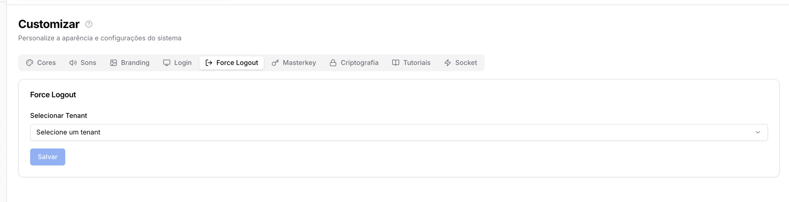

* **Masterkey:** Ferramenta de acesso administrativo. Ao habilitar e gerar uma chave, o administrador pode acessar o painel de qualquer usuário utilizando o e-mail do usuário e a Masterkey no campo de senha.

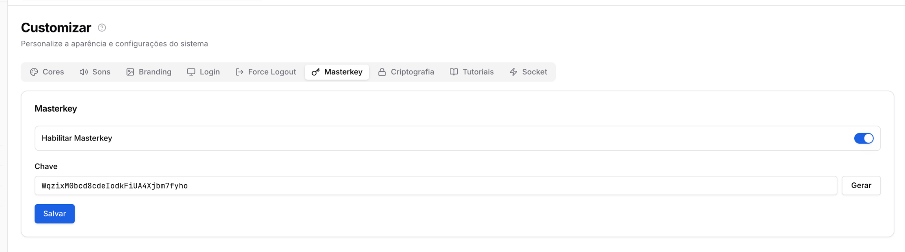

* **Criptografia:** Geração da chave mestra para proteção de dados sensíveis no banco de dados.

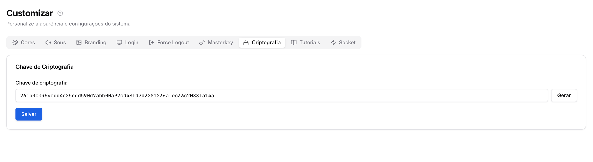

* **Socket (Otimização):** O **Modo Otimizado** deve ser ativado em instalações com alta carga (mais de 25 usuários simultâneos). Ele reduz a carga de consultas ao servidor através de técnicas de cache e debounce.

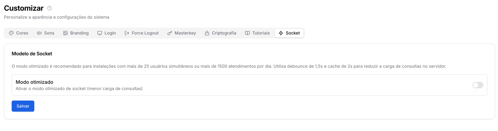

---

#### 7. Aba Tutoriais

Permite ao administrador criar uma biblioteca de vídeos para instruir os tenants sobre o uso da plataforma.

* **Cadastrando um Tutorial:** Clique em "Novo Tutorial", insira um título, descrição e o link do vídeo (YouTube/Vimeo).
* **Thumbnail:** Selecione uma imagem de capa para o vídeo.
* **Hierarquia:** Defina a ordem numérica em que os vídeos aparecerão para o cliente.
* **Visualização:** Uma vez ativos, os vídeos aparecem na aba "Tutoriais" do painel do usuário final, servindo como uma base de conhecimento Prismabot.

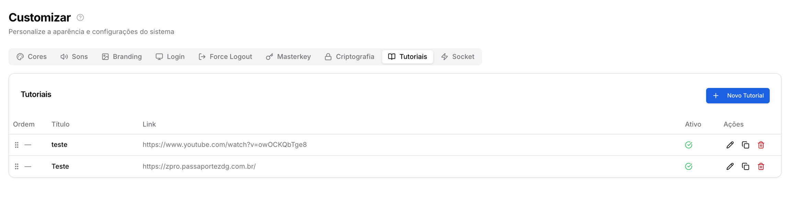

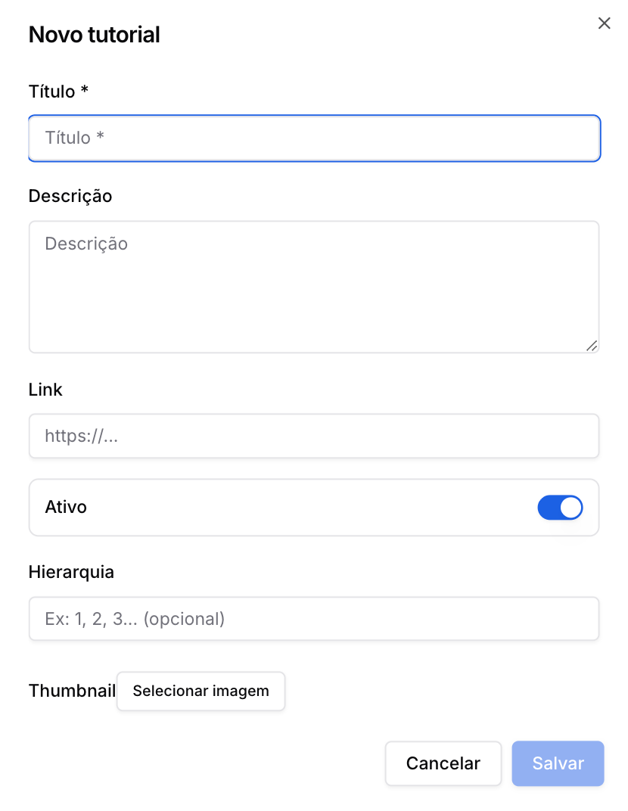

---

#### Importante: Cache de Arquivos

Arquivos de branding e sons são servidos diretamente do servidor sem cache. Isso garante que as alterações entrem em vigor imediatamente após o salvamento, sem a necessidade de o usuário limpar o navegador.

[AnteriorConfigurações Superadmin](/configuracao-superadmin/configuracoes)[PróximoE-mail - SMTP do Tenant](/configuracao-superadmin/configuracoes/e-mail-smtp-do-tenant)

Atualizado há 4 meses

Isto foi útil?