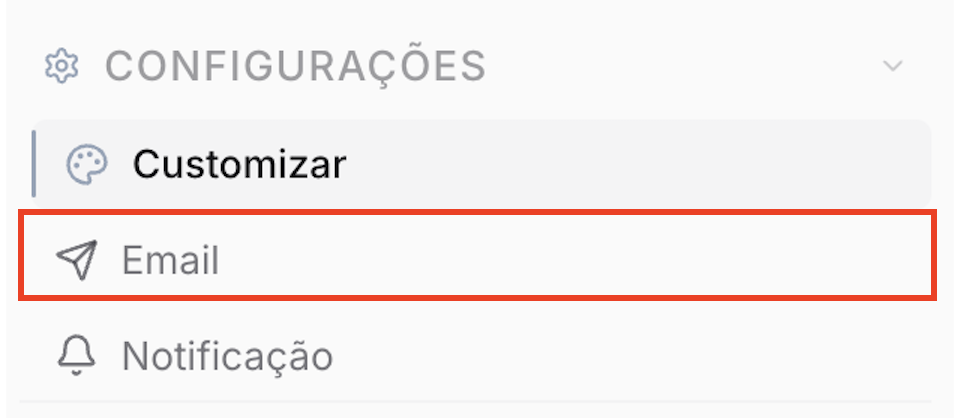
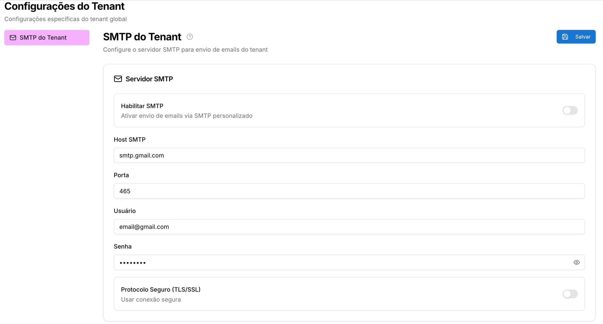

Copiar

Nesta página

1. [Configuração Superadmin](/configuracao-superadmin)
2. [Configurações Superadmin](/configuracao-superadmin/configuracoes)

# E-mail - SMTP do Tenant

**Disponível para o perfil: Superadministrador**

### Introdução

A configuração do SMTP é um passo técnico essencial para permitir que sua plataforma Prismabot envie e-mails transacionais automaticamente em seu nome.

Esta configuração é utilizada para o envio de e-mails transacionais do sistema, como **criação de usuário** e informações do **plataforma de atendimento** (nome da plataforma, logotipo, etc.). **Redefinição de senha não é enviada por este SMTP** — essa funcionalidade não está disponível por esse canal.

### Como acessar

Para acessá-lo, clique no ícone de ***Configurações - Email*** no menu lateral do seu painel.

Nessa seção você tem a opção das permissões para ativar a recuperação de senhas na tela de login:

Tipo de Permissão

Descrição

Habilitar SMTP

Quando ativo o sistema enviará informaçãos para o e-mail do usuário. Nesse caso, é necessário informar o servidor do e-mail, porta SMTP, usuário do e-mail e senha do e-mail.

Host SMTP

Servidor de email do seu host

Porta SMTP

Porta de acesso ao servidor SMTP

Usuário

Conta de e-mail

Senha

Senha do e-mail

Protocolo de Segurança (TLS/SSL)

Ativar protocolo seguro.

### Artigo: [Como recuperar a senha SMTP](/configuracao-superadmin/configuracoes/e-mail-smtp-do-tenant/como-recuperar-a-senha-smtp)

[AnteriorCustomizar (plataforma de atendimento)](/configuracao-superadmin/configuracoes/customizar-plataforma de atendimento)[PróximoComo recuperar a senha SMTP](/configuracao-superadmin/configuracoes/e-mail-smtp-do-tenant/como-recuperar-a-senha-smtp)

Atualizado há 24 dias

Isto foi útil?