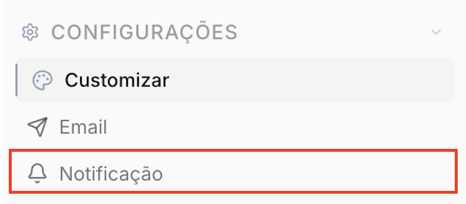
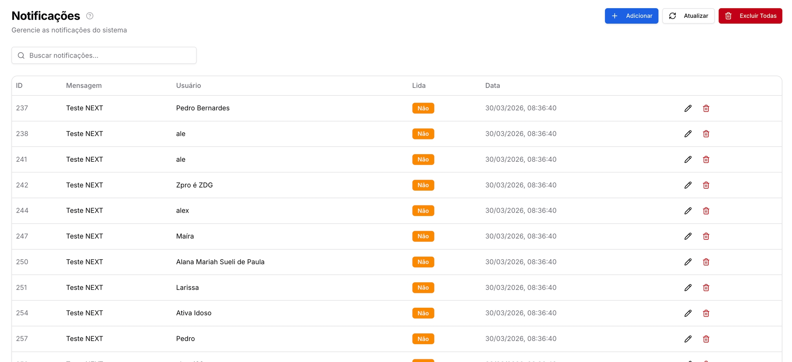
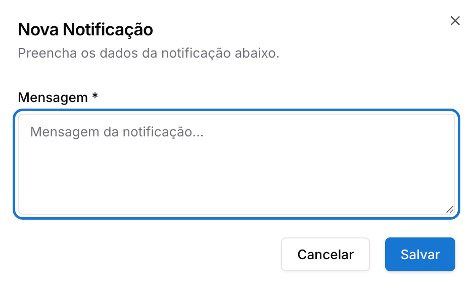

Copiar

Nesta página

1. [Configuração Superadmin](/configuracao-superadmin)
2. [Configurações Superadmin](/configuracao-superadmin/configuracoes)

# Notificações internas

Envio de notificações para todos os usuários do sistema

**Disponível para o perfil: Superadministrador**

O módulo de **Notificações Internas** funciona como uma central de comunicados e alertas emitida pelo Superadministrador para os usuários da plataforma. Ele permite não apenas o envio de avisos, mas também o monitoramento em tempo real de quem recebeu e se a mensagem já foi visualizada.

---

#### 1. Acessando a Página de Notificações

No menu lateral do painel Superadmin, localize a sessão de configurações e selecione a aba **"Notificação"**.

---

#### 2. Entendendo a Listagem de Notificações

A tela principal exibe o histórico detalhado de todas as notificações disparadas. Cada linha representa o recebimento da mensagem por um usuário específico:

* **ID:** Identificador único da notificação no banco de dados;
* **Mensagem:** O conteúdo do texto enviado;
* **Usuário:** O nome do colaborador ou administrador que recebeu o aviso;
* **Lida:** Status de visualização. Exibe **"Não"** (em laranja) se o usuário ainda não abriu a notificação, e **"Sim"** após a leitura;
* **Data:** Carimbo de data e hora exata em que a notificação foi gerada.

---

#### 3. Criando uma Nova Notificação

Para emitir um novo comunicado:

1. Clique no botão **"+ Adicionar"** no canto superior direito.
2. Na janela pop-up, preencha o campo **"Mensagem"** com o conteúdo desejado.
3. Clique em **"Salvar"**.

**Comportamento:** O sistema processará o envio e a mensagem aparecerá instantaneamente (ou no próximo login) para os usuários. Na listagem do Superadmin, novas entradas serão criadas para cada usuário destinatário com o status "Lida: Não".

---

#### 4. Ações e Gestão de Histórico

O administrador possui controle total sobre as mensagens enviadas através dos seguintes comandos:

* **Editar (Ícone Lápis):** Permite corrigir o texto de uma notificação já enviada;
* **Excluir (Ícone Lixeira):** Remove o registro de notificação de um usuário específico;
* **Atualizar:** Recarrega a tabela para verificar mudanças no status de leitura ("Lida");
* **Excluir Todas:** Botão vermelho que limpa todo o histórico de notificações do sistema para todos os usuários.

[AnteriorComo recuperar a senha SMTP](/configuracao-superadmin/configuracoes/e-mail-smtp-do-tenant/como-recuperar-a-senha-smtp)[PróximoCanais Superadmin](/configuracao-superadmin/canais-superadmin)

Atualizado há 4 meses

Isto foi útil?