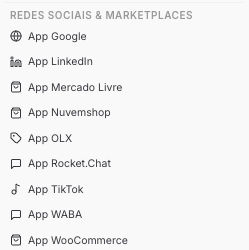

Copiar

Nesta página

1. [Configuração Superadmin](/configuracao-superadmin)

# Redes Sociais e Marketplaces

Aqui são registrados os **Apps** das plataformas externas que precisam ser configurados no nível do superadmin para ficarem disponíveis aos tenants. Cada item representa um aplicativo cadastrado diretamente na plataforma de origem (Meta, Google, TikTok, etc.) e conectado à instância Prismabot.

Essas configurações são feitas uma única vez pelo superadmin. Após configuradas, os tenants conseguem conectar seus próprios canais sem precisar registrar um App próprio.

---

### [App WABA](/configuracao-superadmin/redes-sociais-e-marketplaces/app-waba-superadmin)

Registra o aplicativo da API Oficial do WhatsApp Business (Meta) na instância. Necessário para que os tenants conectem números WABA via Login Incorporado.

---

### [App Google](/configuracao-superadmin/redes-sociais-e-marketplaces/google-superadmin)

Configura o App Google para habilitar integrações que dependem de autenticação OAuth do Google — como Google Calendar, Google Drive e login social.

---

### [App LinkedIn](/configuracao-superadmin/redes-sociais-e-marketplaces/linkedin-superadmin)

Registra o App LinkedIn para habilitar o canal de mensagens do LinkedIn nos tenants.

---

### [App TikTok](/configuracao-superadmin/redes-sociais-e-marketplaces/tiktok-superadmin)

Configura o App TikTok para habilitar o atendimento de comentários e DMs do TikTok nos tenants.

---

### [App Mercado Livre](/configuracao-superadmin/redes-sociais-e-marketplaces/mercado-livre-superadmin)

Registra o App Mercado Livre para habilitar o atendimento de perguntas e mensagens de compradores diretamente na plataforma.

---

### [App Nuvemshop](/configuracao-superadmin/redes-sociais-e-marketplaces/nuvemshop-superadmin)

Configura o App Nuvemshop para integrar lojas e habilitar o atendimento de pedidos e clientes de e-commerce via Nuvemshop.

---

### [App OLX](/configuracao-superadmin/redes-sociais-e-marketplaces/olx-superadmin)

Configura o App OLX para integrar anúncios e conversas da OLX ao atendimento dos tenants.

---

### [App Rocket.Chat](/configuracao-superadmin/redes-sociais-e-marketplaces/rocket.chat-superadmin)

Configura a integração com o Rocket.Chat para uso nos tenants da instância.

---

### [App WooCommerce](/configuracao-superadmin/redes-sociais-e-marketplaces/woocommerce-superadmin)

Registra o App WooCommerce para conectar lojas e habilitar o atendimento de pedidos e clientes de e-commerce.

[AnteriorProvedores de IA (Globais)](/configuracao-superadmin/canais-superadmin/provedores-de-ia-globais)[PróximoGoogle - Superadmin](/configuracao-superadmin/redes-sociais-e-marketplaces/google-superadmin)

Atualizado há 26 dias

Isto foi útil?