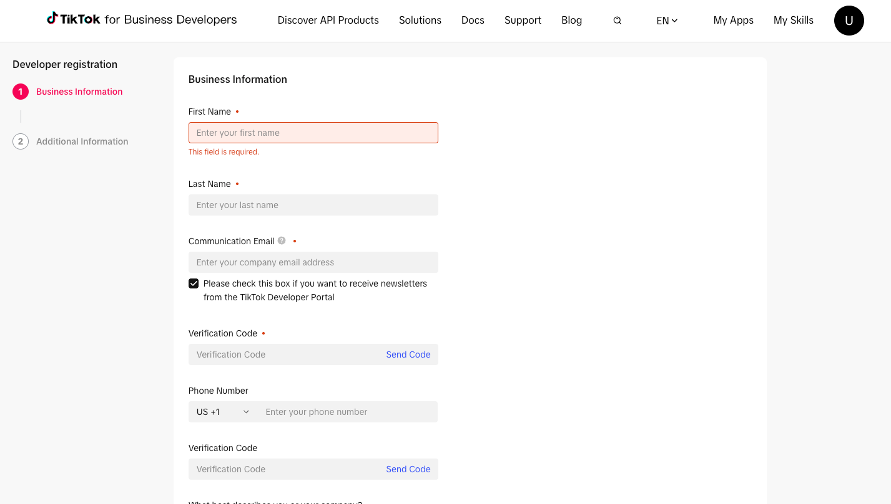
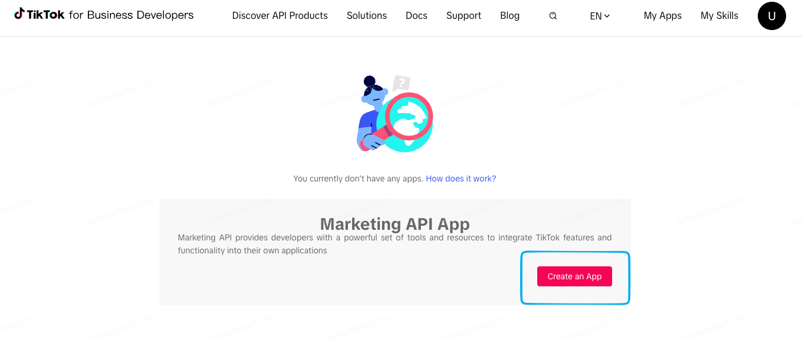

Copiar

Nesta página

1. [Configuração Superadmin](/configuracao-superadmin)
2. [Redes Sociais e Marketplaces](/configuracao-superadmin/redes-sociais-e-marketplaces)

# Como criar um App no TikTok for Business Developers

Esta documentação detalha o processo para criar uma conta de desenvolvedor e um **App** na plataforma **TikTok for Business Developers**. Esse App é o pré-requisito para integrar o **TikTok** ao Prismabot, permitindo que sua equipe **visualize e responda comentários de conteúdo anunciado** (Ads / Spark Ads) diretamente no painel de atendimento.

**Pré-requisitos:**

* Uma conta comercial no TikTok (**TikTok Business Account**).
* Dados da empresa à mão: nome, e-mail comercial e telefone para o cadastro de desenvolvedor.
* Saber que a integração do Prismabot acessa **apenas comentários de conteúdo anunciado** (Ads / Spark Ads) — isso impacta o que você vai descrever para a TikTok nas próximas etapas.

---

### Como funciona a integração

A integração de **Comentários de Redes Sociais** do Prismabot usa a API do TikTok para:

* Listar as publicações de anúncios (Ads / Spark Ads) do anunciante.
* Buscar os comentários de **nível primário** feitos nessas publicações.
* Permitir que a equipe responda aos comentários diretamente do painel Prismabot.

**Atenção ao escopo:** a TikTok aprova o App com base na descrição de uso que você fornece. Como o Prismabot acessa **somente conteúdo anunciado** (não conteúdo orgânico) e **somente comentários de nível primário**, descreva exatamente esse escopo nos campos de revisão — não amplie o uso descrito.

---

### Etapa 1: Criar conta no TikTok for Business Developers

1. Acesse o portal de registro:

   * <https://business-api.tiktok.com/portal/developer/register>
2. Preencha a etapa **Business Information**: **First Name**, **Last Name**, **Communication Email** (com confirmação por código de verificação) e, opcionalmente, **Phone Number** (também com código de verificação).
3. Avance para a etapa **Additional Information** e conclua o cadastro.

---

### Etapa 2: Criar um novo App

1. Com o cadastro de desenvolvedor concluído, acesse **My Apps** no menu superior.
2. Se ainda não houver nenhum App, a TikTok exibirá o card **Marketing API App**.
3. Clique em **Create an App**.

---

### Etapa 3: Preencher os dados do App

Preencha o formulário **Create New App**:

Campo

Como preencher

**App name**

Nome do seu App (ex.: o nome da sua empresa/marca).

**App description**

**Em inglês**, descreva o uso real da integração (máx. **500 caracteres**). Ver sugestão de texto abaixo.

**Advertiser redirect URL**

Campo **fixo** — `https://oauth.techprovider.com.br/callback.html`.

**Importante:** o **Advertiser redirect URL** deve ser cadastrado **exatamente** como `https://oauth.techprovider.com.br/callback.html`. Qualquer divergência impede o funcionamento da integração.

Sugestão de texto para **App description\*** (439/500 caracteres):

*\*Substitua Prismabot pelo nome do seu sistema e crie variações de acordo com o contexto do seu negócio.*

**App logo:** envie uma imagem **512x512**, em **JPG, JPEG ou PNG**, com até **50MB**.

---

### Etapa 4: Selecionar as permissões (Scope of permission)

No campo **Scope of permission**, busque e marque apenas as permissões necessárias para o caso de uso de comentários em anúncios:

Categoria

Permissão

**TikTok Accounts → Account User**

**Get Account User Basic Info**

**TikTok Accounts → Account Post Content**

**Read Video Library**

**Atenção:** Marcar escopos não utilizados (ex.: Ads Management, Creative Management, Pixel Management) pode atrasar ou reprovar a revisão, já que a descrição do App precisa corresponder ao que de fato é solicitado.

Após selecionar as permissões, clique em **Submit**.

---

### Etapa 5: Revisão da TikTok

A TikTok pode solicitar informações complementares antes de aprovar o App. Os campos mais comuns e como respondê-los:

Campo solicitado

O que informar

**Main business scope of the company**

Descreva a empresa como uma plataforma de atendimento omnichannel, licenciada (B2B, white-label, multi-tenant) para outras empresas/agências.

**Required permission and main application scenarios**

Comment Management, escopado a Ads/Spark Ads: listar publicações, buscar comentários de nível primário e responder pelo painel.

**Scope of the account authorization**

Cada empresa licenciada autoriza **sua própria** conta TikTok Business via OAuth; vocês não autorizam contas de terceiros não relacionados à sua base de clientes.

**Cooperative clients/account**

ID e nome de uma conta de anunciante real usada como referência na submissão.

---

### Resumo das Funcionalidades

Funcionalidade

Onde acessar

Criar conta de desenvolvedor

business-api.tiktok.com/portal/developer/register

Criar App

My Apps → Marketing API App → Create an App

Definir permissões

Scope of permission → TikTok Accounts → Account User / Account Post Content

---

### Encerramento

Com o App aprovado pela TikTok, guarde o **App ID** e o **App Secret** gerados — eles serão usados na próxima etapa, de conexão do canal TikTok dentro do Prismabot.

---

### Possíveis Erros e Soluções

#### TikTok solicita informações adicionais na revisão

**Causa:** a TikTok pede detalhamento do escopo de negócio e de autorização de contas antes de aprovar o App.

**Solução:** responda usando os campos da tabela da Etapa 5, mantendo a descrição alinhada ao uso real (somente comentários em conteúdo anunciado).

#### Redirect URL rejeitado ou integração não autentica

**Causa:** o **Advertiser redirect URL** cadastrado no App diverge do esperado.

**Solução:** verifique se está cadastrado **exatamente** como `https://oauth.techprovider.com.br/callback.html`.

[AnteriorTiktok - Superadmin](/configuracao-superadmin/redes-sociais-e-marketplaces/tiktok-superadmin)[PróximoApp Waba - Superadmin](/configuracao-superadmin/redes-sociais-e-marketplaces/app-waba-superadmin)

Atualizado há 1 mês

Isto foi útil?