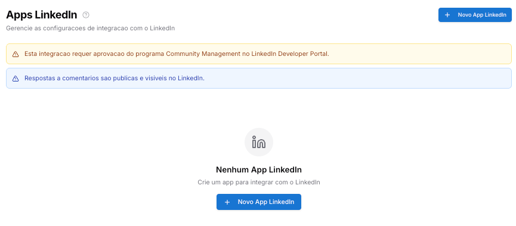
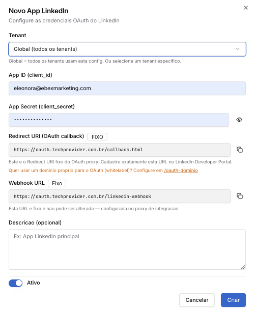

Copiar

Nesta página

1. [Configuração Superadmin](/configuracao-superadmin)
2. [Redes Sociais e Marketplaces](/configuracao-superadmin/redes-sociais-e-marketplaces)

# LinkedIn - Superadmin

**Funcionalidade em beta:** este recurso foi lançado recentemente e ainda está em fase de testes. Alguns comportamentos podem apresentar instabilidade ou não funcionar como esperado em todos os cenários. Estamos coletando feedback e aplicando melhorias e correções ao longo das próximas versões. Se encontrar algum problema, entre em contato com o suporte.

Esta documentação detalha o processo para integrar a **página da empresa no LinkedIn** à plataforma **Prismabot**, permitindo que sua equipe receba e responda **comentários em posts da página** diretamente no painel de atendimento como tickets.

**Configuração global vs. por tenant:** os apps cadastrados aqui ficam disponíveis para todos os tenants. A conexão e o gerenciamento do número WABA de cada tenant é feito individualmente pelo Administrador em Configurações → Integrações

**Pré-requisitos:**

* Uma **página de empresa** ativa no LinkedIn.
* Um aplicativo criado no **LinkedIn Developer Portal** (<https://developer.linkedin.com>).
* Aprovação do programa **Community Management API** no LinkedIn Developer Portal.
* Acesso de **Super Admin** na sua instalação do Prismabot.

**Páginas de referência das telas do admin:**
[Apps — LinkedIn](/configuracao-administrador/configuracoes-painel-admin/apps-configuracoes/linkedin-configuracao-apps)

[Canal LinkedIn](/configuracao-administrador/administracao-painel-admin/canais-de-comunicacao/canal-linkedin)

---

#### Como funciona a integração

Após a configuração:

* Cada **comentário** feito em posts da sua página no LinkedIn criará um **ticket** dentro do Prismabot.
* Sua equipe poderá responder os comentários diretamente pelo painel de atendimento.
* O token de acesso é renovado **automaticamente** pelo Prismabot a cada 60 dias.

**Atenção:**

* **Respostas enviadas pelo Prismabot são públicas** — ficam visíveis no LinkedIn para qualquer pessoa que acesse o post.
* Esta integração é voltada para **comentários em posts da página**, não para mensagens diretas (Direct Messages).
* Uma configuração **Global** (sem tenant) será aplicada a **todos os tenants** que não tiverem uma configuração própria.

---

#### Etapa 1: Criando o Aplicativo no LinkedIn Developer Portal

1. Acesse o **LinkedIn Developer Portal**: <https://developer.linkedin.com>
2. Faça login com sua conta LinkedIn.
3. Clique em **Create App** e preencha:

   * **App name:** Nome do aplicativo (ex: "Prismabot Integração")
   * **LinkedIn Page:** Selecione a página da empresa que será integrada
   * **App Logo:** Obrigatório pelo LinkedIn
4. Clique em **Create app**.

---

#### Etapa 2: Solicitando Acesso ao Community Management API

A integração de comentários exige aprovação de um programa específico do LinkedIn.

1. Dentro do app criado, acesse a aba **Products**.
2. Localize **Community Management API** e clique em **Request access**.
3. Preencha o formulário explicando o caso de uso (ex: "Gerenciar e responder comentários da página da empresa através de uma Prismabot omnichannel").
4. Aguarde a aprovação do LinkedIn.

**Sem a aprovação do Community Management API, a integração não funcionará.** O LinkedIn precisa revisar e aprovar o uso antes de qualquer configuração no Prismabot.

---

#### Etapa 3: Obtendo as Credenciais

Com o app criado e o acesso aprovado:

1. No LinkedIn Developer Portal, acesse seu app e clique na aba **Auth**.
2. Copie o **Client ID** e o **Client Secret**.
3. Na seção **Authorized redirect URLs for your app**, adicione:

   * `https://oauth.techprovider.com.br/callback.html`

O **Redirect URI** deve ser cadastrado **exatamente** como `https://oauth.techprovider.com.br/callback.html` no LinkedIn Developer Portal. Qualquer divergência impedirá o funcionamento da integração.

**Quer usar um domínio próprio (Prismabot)?** Configure-o previamente em `/oauth-dominio` dentro do Prismabot e use esse domínio como Redirect URI no LinkedIn Developer Portal.

---

#### Etapa 4: Configurando no Painel Super Admin

1. Faça login no Prismabot com o usuário **Super Administrador**.
2. No menu lateral, localize **Redes Sociais / Marketplace → App LinkedIn**.

1. Clique em **+ Novo App LinkedIn** e preencha:

Campo

Como preencher

**Tenant**

Selecione **Global** ou um tenant específico

**App ID (client\_id)**

Cole o Client ID obtido no LinkedIn Developer Portal

**App Secret (client\_secret)**

Cole o Client Secret obtido no LinkedIn Developer Portal

**Redirect URI (OAuth callback)**

Campo **fixo** — `https://oauth.techprovider.com.br/callback.html`

**Webhook URL**

Campo **fixo** — `https://oauth.techprovider.com.br/linkedin-webhook`

**Descrição**

Identificação opcional — ex: "App LinkedIn principal"

**Ativo**

Mantenha ativado

1. Clique em **Criar**.

**Global vs. Tenant específico:** A configuração **Global** funciona como fallback — qualquer tenant sem configuração própria utilizará a global. Para clientes individuais (revendedores SaaS), o ideal é configurar **por tenant**.

---

#### Etapa 5: Criando o Canal LinkedIn no Painel Admin

1. Acesse o **painel administrativo** do tenant integrado.
2. Vá em **Canais → Adicionar Canal**, selecione o tipo **LinkedIn**, dê um nome e clique em **Criar Canal**.
3. Após a criação, clique em **Conectar** e siga o fluxo de autenticação OAuth — você será redirecionado ao LinkedIn para autorizar o acesso à página da empresa.
4. Após autorizar, o canal ficará **conectado**.

A partir desse momento, os comentários nos posts da página passarão a chegar no Prismabot como tickets de atendimento.

---

#### Etapa 6: Atendimento dos Tickets do LinkedIn

Cada novo comentário gera um ticket no Prismabot, respondível diretamente pelo painel de atendimento.

**Respostas são públicas.** Toda resposta enviada pelo Prismabot aparece publicamente no LinkedIn, visível para qualquer pessoa que acesse o post. Oriente sua equipe para responder de forma adequada ao contexto público da rede social.

---

#### Renovação do token

O token do LinkedIn expira a cada **60 dias** e é **renovado automaticamente** pelo Prismabot — não é necessária nenhuma ação manual.

---

#### Resumo das Funcionalidades

Funcionalidade

Onde acessar

Configurar integração com LinkedIn

Super Admin > App LinkedIn

Configurar credenciais por tenant

Painel Admin > Configurações > Apps > LinkedIn

Criar canal de atendimento

Painel Admin > Canais > LinkedIn

Receber comentários como tickets

Atendimento (fila de tickets)

Renovação do token

Automática (a cada 60 dias)

---

#### Possíveis Erros e Soluções

**Integração não funciona após a configuração**

**Causa:** O app ainda não tem aprovação do Community Management API.

**Solução:** Verifique no LinkedIn Developer Portal se o acesso ao **Community Management API** foi aprovado na aba **Products** do seu app.

**Erro de autenticação OAuth ao criar o canal**

**Causa:** Redirect URI cadastrado incorretamente no LinkedIn Developer Portal.

**Solução:** Confirme que o **Redirect URI** cadastrado é exatamente `https://oauth.techprovider.com.br/callback.html`.

**Comentários não estão chegando como tickets**

**Causa:** Canal desconectado ou webhook não configurado.

**Solução:** Verifique se o canal está com status **Conectado** no painel admin e refaça a autenticação OAuth se necessário.

[AnteriorGoogle - Superadmin](/configuracao-superadmin/redes-sociais-e-marketplaces/google-superadmin)[PróximoMercado Livre - Superadmin](/configuracao-superadmin/redes-sociais-e-marketplaces/mercado-livre-superadmin)

Atualizado há 1 dia

Isto foi útil?