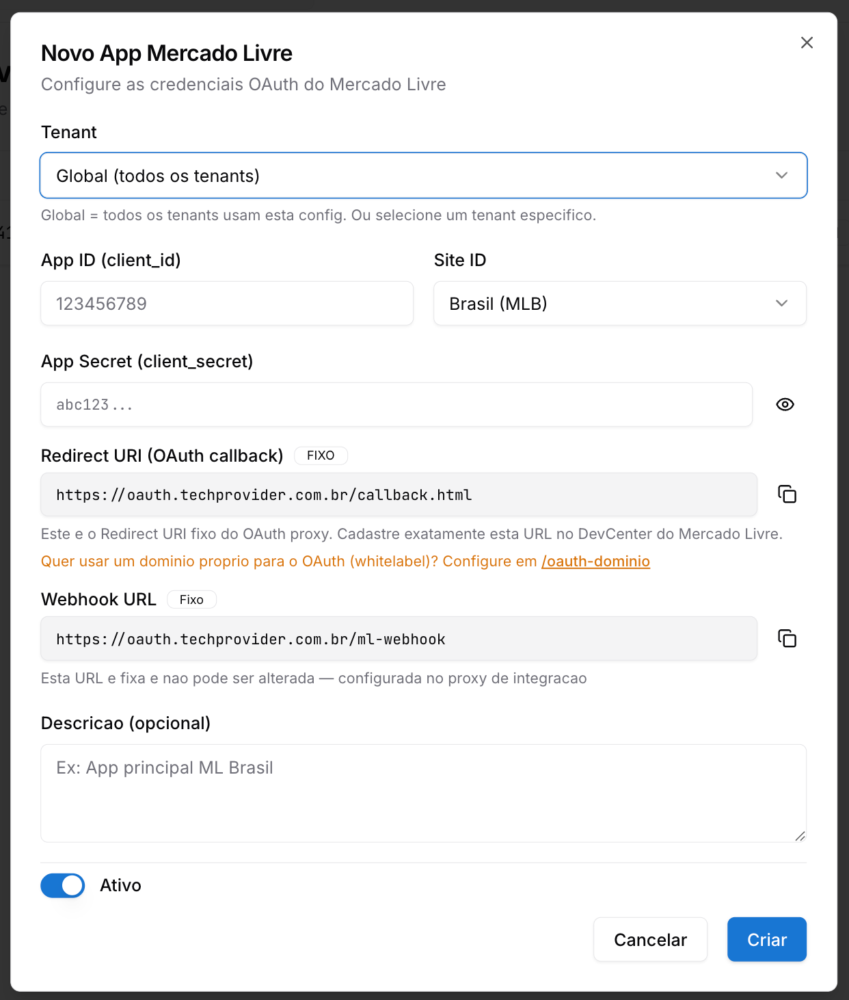
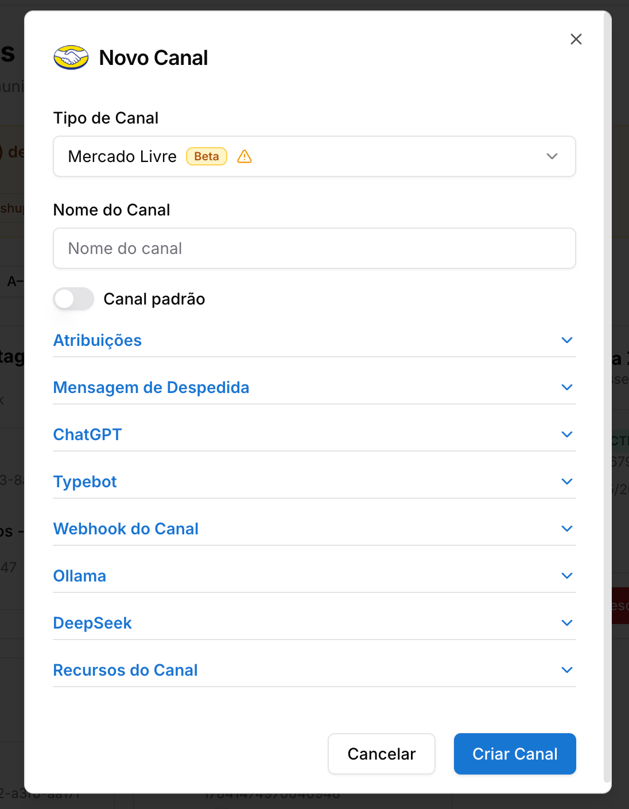
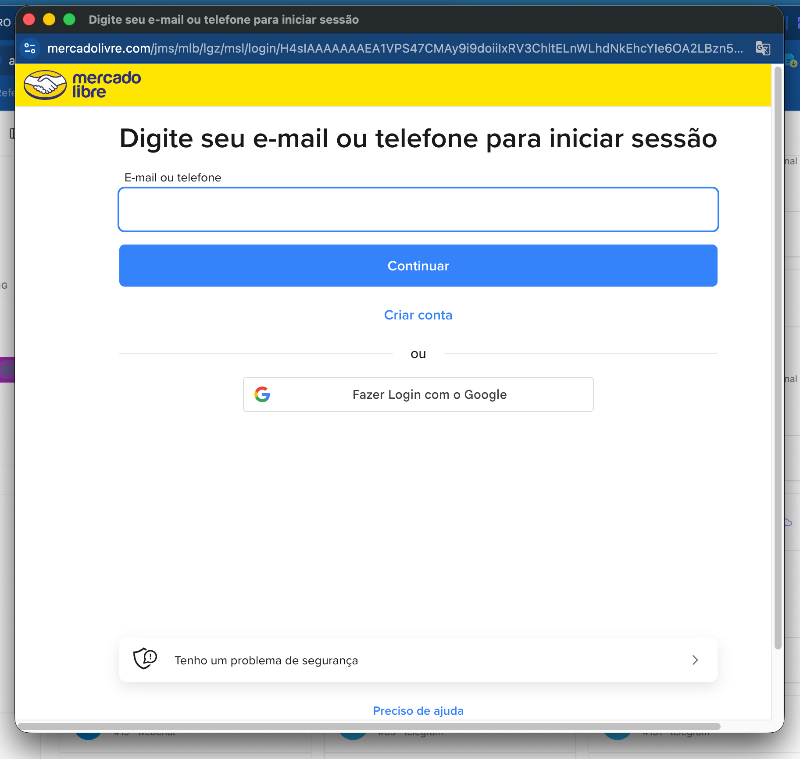

Copiar

Nesta página

1. [Configuração Superadmin](/configuracao-superadmin)
2. [Redes Sociais e Marketplaces](/configuracao-superadmin/redes-sociais-e-marketplaces)

# Mercado Livre - Superadmin

Como integrar uma conta Mercado Livre como canal no Prismabot

**Funcionalidade em beta:** este recurso foi lançado recentemente e ainda está em fase de testes. Alguns comportamentos podem apresentar instabilidade ou não funcionar como esperado em todos os cenários. Estamos coletando feedback e aplicando melhorias e correções ao longo das próximas versões. Se encontrar algum problema, entre em contato com o suporte.

Esta documentação detalha o processo completo para integrar uma conta do **Mercado Livre** à plataforma **Prismabot**, permitindo que sua equipe receba **mensagens e perguntas de compradores** diretamente no painel de atendimento como tickets.

Com essa integração, todas as interações de compradores realizadas em seus anúncios no Mercado Livre passam a ser centralizadas no Prismabot, evitando a necessidade de monitorar múltiplas plataformas.

**Configuração global vs. por tenant:** os apps cadastrados aqui ficam disponíveis para todos os tenants. A conexão e o gerenciamento do número WABA de cada tenant é feito individualmente pelo Administrador em Configurações → Integrações

**Pré-requisitos:**

* Uma conta ativa no **Mercado Livre** (vendedor).
* Acesso ao **Portal de Desenvolvedores do Mercado Livre** (<https://developers.mercadolivre.com.br/devcenter>).
* Acesso de **Super Admin** na sua instalação do Prismabot.

**Páginas de referência das telas do admin:**

[Configuração - Apps — Mercado Livre](/configuracao-administrador/configuracoes-painel-admin/apps-configuracoes/mercado-livre-configuracao-apps)

[Canal Mercado Livre](/configuracao-administrador/administracao-painel-admin/canais-de-comunicacao/canal-mercado-livre)

---

### Como funciona a integração

Após a configuração:

* Cada **mensagem ou pergunta** enviada por um comprador através do Mercado Livre criará um **ticket** dentro do Prismabot.
* Sua equipe poderá responder os compradores diretamente do painel de atendimento.
* O token de acesso é renovado **automaticamente** pelo Prismabot.

**Atenção aos limites do Mercado Livre:**

* O **token de acesso expira a cada 6 horas** e é renovado automaticamente pelo Prismabot.
* Mensagens de **pós-venda** possuem limite de **350 caracteres**.
* Uma configuração **Global** (sem tenant) será aplicada a **todos os tenants** que não tiverem uma configuração própria.

---

### Etapa 1: Criando o Aplicativo no Portal de Desenvolvedores do Mercado Livre

Antes de configurar a integração no Prismabot, é necessário criar um aplicativo no portal de desenvolvedores do Mercado Livre para obter as credenciais OAuth (**App ID** e **App Secret**).

1. Acesse o **DevCenter do Mercado Livre**:

   * <https://developers.mercadolivre.com.br/devcenter>
2. Faça login com sua conta do Mercado Livre.
3. Clique em **Criar novo aplicativo**.
4. Preencha os dados solicitados pelo Mercado Livre conforme o passo a passo oficial:

   * [Como criar uma aplicação no Mercado Livre](https://developers.mercadolivre.com.br/pt_br/crie-uma-aplicacao-no-mercado-livre)
5. Nos campos de configuração do app, utilize os valores **fixos** fornecidos pelo Prismabot:

   * **Redirect URI:** `https://oauth.techprovider.com.br/callback.html`
   * **Webhook URL:** `https://oauth.techprovider.com.br/ml-webhook`

**Importante:** O **Redirect URI** e o **Webhook URL** devem ser cadastrados, **exatamente** como informados acima, no DevCenter do Mercado Livre. Qualquer divergência impedirá o funcionamento da integração.

1. Após criar o aplicativo, copie e guarde:

   * **App ID (client\_id)**
   * **App Secret (client\_secret)**

**Quer usar um domínio próprio (plataforma de atendimento)?** Caso você queira utilizar um domínio próprio para o OAuth em vez do `oauth.techprovider.com.br`, configure-o previamente em `/oauth-dominio` dentro do Prismabot.

---

### Etapa 2: Acessando o App Mercado Livre no Painel Super Admin

Com o aplicativo criado no Mercado Livre e as credenciais em mãos, acesse o Prismabot para iniciar a integração.

1. Faça login no Prismabot com o usuário **Super Administrador** da sua instalação.
2. No menu lateral, localize a seção **Redes Sociais / Marketplace**.
3. Clique na opção **App Mercado Livre**.
4. Clique no botão **Novo App** para criar uma nova integração.

---

### Etapa 3: Definindo o Escopo da Integração (Global ou Tenant)

Ao criar um novo app, defina o escopo:

* **Global (todos os tenants):** A integração será aplicada para todos os tenants da instalação que não tiverem uma configuração própria.
* **Tenant específico:** A integração será aplicada apenas para uma conta/empresa específica.

**Recomendação:** A configuração **Global** funciona como um fallback — qualquer tenant que **não tenha** uma configuração própria utilizará a global. Para clientes individuais (revendedores SaaS), o ideal é configurar **por tenant**.

---

### Etapa 4: Preenchendo as Credenciais do Aplicativo

Preencha o formulário **Novo App Mercado Livre** com as informações obtidas no DevCenter:

Clique em **Criar** para salvar a integração.

O **Site ID** define o marketplace em que o app vai operar. Use **MLB** para Brasil, **MLA** para Argentina, **MLM** para México e assim por diante.

---

### Etapa 5: Criando o Canal Mercado Livre no Painel Admin

Após a integração estar criada no Super Admin, é necessário **vincular um canal** dentro do painel administrativo do tenant para que as mensagens cheguem como tickets.

1. Acesse o **painel administrativo** do Prismabot da conta (tenant) integrada.
2. No menu lateral, vá em **Canais**.
3. Clique em **Adicionar Canal**.
4. Selecione o tipo **Mercado Livre,** de um nome e clique em **criar canal.**
5. 

Após a criação do canal, clique em **"conectar"** e siga o fluxo de **autenticação OAuth**: você será redirecionado para o Mercado Livre para autorizar o acesso da sua conta de vendedor.

Após autorizar, o canal será criado e ficará **conectado**.

A partir desse momento, todas as **mensagens e perguntas** enviadas por compradores nos seus anúncios do Mercado Livre passarão a chegar no Prismabot como **tickets de atendimento**.

---

### Etapa 6: Atendimento dos Tickets do Mercado Livre

Cada nova mensagem ou pergunta de comprador gera um ticket no Prismabot, que pode ser respondido diretamente pelo painel de atendimento.

* As mensagens chegam na **fila de tickets**, igual a qualquer outro canal.
* O ticket conterá os dados do comprador e o contexto da pergunta/mensagem.
* A resposta enviada pelo Prismabot será entregue ao comprador no Mercado Livre.

**Limite de caracteres em pós-venda:** Mensagens enviadas após a finalização da compra (pós-venda) possuem um limite de **350 caracteres**. Mensagens mais longas serão rejeitadas pela API do Mercado Livre.

---

### Resumo das Funcionalidades

Funcionalidade

Onde acessar

Configurar integração com Mercado Livre

Super Admin > App Mercado Livre

Criar canal de atendimento

Painel Admin > Canais > Mercado Livre

Receber mensagens e perguntas como tickets

Atendimento (fila de tickets)

Renovação automática do token

Automática (a cada 6 horas)

---

### Encerramento

Com a integração ativa, o Prismabot passa a:

* **Receber automaticamente** todas as mensagens e perguntas dos compradores do Mercado Livre.
* **Centralizar o atendimento** em uma única plataforma omnichannel.
* **Renovar tokens automaticamente** sem necessidade de intervenção manual.
* **Permitir o uso de múltiplas contas** (uma por tenant) com integrações isoladas.

Esta integração é ideal para vendedores que utilizam o Mercado Livre como canal de vendas e desejam unificar o atendimento dos compradores junto aos demais canais de comunicação (WhatsApp, Instagram, E-mail etc.).

---

### Possíveis Erros e Soluções

#### Erro de autenticação OAuth ao criar o canal

**Causa:** Redirect URI cadastrado incorretamente no DevCenter do Mercado Livre.

**Solução:** Verifique se o **Redirect URI** está cadastrado **exatamente** como `https://oauth.techprovider.com.br/callback.html` no app do Mercado Livre.

#### Mensagens não estão chegando como tickets

**Causa:** Webhook URL incorreto ou canal não autorizado.

**Solução:**

1. Confirme que o **Webhook URL** cadastrado no Mercado Livre é `https://oauth.techprovider.com.br/ml-webhook`.
2. Refaça o processo de autorização do canal no Painel Admin.

#### Mensagem de pós-venda rejeitada

**Causa:** A mensagem ultrapassou o limite de **350 caracteres** imposto pela API do Mercado Livre.

**Solução:** Reduza o tamanho da mensagem ou divida o conteúdo em múltiplas mensagens.

#### Configuração Global não está sendo aplicada para um tenant

**Causa:** O tenant possui uma configuração própria que sobrepõe a Global.

**Solução:** Remova a configuração específica do tenant ou ajuste-a conforme necessário. A Global só se aplica quando o tenant **não tem** configuração própria.

[AnteriorLinkedIn - Superadmin](/configuracao-superadmin/redes-sociais-e-marketplaces/linkedin-superadmin)[PróximoNuvemshop - Superadmin](/configuracao-superadmin/redes-sociais-e-marketplaces/nuvemshop-superadmin)

Atualizado há 1 dia

Isto foi útil?