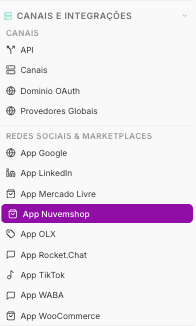

Copiar

Nesta página

1. [Configuração Superadmin](/configuracao-superadmin)
2. [Redes Sociais e Marketplaces](/configuracao-superadmin/redes-sociais-e-marketplaces)

# Nuvemshop - Superadmin

**Funcionalidade em beta:** este recurso foi lançado recentemente e ainda está em fase de testes. Alguns comportamentos podem apresentar instabilidade ou não funcionar como esperado em todos os cenários. Estamos coletando feedback e aplicando melhorias e correções ao longo das próximas versões. Se encontrar algum problema, entre em contato com o suporte.

**Disponível para o perfil:** Super Administrador

Configure a integração com o Nuvemshop para receber pedidos como atendimentos e notificar clientes automaticamente. Um único app pode cobrir todos os tenants (Global) ou ser configurado por tenant específico.

**Beta:** esta integração está em fase beta. A disponibilidade pode variar conforme o plano contratado.

**Configuração global vs. por tenant:** os apps cadastrados aqui ficam disponíveis para todos os tenants. A conexão e o gerenciamento do número WABA de cada tenant é feito individualmente pelo Administrador em Configurações → Integrações

---

#### Como acessar

No painel Super Admin, acesse **Redes Sociais e Marketplaces → Nuvemshop**.

---

#### Conectando uma loja

Clique em **+ Novo App Nuvemshop**. A integração suporta dois modos de conexão:

**Modo OAuth (recomendado)**

1. Informe a **URL da loja** (ex.: https://minha-loja.com)
2. Clique em **Conectar** — uma janela abre o site da Nuvemshop para autorização
3. Após autorizar, as credenciais são preenchidas automaticamente

**Modo manual (BYO)**

Cole as credenciais obtidas no painel de parceiros da Nuvemshop:

Campo

O que é

**Store ID**

ID da loja na Nuvemshop — user\_id retornado no OAuth ou no painel de parceiros

**Access Token**

Token de acesso da API. Não expira; obtido via OAuth ou painel de parceiros

**Client ID**

ID do app de parceiro (opcional)

**Client Secret**

Usado para validar o HMAC dos webhooks no modo manual (opcional)

**Ativando os webhooks**

Após preencher as credenciais, copie a **URL do Webhook** exibida no formulário e cole em: **Nuvemshop → Configurações → Avançado → Webhooks → URL de entrega**

Os webhooks notificam a plataforma sobre novos pedidos e atualizações em tempo real.

O campo **Callback do OAuth proxy** é fixo e informativo — o cliente não precisa cadastrá-lo manualmente. Para usar um domínio próprio no OAuth (Prismabot), configure em `/auth-dominio`.

---

#### Configurações do app

Opção

O que faz

**Tenant**

Global = todos os tenants usam esta config. Ou selecione um tenant específico

**Sincronizar produtos**

Mantém o cache do seletor de produtos atualizado

**Canal vinculado**

O picker de produtos usará esta loja quando o ticket vier deste canal

**Descrição**

Identificação opcional — ex: "Loja principal da empresa"

**Fechar ticket ao completar pedido**

Fecha o ticket automaticamente quando o pedido for marcado como concluído

**Ativo**

Liga ou desliga a integração

---

#### Páginas relacionadas

* [Nuvemshop — Gestão Comercial](/configuracao-administrador/gestao-comercial/operacao-gestao-comercial/nuvemshop) — gerenciar pedidos e produtos no dia a dia
* [Nuvemshop — Configurações Apps](/configuracao-administrador/configuracoes-painel-admin/apps-configuracoes/nuvemshop-configuracoes-apps) — configuração por tenant no painel admin

---

[AnteriorMercado Livre - Superadmin](/configuracao-superadmin/redes-sociais-e-marketplaces/mercado-livre-superadmin)[PróximoOLX - Superadmin](/configuracao-superadmin/redes-sociais-e-marketplaces/olx-superadmin)

Atualizado há 1 dia

Isto foi útil?