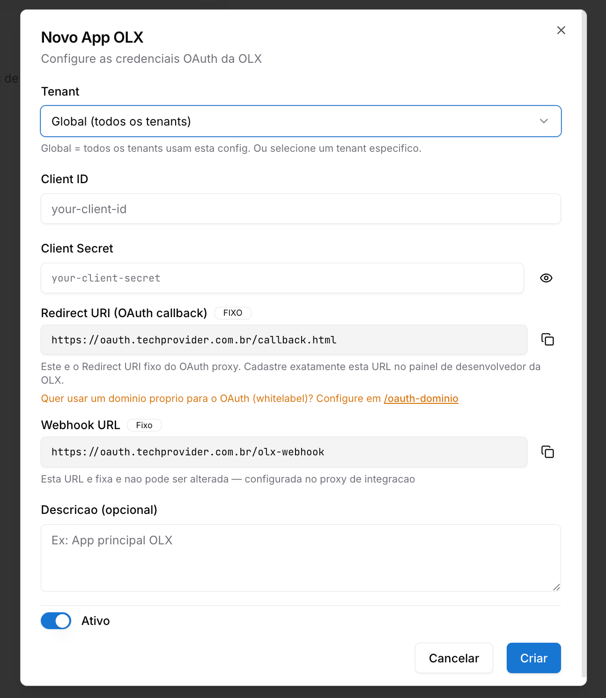
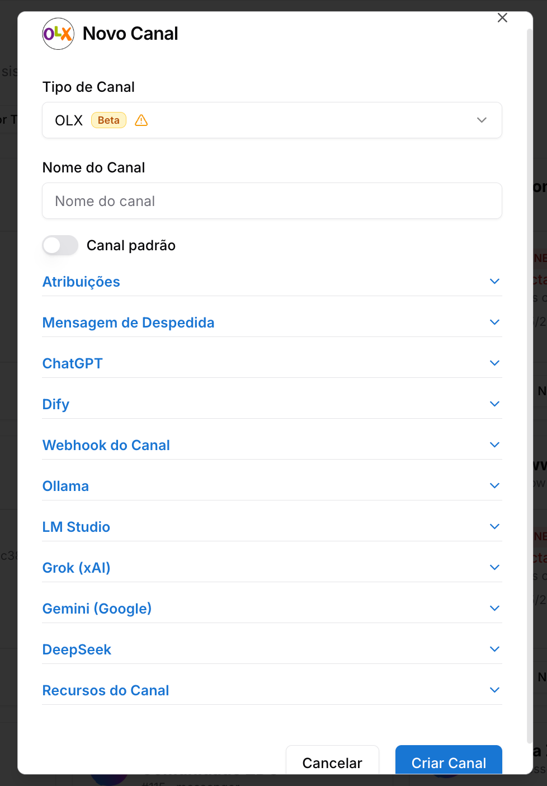

Copiar

Nesta página

1. [Configuração Superadmin](/configuracao-superadmin)
2. [Redes Sociais e Marketplaces](/configuracao-superadmin/redes-sociais-e-marketplaces)

# OLX - Superadmin

Como integrar uma conta OLX como canal no Prismabot

**Funcionalidade em beta:** este recurso foi lançado recentemente e ainda está em fase de testes. Alguns comportamentos podem apresentar instabilidade ou não funcionar como esperado em todos os cenários. Estamos coletando feedback e aplicando melhorias e correções ao longo das próximas versões. Se encontrar algum problema, entre em contato com o suporte.

Esta documentação detalha o processo para integrar uma conta da **OLX** à plataforma **Prismabot**, permitindo que sua equipe receba **mensagens de compradores interessados nos seus anúncios** diretamente no painel de atendimento como tickets.

Com essa integração, todas as interações de compradores realizadas nos seus anúncios da OLX passam a ser centralizadas no Prismabot, evitando a necessidade de monitorar a caixa de mensagens da plataforma manualmente.

**Configuração global vs. por tenant:** os apps cadastrados aqui ficam disponíveis para todos os tenants. A conexão e o gerenciamento do número WABA de cada tenant é feito individualmente pelo Administrador em Configurações → Integrações

**Pré-requisitos:**

* Uma conta ativa na **OLX** (anunciante).
* Credenciais OAuth fornecidas pela **OLX** (Client ID e Client Secret).
* Acesso de **Super Admin** na sua instalação do Prismabot.

**Páginas de referência das telas do admin:**
[Configuração - Apps — OLX](/configuracao-administrador/configuracoes-painel-admin/apps-configuracoes/olx-configuracao-apps)

[Canal OLX](/configuracao-administrador/administracao-painel-admin/canais-de-comunicacao/canal-olx)

---

### Como funciona a integração

Após a configuração:

* Cada **mensagem** enviada por um comprador através da OLX criará um **ticket** dentro do Prismabot.
* Sua equipe poderá responder os compradores diretamente do painel de atendimento.

**Atenção aos limites da OLX:**

* **Tokens OLX não possuem refresh automático.** Se o token expirar, será necessário **reconectar via OAuth** manualmente.
* As **respostas enviadas via API são somente texto** — não é possível enviar imagens, áudios ou outros tipos de mídia.
* Uma configuração **Global** (sem tenant) será aplicada a **todos os tenants** que não tiverem uma configuração própria.

---

### Etapa 1: Solicitando as Credenciais OAuth na OLX

Diferente de outras plataformas, a OLX **não possui um portal self-service** para criar aplicações. As credenciais OAuth (**Client ID** e **Client Secret**) precisam ser solicitadas diretamente pelo time da OLX por e-mail.

1. Envie um e-mail para `suporteintegrador@olxbr.com` solicitando a criação de um aplicativo OAuth.
2. No e-mail, inclua as seguintes informações:

   * **Nome do cliente** (sua empresa)
   * **Nome do aplicativo** (ex.: `Integração Prismabot`)
   * **Descrição** do uso (ex.: "Integração para receber e responder mensagens de compradores via Prismabot")
   * **Website** da empresa
   * **Telefone** de contato
   * **E-mail** de contato
   * **Redirect URI(s)** — informe a URL fixa do Prismabot:

     + `https://oauth.techprovider.com.br/callback.html`
3. Aguarde o retorno da OLX com o **Client ID** e o **Client Secret**.

**Documentação oficial completa da OLX:** Para detalhes técnicos completos sobre o fluxo OAuth da OLX, consulte a documentação oficial em <https://developers.olx.com.br/anuncio/api/oauth.html>.

**Quer usar um domínio próprio (Prismabot)?** Caso você queira utilizar um domínio próprio para o OAuth em vez do `oauth.techprovider.com.br`, configure-o **antes de enviar o e-mail para a OLX** em `/oauth-dominio` dentro do Prismabot, e informe seu domínio customizado como Redirect URI no lugar do padrão. Veja o artigo [Domínio OAuth Customizado](/configuracao-superadmin/canais-superadmin/dominio-oauth-customizado).

---

### Etapa 2: Permissões (Scopes) Necessárias

Ao solicitar as credenciais, certifique-se de que o aplicativo terá os **scopes (permissões)** corretos para a integração de mensagens funcionar:

Scope

Finalidade

`chat`

Acesso à configuração do chat e recebimento de mensagens da OLX. **Obrigatório.**

`basic_user_info`

Nome e e-mail do usuário. Recomendado.

`autoservice`

Alterações em configurações de webhook e leads. Recomendado.

O scope `chat` é o mais importante e **obrigatório** para que o Prismabot consiga receber e responder mensagens. Sem ele, a integração não funcionará.

---

### Etapa 3: Acessando o App OLX no Painel Super Admin

Com as credenciais em mãos, acesse o Prismabot para iniciar a integração.

1. Faça login no Prismabot com o usuário **Super Administrador** da sua instalação.
2. No menu lateral, localize a seção **Redes Sociais / Marketplace**.
3. Clique na opção **App OLX**.
4. Clique no botão **Novo App** para criar uma nova integração.

---

### Etapa 4: Definindo o Escopo da Integração (Global ou Tenant)

Ao criar um novo app, defina o escopo:

* **Global (todos os tenants):** A integração será aplicada para todos os tenants da instalação que não tiverem uma configuração própria.
* **Tenant específico:** A integração será aplicada apenas para uma conta/empresa específica.

**Recomendação:** A configuração **Global** funciona como um fallback — qualquer tenant que **não tenha** uma configuração própria utilizará a global. Para clientes individuais (revendedores SaaS), o ideal é configurar **por tenant**.

---

### Etapa 5: Preenchendo as Credenciais do Aplicativo

Preencha o formulário **Novo App OLX** com as informações recebidas por e-mail da OLX:

Clique em **Criar** para salvar a integração.

**Quer usar um domínio próprio (Prismabot)?** Caso você queira utilizar um domínio próprio para o OAuth em vez do `oauth.techprovider.com.br`, configure-o previamente em `/oauth-dominio` dentro do Prismabot.

Atenção: se você alterar o domínio OAuth, será necessário solicitar à OLX a **atualização do Redirect URI** cadastrado no app.

---

### Etapa 6: Criando o Canal OLX no Painel Admin

Após a integração estar criada no Super Admin, é necessário **vincular um canal** dentro do painel administrativo do tenant para que as mensagens cheguem como tickets.

1. Acesse o **painel administrativo** do Prismabot da conta (tenant) integrada.
2. No menu lateral, vá em **Canais**.
3. Clique em **Adicionar Canal**.
4. Selecione o tipo **OLX**, dê um nome e clique em **Criar Canal**.

1. Após a criação do canal, clique em **Conectar** e siga o fluxo de **autenticação OAuth**: você será redirecionado para a OLX para autorizar o acesso da sua conta de anunciante.
2. Após autorizar, o canal será criado e ficará **conectado**.

A partir desse momento, todas as **mensagens** enviadas por compradores nos seus anúncios da OLX passarão a chegar no Prismabot como **tickets de atendimento**.

---

### Etapa 7: Atendimento dos Tickets da OLX

Cada nova mensagem de comprador gera um ticket no Prismabot, que pode ser respondido diretamente pelo painel de atendimento.

* As mensagens chegam na **fila de tickets**, igual a qualquer outro canal.
* O ticket conterá os dados do comprador e o contexto do anúncio.
* A resposta enviada pelo Prismabot será entregue ao comprador na OLX.

**Apenas mensagens de texto:** A API da OLX **não permite envio de mídia** (imagens, vídeos, áudios). Todas as respostas enviadas pelo Prismabot precisam ser **texto puro**. Tentativas de envio de mídia serão rejeitadas.

---

### Renovação do Token (Reconexão Manual)

Diferente do Mercado Livre, os tokens emitidos pela OLX **não possuem refresh automático**.

**Tempo de validade do token:** A OLX **não divulga publicamente** o tempo exato de expiração do `access_token` na sua [documentação oficial de OAuth](https://developers.olx.com.br/anuncio/api/oauth.html). Para confirmar o TTL específico do seu aplicativo, entre em contato com `suporteintegrador@olxbr.com`.

Na prática, recomendamos **monitorar o status do canal** e refazer a conexão sempre que ele aparecer como desconectado.

Quando o token expirar, o canal OLX no Prismabot ficará com status **desconectado** e as mensagens deixarão de chegar. Para restabelecer a integração:

1. Acesse o **Painel Admin > Canais**.
2. Localize o canal OLX desconectado.
3. Clique em **Conectar** e refaça o fluxo de **autenticação OAuth**.

Recomendamos monitorar periodicamente o status do canal OLX para evitar perda de mensagens. Configure um responsável para refazer a conexão sempre que necessário.

---

### Resumo das Funcionalidades

Funcionalidade

Onde acessar

Configurar integração com OLX

Super Admin > App OLX

Criar canal de atendimento

Painel Admin > Canais > OLX

Receber mensagens como tickets

Atendimento (fila de tickets)

Reconectar canal após expiração

Painel Admin > Canais > Conectar

---

### Encerramento

Com a integração ativa, o Prismabot passa a:

* **Receber automaticamente** todas as mensagens dos compradores da OLX como tickets.
* **Centralizar o atendimento** em uma única plataforma omnichannel.
* **Permitir o uso de múltiplas contas** (uma por tenant) com integrações isoladas.

Esta integração é ideal para anunciantes que utilizam a OLX como canal de vendas e desejam unificar o atendimento dos compradores junto aos demais canais de comunicação (WhatsApp, Instagram, E-mail, Mercado Livre etc.).

---

### Possíveis Erros e Soluções

#### Não recebi as credenciais da OLX

**Causa:** Solicitação incompleta ou falta de retorno do time de integradores da OLX.

**Solução:** Reenvie o e-mail para `suporteintegrador@olxbr.com` confirmando todos os dados (nome do app, descrição, website, telefone, e-mail e o Redirect URI exato `https://oauth.techprovider.com.br/callback.html`).

#### Erro de autenticação OAuth ao criar o canal

**Causa:** Redirect URI cadastrado incorretamente pela OLX.

**Solução:** Solicite à OLX (`suporteintegrador@olxbr.com`) a confirmação de que o Redirect URI cadastrado no app é **exatamente** `https://oauth.techprovider.com.br/callback.html`.

#### Mensagens não estão chegando como tickets

**Causa:** Webhook não configurado corretamente ou scope `chat` ausente.

**Solução:**

1. Confirme com a OLX que o app foi criado com o scope `chat`.
2. Verifique se o canal está conectado no painel admin.
3. Caso necessário, refaça a autorização OAuth.

#### Resposta com imagem ou áudio rejeitada

**Causa:** A API da OLX aceita apenas mensagens de texto.

**Solução:** Envie apenas **mensagens de texto puro**. Mídias precisam ser enviadas por outro canal (e-mail, WhatsApp etc.) após combinar com o comprador.

#### Canal OLX está desconectado

**Causa:** Token expirado — a OLX **não renova automaticamente**.

**Solução:** Acesse **Painel Admin > Canais**, localize o canal OLX e clique em **Conectar** para refazer o fluxo OAuth.

#### Configuração Global não está sendo aplicada para um tenant

**Causa:** O tenant possui uma configuração própria que sobrepõe a Global.

**Solução:** Remova a configuração específica do tenant ou ajuste-a conforme necessário. A Global só se aplica quando o tenant **não tem** configuração própria.

[AnteriorNuvemshop - Superadmin](/configuracao-superadmin/redes-sociais-e-marketplaces/nuvemshop-superadmin)[PróximoRocket.chat - Superadmin](/configuracao-superadmin/redes-sociais-e-marketplaces/rocket.chat-superadmin)

Atualizado há 1 dia

Isto foi útil?