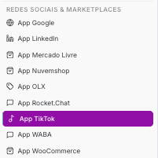
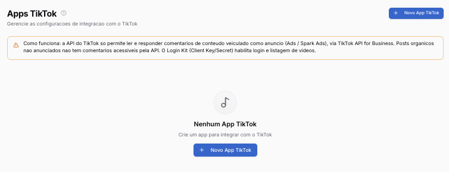
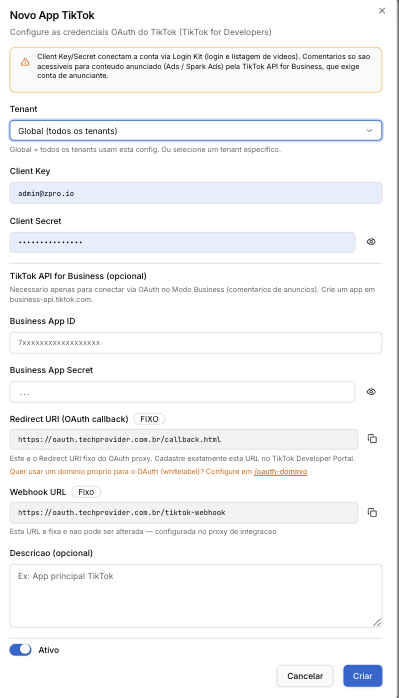

Copiar

Nesta página

1. [Configuração Superadmin](/configuracao-superadmin)
2. [Redes Sociais e Marketplaces](/configuracao-superadmin/redes-sociais-e-marketplaces)

# Tiktok - Superadmin

**Funcionalidade em beta:** este recurso foi lançado recentemente e ainda está em fase de testes. Alguns comportamentos podem apresentar instabilidade ou não funcionar como esperado em todos os cenários. Estamos coletando feedback e aplicando melhorias e correções ao longo das próximas versões. Se encontrar algum problema, entre em contato com o suporte.

**Disponível para o perfil:** Super Administrador

Nesta página o Super Administrador cadastra os apps TikTok globais usados para conectar contas e acessar comentários de vídeos anunciados.

**Configuração global vs. por tenant:** os apps cadastrados aqui ficam disponíveis para todos os tenants. A conexão e o gerenciamento do número WABA de cada tenant é feito individualmente pelo Administrador em Configurações → Integrações

**Como funciona a API do TikTok:** a API só permite ler e responder comentários de conteúdo veiculado como anúncio (Ads / Spark Ads), via TikTok API for Business. Posts orgânicos não anunciados **não têm comentários acessíveis pela API**. O Login Kit (Client Key/Secret) habilita login e listagem de vídeos.

---

#### Como acessar

No painel Super Admin, acesse **Redes Sociais e Marketplaces → Apps TikTok**.

---

#### Como configurar

1. Acesse [developers.tiktok.com](https://developers.tiktok.com/) e crie um app. [(veja o artigo passo a passo aqui)](/configuracao-superadmin/redes-sociais-e-marketplaces/como-criar-um-app-no-tiktok-for-business-developers)
2. Habilite os escopos `user.info.basic` e `video.list`
3. Copie o **Client Key** e o **Client Secret** para os campos abaixo
4. Cadastre o **Redirect URI** exibido no formulário no TikTok Developer Portal

---

#### Campos do formulário

**Login Kit (obrigatório)**

Campo

Descrição

**Tenant**

Global = todos os tenants usam esta config. Ou selecione um tenant específico

**Client Key**

Chave do app gerada no TikTok Developer Portal

**Client Secret**

Chave secreta do app

**Redirect URI (OAuth callback)**

URL fixa — cadastre exatamente esta URL no TikTok Developer Portal

**Webhook URL**

URL fixa do proxy de integração — não pode ser alterada

**Descrição**

Identificação opcional (ex.: App principal TikTok)

**Ativo**

Liga ou desliga esta configuração

**TikTok API for Business (opcional)**

Necessário apenas para acessar comentários de conteúdo anunciado (Ads / Spark Ads). Crie um app separado em [business-api.tiktok.com](https://business-api.tiktok.com/).

Campo

Descrição

**Business App ID**

ID do app de negócios (começa com `7...`)

**Business App Secret**

Chave secreta do app de negócios

**Importante:**

* O `access_token` expira em 24h — o sistema renova automaticamente via `refresh_token`
* A configuração **Global** aplica para todos os tenants que não tiverem configuração própria

---

#### Páginas relacionadas

* [Canal TikTok — conectar a conta TikTok ao Prismabot](/configuracao-administrador/administracao-painel-admin/canais-de-comunicacao/canal-tiktok)
* [Apps TikTok — Configurações Admin](/configuracao-administrador/configuracoes-painel-admin/apps-configuracoes/tiktok-configuracao-apps)
* [Comentários Tiktok](/ferramentas-do-atendimento/comunicacao-e-marketing/redes-sociais-comentarios/comentarios-tiktok)

---

[AnteriorRocket.chat - Superadmin](/configuracao-superadmin/redes-sociais-e-marketplaces/rocket.chat-superadmin)[PróximoComo criar um App no TikTok for Business Developers](/configuracao-superadmin/redes-sociais-e-marketplaces/como-criar-um-app-no-tiktok-for-business-developers)

Atualizado há 1 dia

Isto foi útil?