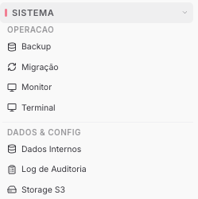

Copiar

Nesta página

1. [Configuração Superadmin](/configuracao-superadmin)

# Sistema

Esta seção reúne todas as documentações sobre as tarefas de administração, manutenção e configuração técnica da sua instância Prismabot.

**Disponível para o perfil: Superadministrador**

Esta seção reúne as ferramentas de operação e manutenção técnica da instância. Use-a para monitorar a saúde do sistema, executar tarefas administrativas, fazer backups e gerenciar armazenamento e logs.

---

### Operação

Ferramentas para monitorar e operar a instância em tempo real.

#### [Monitor](/configuracao-superadmin/sistema/sistema-operacao/monitor)

Visão em tempo real do estado dos serviços da instância — consumo de recursos, processos ativos e alertas de falha.

#### [Terminal](/configuracao-superadmin/sistema/sistema-operacao/terminal)

Acesso ao terminal do servidor diretamente pelo painel Superadmin. Permite executar comandos sem precisar de acesso SSH externo.

#### [Backup](/configuracao-superadmin/sistema/sistema-operacao/backup)

Criação e restauração de backups da instância Prismabot. Essencial antes de atualizações e migrações.

#### [Migração de Tenants](/configuracao-superadmin/sistema/sistema-operacao/migracao-de-tenants)

Transferência de tenants entre instâncias Prismabot — útil para reorganizar infraestrutura ou mover clientes para um servidor dedicado.

---

### Dados e Configuração

Gestão de armazenamento, cache e rastreabilidade de ações administrativas.

#### [Dados Internos](/configuracao-superadmin/sistema/sistema-dados-e-configuracao/dados-internos)

Gerenciamento do banco de dados Redis e limpeza de cache da instância. Use quando a plataforma apresentar comportamento inconsistente ou após atualizações.

#### [Storage S3](/configuracao-superadmin/sistema/sistema-dados-e-configuracao/storage-s3)

Configuração do armazenamento externo de mídia via Amazon S3 ou serviços compatíveis. Recomendado para instâncias com alto volume de arquivos e mídias.

#### [Log de Auditoria](/configuracao-superadmin/sistema/sistema-dados-e-configuracao/log-de-auditoria)

Histórico de ações administrativas realizadas na instância — quem fez o quê e quando. Útil para rastrear alterações e investigar incidentes.

[AnteriorWooCommerce - Superadmin](/configuracao-superadmin/redes-sociais-e-marketplaces/woocommerce-superadmin)[PróximoSistema - Operação](/configuracao-superadmin/sistema/sistema-operacao)

Atualizado há 26 dias

Isto foi útil?