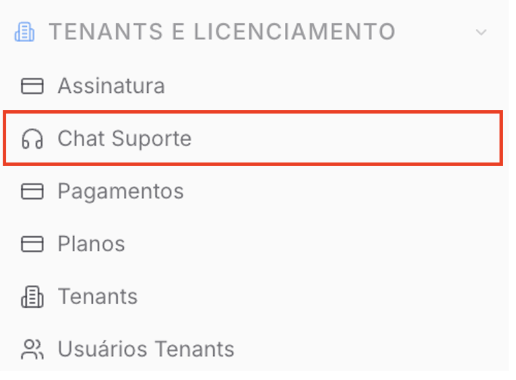
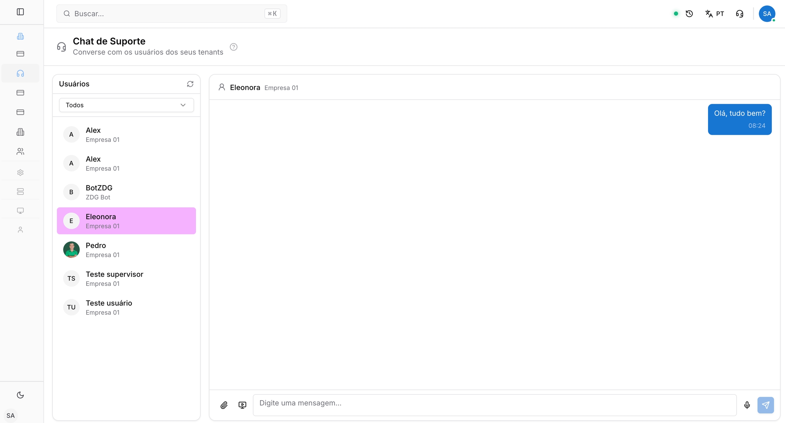
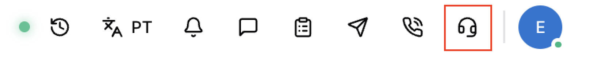
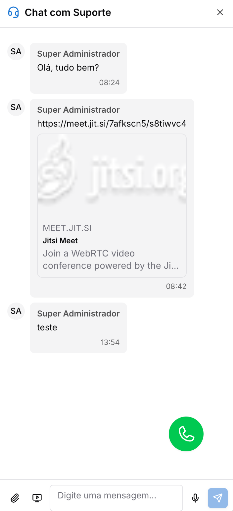

Copiar

Nesta página

1. [Configuração Superadmin](/configuracao-superadmin)
2. [Tenants e Licença](/configuracao-superadmin/tenants-e-licenca)

# Chat Suporte

O chat de suporte é o canal destinado ao gerenciamento do atendimento dos usuários dos tenants, possibilitando o envio de respostas e o auxílio direto na plataforma.

A definição do chat de suporte é usada para representar o local onde se pode interagir e auxiliar os usuários das empresas de forma centralizada.

Para o cliente abrir o chat com o suporte é preciso habilitar essa função no cadastro/edição do Tenant

As principais funções do chat de suporte são:

* Visualizar e responder mensagens de usuários;
* Filtrar contatos por empresa ou nome;
* Anexar arquivos e enviar áudios.

### 1. Atendendo um Usuário

Para atender um usuário é necessário acessar o painel e ir na aba Chat de Suporte.

Ao acessar a listagem lateral, clique em um usuário para visualizar o histórico e responder às mensagens.

### 2. Recursos da Lista de Usuários

Abaixo estão listados os itens presentes na lista de usuários e suas funcionalidades:

* **Selecionar um usuário:** Clique em um usuário na lista lateral para visualizar o histórico e responder às mensagens;
* **Filtrar usuários:** Utilize o campo de busca para filtrar os usuários por empresa ou por nome;
* **Identificar chats ativos:** Os usuários com chat ativo aparecem destacados na lista lateral.

### 3. Enviando Mensagens

Nessa área é possível enviar os textos e mídias para interagir com o usuário selecionado.

Abaixo estão listados os recursos presentes no envio de mensagens e suas funcionalidades:

* **Envio de texto:** Digite a mensagem no campo inferior da tela e pressione a tecla Enter para enviar;
* **Envio de mídias:** Utilize os botões auxiliares na tela para anexar arquivos ou enviar áudios gravados diretamente no chat.
* **Envio de link de reunião:** Ao clicar no ícone, será enviado uma mensagem automática com um link para realizar uma reunião online com o contato.

### Visão do chat para o Tenant

O administrador do Tenant conseguirá acessar o chat com o superadmin clicando no ícone no canto superior direito

Abrirá uma guia no seguinte modelo:

[AnteriorScore do App Tech Provider](/configuracao-superadmin/tenants-e-licenca/gerenciar-licenca-prismabot/score-do-app-tech-provider)[PróximoGestão de Tenants (clientes)](/configuracao-superadmin/tenants-e-licenca/gestao-de-tenants-clientes)

Atualizado há 4 meses

Isto foi útil?