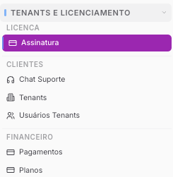
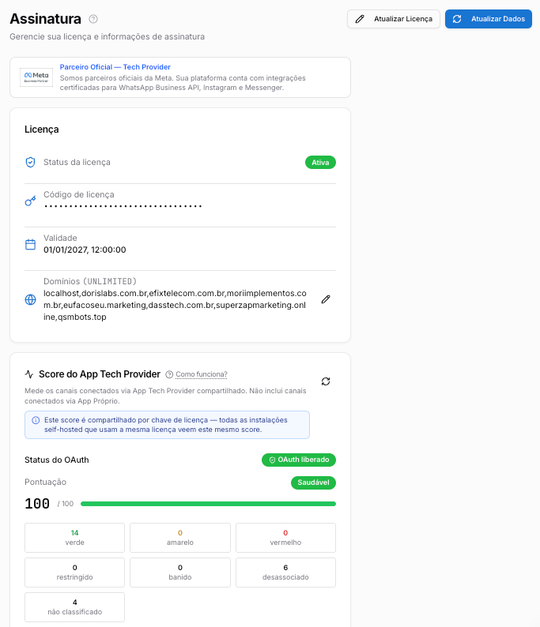
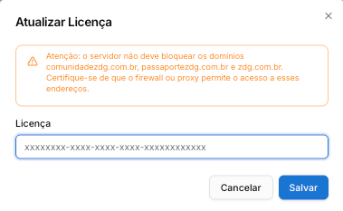
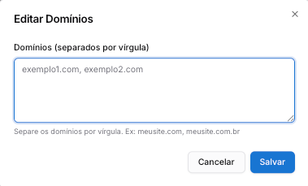

Copiar

Nesta página

1. [Configuração Superadmin](/configuracao-superadmin)
2. [Tenants e Licença](/configuracao-superadmin/tenants-e-licenca)

# Gerenciar Licença Prismabot

Ativar, renovar e gerenciar a licença do Prismabot: validar chave de licença, trocar domínio, modo de recuperação e status da assinatura.

**Disponível para o perfil: Superadministrador**

A licença Prismabot é o que mantém sua instalação ativa e com direito a atualizações. Ela é gerenciada pelo **Superadmin** e precisa ser ativada logo após a instalação, renovada anualmente e mantida associada ao domínio correto — caso contrário, o sistema é bloqueado automaticamente.

---

### Acessando a Página de Assinatura

No menu lateral do painel **Superadmin**, localize a seção "TENANTS E LICENCIAMENTO" e entre na aba **Assinatura**.

---

### Entendendo as Informações da Tela

#### Licença

* **Status da Licença:** O estado atual da sua licença (Ativo, Inativo, Em Validação).
* **Código da Licença:** A sua chave de licença atual, parcialmente ofuscada por segurança.
* **Validade da Licença:** A data de vencimento da sua assinatura anual.
* **Domínio:** Domínio utilizado na instalação (não é necessário adicionar subdomínios).

#### Score do App Tech Provider

Mede os canais conectados via App Tech Provider compartilhado. Não inclui canais conectados via App Próprio.

#### Versão do Sistema

* **Versão do Backend / Frontend:** As versões atuais da sua instalação Prismabot.
* **Expira em:** A data limite em que a versão instalada deixa de receber suporte.
* **Dias restantes:** Contagem regressiva para a atualização obrigatória de versão.

Quando os dias restantes chegarem a zero, **o sistema para de funcionar mesmo com a licença em dia**. Atualize antes do prazo para evitar interrupção no atendimento.

[Procedimento Padrão de Atualização](/central-do-assinante/atualizacoes-e-status-do-prismabot/procedimento-padrao-de-atualizacao)

---

### Validade da Licença vs. Validade do Sistema

Estas são as duas datas que mais geram confusão no painel. Elas são independentes e controlam coisas completamente diferentes.

Validade da Licença

Validade do Sistema

**O que é**

Sua assinatura anual paga

O prazo de vida da versão instalada

**O que acontece quando expira**

Você perde acesso à plataforma até renovar

O sistema **para de funcionar**, mesmo com a licença em dia

**Como renovar**

Acessando a página de renovação e pagando

Atualizando o Prismabot para uma versão mais nova

**Depende da outra?**

Não

Não

**Como funciona na prática:** cada versão do Prismabot tem um período máximo de vida — geralmente alguns meses. Isso é um mecanismo de segurança que garante que todas as instalações sejam atualizadas com regularidade, recebendo correções e melhorias. Na prática, isso significa que você precisa atualizar pelo menos duas vezes por ano, independentemente de quando renova a licença.

Fique atento às duas datas: uma não substitui a outra.

---

### Ativar Licença (primeiro acesso)

Realize estes dois passos logo após a primeira instalação do Prismabot.

#### Passo 1 — Adicionar o código de licença

1. Na página de Assinatura, clique no botão **"Alterar licença"**.
2. No campo **"Atualizar licença"**, cole a chave de licença recebida por e-mail após a compra.
3. Clique em **"Salvar"**.

Após salvar, o status pode levar alguns minutos para atualizar. Aguarde até que o sistema processe a validação e o status mude para **"Ativo"**.

Não recebeu sua licença por e-mail? Abra um chamado de suporte administrativo em [suporte.zdg.com.br](https://prismatelecomservicos.com/).

#### Passo 2 — Adicionar o domínio

1. Clique em **"Editar domínio"**.

Retire o domínio "whatsapp.com" e adicione o domínio da sua instalação. Não é necessário adicionar subdomínios — apenas o domínio raiz.

1. Adicione o(s) domínio(s) utilizados na instalação, separados por vírgula.

Fique atento ao seu plano:

* **One Domain:** adicionar apenas um domínio
* **Unlimited:** adicionar todos os domínios utilizados na instalação

---

### Renovar Licença Anual

Quando você renova a assinatura por mais um ano, o procedimento para atualizar a data de expiração no sistema é simples.

1. **A chave de licença não muda.** Você continuará usando o mesmo código.
2. Após a confirmação do pagamento da renovação, acesse a página **"Assinatura"**.
3. Clique em **"Atualizar dados"**.
4. Aguarde alguns minutos. O sistema identificará a renovação e atualizará a **"Expiração da Licença"** no painel.

A nova data de validade será de mais 12 meses somados à data de vencimento **atual** — não à data em que o pagamento foi realizado.

---

### Perguntas Frequentes

#### Minha licença aparece como "Validando" ou recebo "License Error" ao fazer login. O que fazer?

Ambos os problemas geralmente estão ligados à configuração da licença. Verifique:

1. **Chave de licença:** confirme se a chave foi inserida corretamente na aba **Assinatura**.
2. **Domínio:** garanta que o domínio configurado é exatamente o mesmo usado para acessar a plataforma — sem subdomínios como `app.` ou `api.`, apenas o domínio principal (ex: `suaempresa.com.br`).
3. **Domínio padrão:** verifique se `whatsapp.com` não permanece no campo de domínio — ele deve ser removido e substituído pelo seu domínio.

Se o erro persistir após essas verificações, abra um chamado no [suporte administrativo](https://prismatelecomservicos.com/).

---

#### Onde encontro minha chave de licença?

Sua chave foi enviada automaticamente para o e-mail cadastrado logo após a confirmação da compra. Verifique a caixa de entrada e a pasta de spam procurando por e-mails de `suporte@zdg.dev.br`.

Se não encontrar, abra um chamado no [suporte administrativo](https://prismatelecomservicos.com/) solicitando o reenvio.

---

#### Por que o status da licença não atualizou depois de salvar?

O sistema leva alguns minutos para processar a validação com os servidores da Prisma Telecom. Aguarde e recarregue a página. Se após 10 minutos o status ainda não for **"Ativo"**, verifique se a chave e o domínio estão corretos.

---

#### Vejo duas datas diferentes no painel: "Expiração da Licença" e "Essa versão expira em". Qual é a minha data de renovação?

São datas completamente diferentes — veja a tabela de comparação acima.

A **"Expiração da Licença"** é a data da sua assinatura anual — quando você precisa renovar o pagamento.

A **"Essa versão expira em"** é o prazo da versão de software instalada — quando você precisa atualizar o Prismabot. Passar dessa data sem atualizar faz o sistema parar de funcionar, mesmo com a licença paga.

---

#### Renovei minha licença mas a data no painel não mudou. O que fazer?

Acesse a aba **Assinatura** e clique em **"Atualizar dados"**. O sistema irá buscar a nova validade nos servidores. Aguarde alguns minutos.

Lembre que a nova data é calculada a partir da data de vencimento **anterior** — e não da data do pagamento. Se sua licença vencia em 01/11/2025, a nova expiração será 01/11/2026.

---

#### Quantos domínios posso adicionar na licença?

Depende do seu plano:

* **One Domain:** apenas um domínio
* **Unlimited:** todos os domínios utilizados na instalação, separados por vírgula

Em ambos os casos, adicione apenas o domínio raiz (ex: `suaempresa.com.br`) — sem subdomínios.

---

#### O sistema parou de funcionar mas minha licença ainda está dentro da validade. O que acontece?

Provavelmente a **validade da versão instalada** expirou — veja a diferença entre as duas datas explicada acima. Mesmo com a licença em dia, se a versão do Prismabot instalada passou do prazo de suporte, o sistema é bloqueado até que você atualize.

[Atualize o Prismabot](/central-do-assinante/atualizacoes-e-status-do-prismabot/procedimento-padrao-de-atualizacao)

---

#### Como renovar minha assinatura?

Acesse [prismabot.zdg.com.br/renovar](https://prismabot.zdg.com.br/renovar/), informe o e-mail utilizado na compra original e siga para o checkout. Trabalhamos apenas com plano anual — não há renovação automática ou recorrência.

---

#### Ainda não consegui resolver. Como abrir suporte?

Abra um chamado no portal de suporte administrativo em [suporte.zdg.com.br](https://prismatelecomservicos.com/). Selecione o departamento **"Suporte Administrativo"** e descreva o problema com o print do status da licença e o domínio configurado.

#### [Link para aula completa - portal do assinante](https://prismatelecomservicos.com/)

[AnteriorTenants e Licença](/configuracao-superadmin/tenants-e-licenca)[PróximoScore do App Tech Provider](/configuracao-superadmin/tenants-e-licenca/gerenciar-licenca-prismabot/score-do-app-tech-provider)

Atualizado há 25 dias

Isto foi útil?