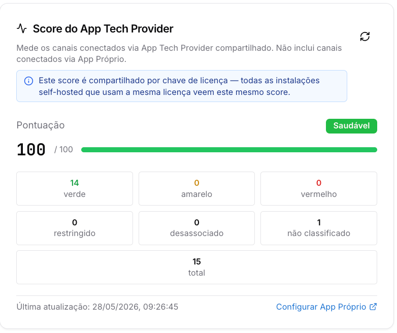
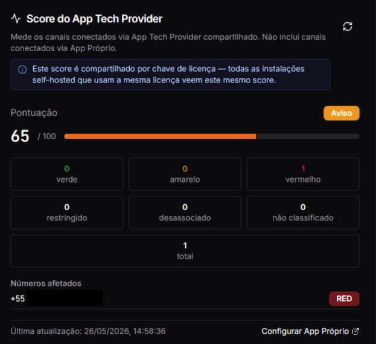
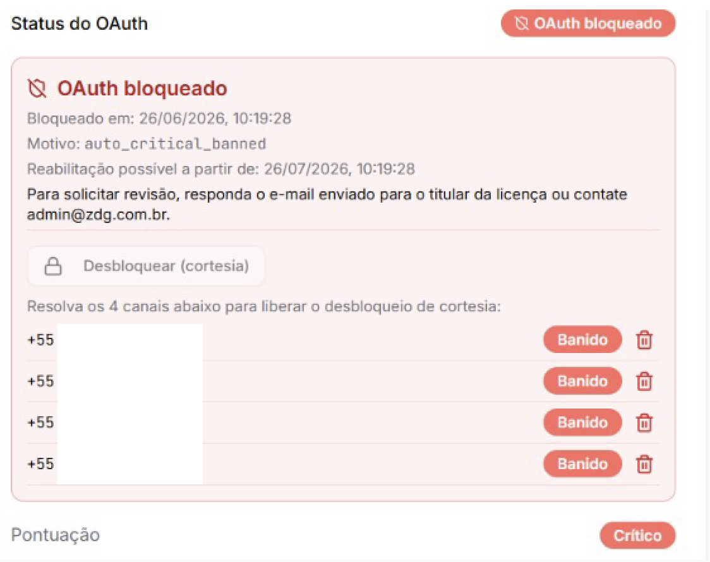
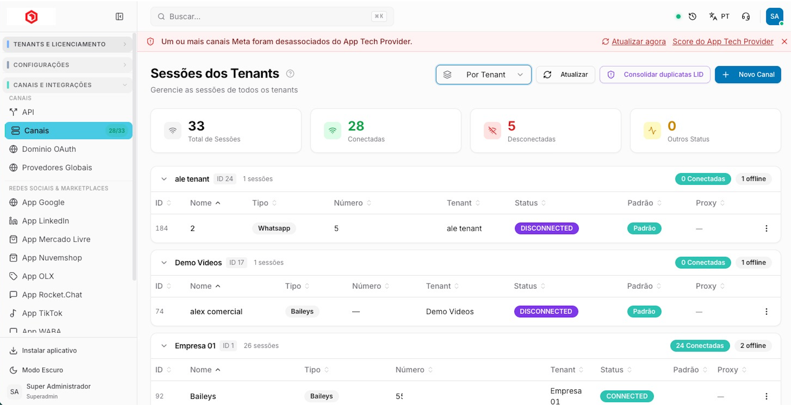

Copiar

Nesta página

1. [Configuração Superadmin](/configuracao-superadmin)
2. [Tenants e Licença](/configuracao-superadmin/tenants-e-licenca)
3. [Gerenciar Licença Prismabot](/configuracao-superadmin/tenants-e-licenca/gerenciar-licenca-prismabot)

# Score do App Tech Provider

**Disponível para o perfil: Superadministrador**

A seção **Score do App Tech Provider** avalia a saúde e a reputação dos seus números de WhatsApp Oficial (WABA) que estão conectados utilizando o **App compartilhado da ZDG** (login incorporado padrão). É um mecanismo de **proteção**: ele monitora a qualidade que a **própria Meta** atribui aos seus números e impede que números de baixa reputação coloquem em risco o aplicativo compartilhado — e, com ele, todos os demais clientes.

**O score é compartilhado por chave de licença.** Todas as suas instalações auto-hospedadas que utilizam a mesma licença visualizam o mesmo score e compartilham a mesma reputação. Isso **inclui os números que os seus clientes/tenants conectam** pelo App compartilhado sob a sua licença — eles também contam para o seu score.

Você acompanha o score em **Superadmin → Tenants e Licença → Gerenciar Licença → Score do App Tech Provider**, com o detalhamento **número a número**.

---

### Como a Meta classifica cada número

A Meta classifica a qualidade dos números de WhatsApp com base no comportamento e nas **denúncias e bloqueios feitos pelos destinatários** (marcação de spam, "bloquear contato"). O Prismabot lê e exibe essa classificação:

* 🟢 **Verde (High):** alta qualidade. Baixo índice de bloqueios e denúncias.
* 🟡 **Amarelo (Medium):** qualidade média. O número recebeu alguns bloqueios/denúncias e está sob aviso.
* 🔴 **Vermelho (Low):** baixa qualidade. O número excedeu o limite tolerável de denúncias/spam pela Meta.

Além dessas, a Meta pode aplicar dois status mais graves: **Restringido** (envio limitado) e **Conta Rejeitada**.

O painel também exibe **Desassociado** (número removido do App compartilhado) e **Não classificado** (número sem status definido pela Meta ainda).

---

### Como o score é calculado

Toda licença começa com **100 pontos**. O score é **recalculado automaticamente a cada checagem** — que acontece **pelo menos uma vez por dia** —, com base na classificação de cada número conectado:

Classificação Meta do número

Efeito no score

🟡 Amarelo

−25 pontos (cada)

🔴 Vermelho

−35 pontos (cada)

🚫 Restringido pela Meta

cai direto para **10**

⛔ Conta Rejeitada pela Meta

vai a **0**

**Faixas do score**

Score

Situação

Efeito

90–100

✅ Saudável

Tudo normal

70–89

👀 Observação

Alerta por e-mail

40–69

⚠️ Alerta

**Envio limitado a 10% do tier do número** (throttle)

0–39

🔴 Crítico

Contagem regressiva para **bloqueio automático**

**O que é o throttle de 10%?**

Quando o score cai **abaixo de 70**, o app passa a limitar cada número a **10% do limite diário (tier) que a Meta concede a ele**.

**Exemplo:** se a Meta permite que o número envie **1.000 mensagens por dia** (tier máximo), com o throttle ativo ele fica limitado a **100 mensagens por dia** — enquanto o score permanecer nessa faixa.

É uma contenção temporária: reduz o volume para frear a queda de reputação na Meta e dar tempo de recuperação, **sem bloquear** a operação por completo.

Exemplo de score Amarelo/vermelho:

---

**Bloqueio automático**

Quando a licença entra em estado **crítico**, o bloqueio é aplicado automaticamente:

* **3 ou mais números vermelhos** (ou amarelos acumulados) → bloqueio em **3 dias**.
* Número **Restringido** ou conta **Rejeitada** pela Meta → bloqueio em **1 dia**.

**Ninguém é bloqueado sem aviso.** Antes do bloqueio, você recebe alertas por e-mail (diários quando o score está crítico) com o score atual, o resumo dos números afetados e o prazo restante até o bloqueio.

Em nível de número: quando um número conectado pelo App compartilhado fica **Vermelho**, ele é **desconectado** do nosso aplicativo (OAuth da ZDG) após um período, para preservar a reputação do App global. Uma vez desassociado, **aquele número não consegue mais se reconectar** usando o App compartilhado. E, se a sua operação acumular vários números vermelhos (score geral muito baixo), a licença perde a permissão de conectar **qualquer novo número** pelo nosso App.

**Erro que aparece quando o número é desassociado**

---

### Identificando os números com problema

Quando o OAuth está bloqueado, o painel exibe diretamente **quais números são responsáveis** pelo bloqueio — com os números de telefone listados e o status de cada um (ex: **Banido**).

Essa listagem permite identificar rapidamente quais canais precisam ser tratados antes de solicitar reabilitação.

**Identificando a qual tenant/cliente pertence cada número bloqueado**

Os números exibidos no Score podem pertencer a **qualquer um dos seus tenants** (clientes). Para descobrir de qual empresa/cliente é cada canal problemático, acesse:

**Superadmin → Canais (e Integrações) → Canais → Sessões dos Tenants**

Nessa tela, clique em **"Por Tenant"** para agrupar as sessões por cliente. Você consegue ver, para cada tenant, quais canais estão desconectados ou com problema — cruzando com os números listados no Score.

Quando um ou mais canais são desassociados do App Tech Provider, um aviso aparece automaticamente na barra superior da tela de Canais: **"Um ou mais canais Meta foram desassociados do App Tech Provider."** Clique em **Atualizar agora** ou acesse o **Score do App Tech Provider** diretamente pelo link exibido no aviso.

---

### **Como tirar um número do score e recuperar a pontuação**

Um número só **deixa de pesar no score** quando é **desvinculado do App compartilhado da ZDG (Tech Provider)**. Enquanto ele permanecer vinculado ao nosso App, continua sendo avaliado — **mesmo que você já esteja enviando mensagens por outro caminho**.

Para recuperar a pontuação: assim que um número ficar Amarelo ou Vermelho, remova-o do App compartilhado. Na **próxima checagem de score** — que acontece **pelo menos uma vez por dia** — aquele número deixa de ser considerado e a pontuação é **recalculada naturalmente**, devolvendo os pontos que ele estava descontando.

**Atenção: "Alterar origem" não desvincula o número.**

O botão **Alterar origem** muda apenas **por onde os webhooks da Meta são entregues** (proxy da ZDG × App Próprio). Ele **não** altera o vínculo de autenticação do número e, por isso, **não** o remove do score.

Para desvincular um número do nosso App de forma eficaz, você precisa de uma destas ações:

* **Desconectar o canal** no Prismabot; **ou**
* **Recriar o canal**, conectando-o a um **novo App** (o seu App Próprio).

### Já desconectei o canal, mas o número continua vinculado ao score. O que fazer?

Excluir apenas o canal do Prismabot não remove a conexão do número com o App Tech Provider. Do lado da Meta, o número pode permanecer associado ao app compartilhado e, por isso, segue contando no score da sua licença.

Para números **banidos**, o fluxo correto é o botão **"Deletar canal banido"** (ícone de lixeira) em **Superadmin → Assinatura**: ele executa a sequência completa na ordem certa — desregistra na Meta → desassocia do BM → tira do score → remove o canal.

Se você excluiu o canal manualmente sem seguir esse fluxo, será necessário desvincular o número do App compartilhado da ZDG diretamente na gestão do próprio número:

* **Conexão via coexistência:** a desvinculação é feita no aplicativo **WhatsApp Business do celular** — siga os passos do vídeo abaixo.

* **Conexão sem coexistência (cadastro incorporado):** remova o vínculo do app pelo **Gerenciador do WhatsApp** na sua Business Manager. <https://business.facebook.com/latest/whatsapp_manager/phone_numbers/>

Feita a desvinculação, aguarde a **próxima checagem de score** — acontece pelo menos uma vez ao dia. O número deixa de ser considerado e a pontuação é recalculada automaticamente.

---

### **Depois de bloqueado: reabilitação**

Uma vez bloqueada, a licença **não consegue mais conectar canais Meta pelo App compartilhado da ZDG**. **Não existe desbloqueio automático** — não adianta reinstalar, trocar de número ou reconectar.

A reabilitação segue estas regras:

* A liberação é feita **somente de forma manual** pela nossa equipe, avaliada **caso a caso**.
* Há uma **carência mínima de 30 dias** a partir do bloqueio antes que a reabilitação seja possível.
* A revisão é solicitada **respondendo ao e-mail de bloqueio** enviado para o titular da licença, ou pelo e-mail **suporte@zdg.com.br**, com um **plano de mitigação**: o que causou a queda de qualidade e o que mudou para que não se repita.

**Desbloqueio de cortesia**

Em alguns casos, o painel exibe o botão **"Desbloquear (cortesia)"**. Essa opção permite solicitar o desbloqueio sem aguardar o prazo de 30 dias, **desde que todos os canais problemáticos listados sejam resolvidos primeiro**.

O painel mostra exatamente quais números precisam ser tratados para liberar a cortesia. Enquanto esses canais permanecerem com status **Banido**, o botão não tem efeito.

O desbloqueio de cortesia é avaliado caso a caso e não é garantido. Resolva os canais listados e então utilize o botão para solicitar a revisão.

---

**O que NÃO é afetado**

* Canais configurados via **App Próprio** (sua própria conta Meta Developer) continuam funcionando normalmente — o bloqueio atinge **apenas** as conexões pelo nosso App compartilhado.
* Os demais canais da plataforma (**Baileys, Telegram, Instagram, etc.**) **não** entram nesse score.

---

### **Como manter o score alto**

1. **Opt-in sempre** — envie apenas para quem aceitou receber.
2. **Cuidado com volume e frequência** — picos de disparo derrubam a qualidade na Meta.
3. **Monitore bloqueios e denúncias** — um número marcado como spam vira amarelo/vermelho rápido.
4. **Aja rápido em números amarelos/vermelhos** — desvincule-os do App compartilhado assim que caírem. Eles param de descontar pontos e a pontuação se recupera na próxima checagem.
5. **Identifique o tenant responsável** — use **Canais → Sessões dos Tenants → Por Tenant** para saber de qual cliente é o número problemático e orientá-lo.
6. **Acompanhe pelo painel** — em **Superadmin → Assinatura** você vê o detalhe por número.
7. **Considere migrar para App Próprio** se faz disparos em volume.

---

### **Solução definitiva: App Próprio**

Se a sua operação trabalha com nichos que geram muitas denúncias, ou você tem clientes que rotineiramente deixam os números em vermelho, **você não poderá continuar utilizando o App compartilhado da ZDG**. Nesse cenário, a orientação é criar a sua própria infraestrutura na Meta:

* **Configurar App Próprio (Tornar-se Tech Provider)**: acesse o Facebook Developers, crie o seu próprio aplicativo, passe pelo processo de aprovação da Meta e configure as credenciais no painel Superadmin do Prismabot.
* **Vantagem:** com o seu próprio App, a saúde (score) fica **isolada na sua própria Business Manager**, permitindo que você gerencie os números vermelhos dos seus clientes **sob a sua responsabilidade**, sem afetar o ecossistema global do Prismabot e sem risco de bloqueio coletivo.

Para iniciar, clique no link **"Configurar App Próprio"** no canto inferior direito do painel de Score.

Sempre que houver queda de qualidade, enviaremos um e-mail com o resumo dos números e a recomendação do que fazer.

[AnteriorGerenciar Licença Prismabot](/configuracao-superadmin/tenants-e-licenca/gerenciar-licenca-prismabot)[PróximoChat Suporte](/configuracao-superadmin/tenants-e-licenca/chat-suporte)

Atualizado há 15 dias

Isto foi útil?