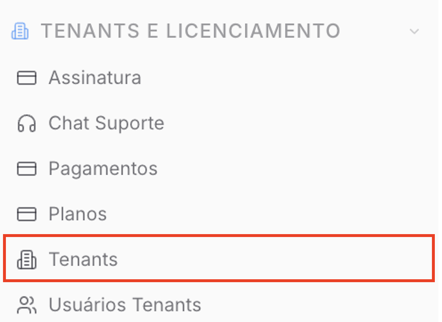
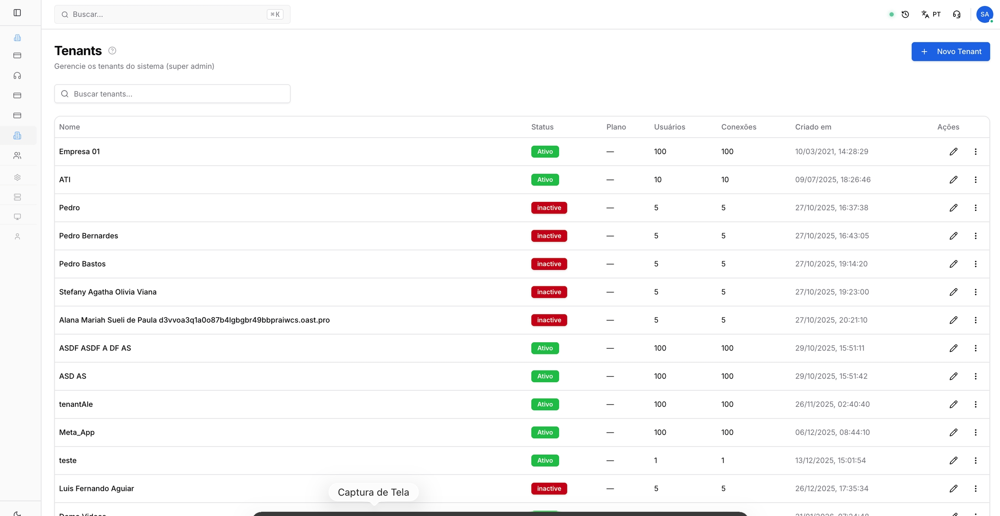
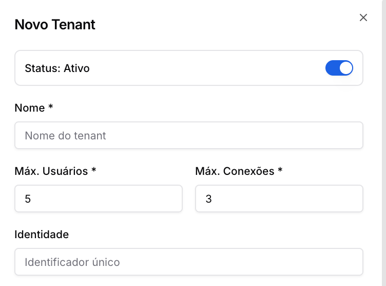
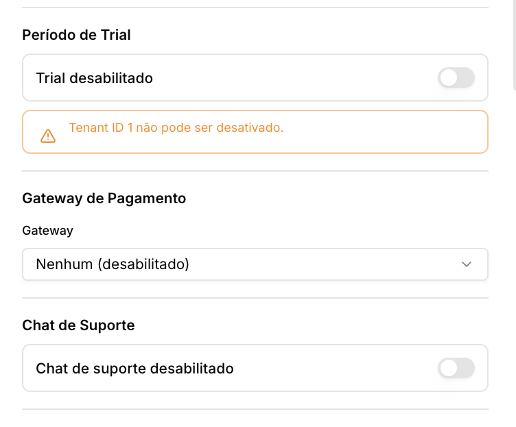
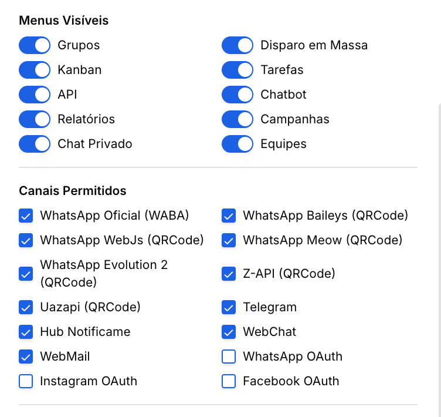
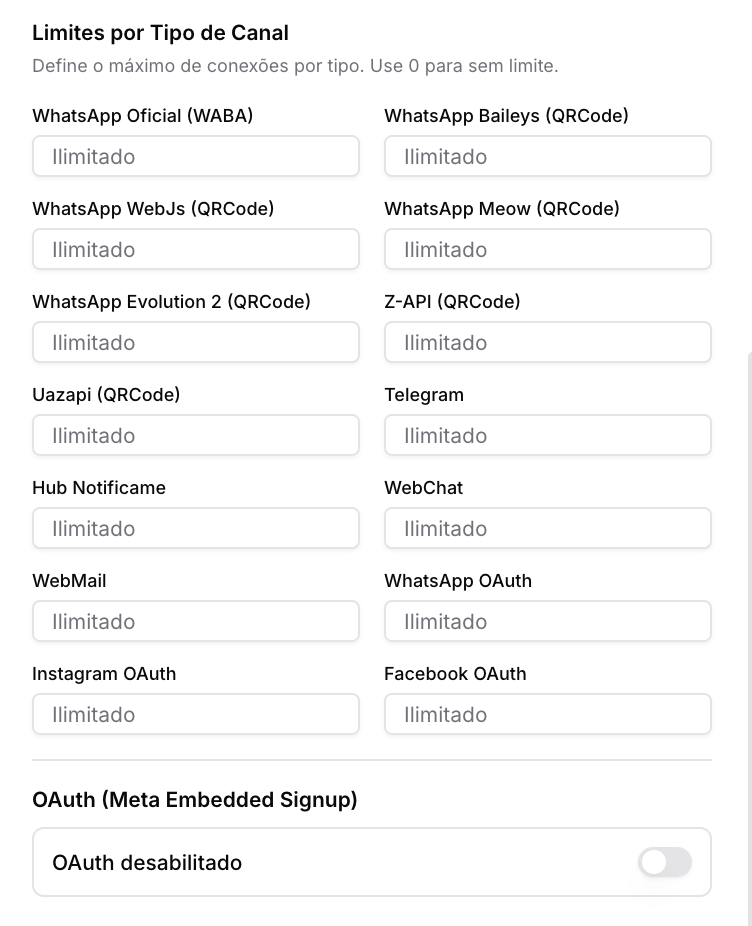
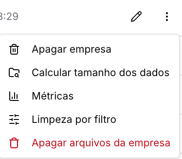
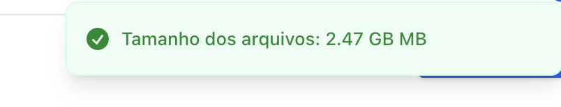
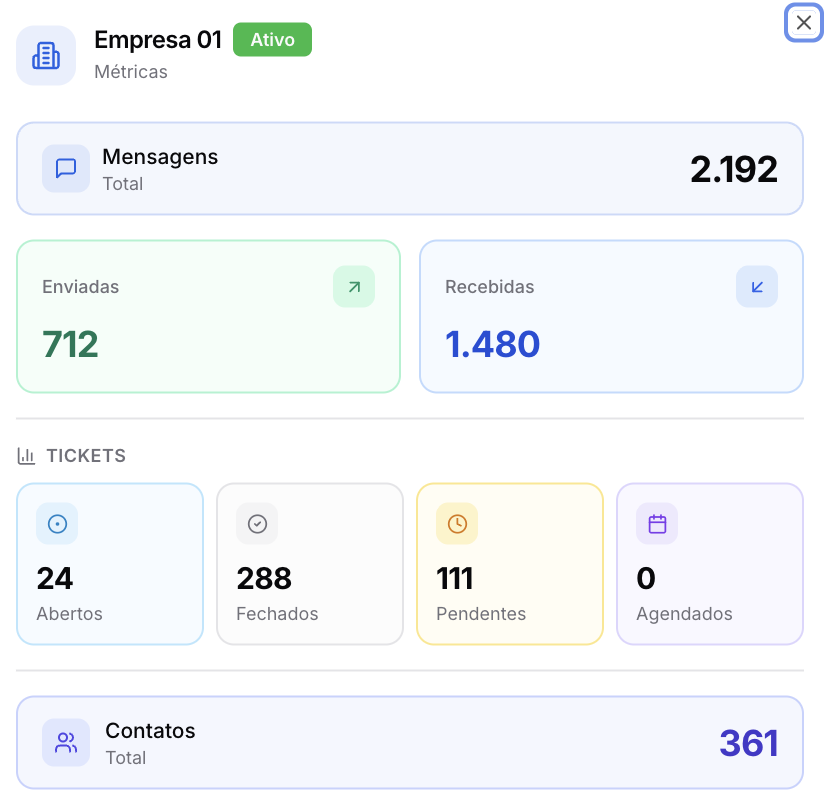

Copiar

Nesta página

1. [Configuração Superadmin](/configuracao-superadmin)
2. [Tenants e Licença](/configuracao-superadmin/tenants-e-licenca)

# Gestão de Tenants (clientes)

Os Tenants representam as instâncias individuais (empresas ou clientes) que utilizam a plataforma Prismabot. Nesta seção, o Superadministrador controla os limites de uso, as funcionalidades liberadas e a

**Disponível para o perfil: Superadministrador**

Esta documentação detalha como criar, configurar e gerenciar os recursos de cada tenant cadastrado no sistema.

---

#### Acessando a Página de Tenants

No menu lateral do painel Superadmin, localize a sessão **"TENANTS E LICENCIAMENTO"** e selecione a aba **"Tenants"**.

#### Visão Geral da Listagem

A tela principal exibe todos os tenants cadastrados com as seguintes informações:

* **Nome:** Identificação da empresa.
* **Status:** Indica se a conta está `Ativa` (Verde) ou `Inativa` (Vermelho).
* **Plano:** Nome do plano assinado (caso configurado).
* **Usuários / Conexões:** Exibição do consumo atual versus o limite permitido.
* **Criado em:** Data e hora de abertura da conta.
* **Ações:** Atalhos para edição rápida ou ferramentas administrativas avançadas.

---

#### Criando ou Editando um Tenant

Ao clicar em **"+ Novo Tenant"** ou no ícone de edição (lápis), uma janela de configuração completa será aberta.

**1. Dados Básicos e Limites**

* **Status:** Chave para ativar ou suspender o acesso do tenant.

  + **Nota:** O Tenant ID 1 (instalação mestre) não pode ser desativado.
* **Nome:** Nome oficial da empresa.
* **Máx. Usuários / Máx. Conexões:** Define o teto de atendentes e canais que o cliente pode cadastrar.
* **Identidade:** Campo para o identificador único do tenant no banco de dados.

**2. Financeiro e Suporte**

* **Período de Trial:** Chave para habilitar ou desabilitar o período de teste gratuito.
* [**Gateway de Pagamento**](/configuracao-superadmin/tenants-e-licenca/planos)**:** Seleção do gateway (ex: Asaas) e inserção do Token de API e Customer ID específico para este cliente.
* [**Chat de Suporte**](/configuracao-superadmin/tenants-e-licenca/chat-suporte)**:** Habilita ou desabilita o acesso do tenant ao chat de suporte direto.

**3. Menus Visíveis e Canais Permitidos**

Nesta seção, o Superadmin define exatamente quais funcionalidades o tenant poderá visualizar em seu painel lateral:

* **Recursos:** Grupos, Kanban, API, Relatórios, Chat Privado, Disparo em Massa, Tarefas, Chatbot, Campanhas e Equipes.
* **Canais:** Checklist para permitir quais tipos de conexão o cliente pode usar (WhatsApp Oficial WABA, Baileys, WebJs, Meow, Evolution, Telegram, WebChat, Instagram/Facebook OAuth, etc).

**4. Limites por Tipo de Canal**

Permite um controle granular sobre a quantidade de conexões para cada tecnologia específica.

[Ver documentação OAuth](/configuracao-administrador/administracao-painel-admin/canais-de-comunicacao/whatsapp-oficial-oauth-app-prismabot-com-coexistencia)

---

**Quota de galeria:** Define o limite máximo de armazenamento de arquivos de mídia (imagens, áudios, vídeos e documentos) para o tenant, em MB. Quando o limite é atingido, novos uploads de mídia são bloqueados para aquele tenant até que o espaço seja liberado.

Para verificar quanto espaço um tenant já ocupa, use a opção **Calcular tamanho dos dados** no menu de três pontos ao lado do tenant. Para liberar espaço, use **Apagar arquivos da empresa.**

---

#### Ações e Ferramentas Administrativas

No menu de três pontos ao lado de cada tenant, estão disponíveis ferramentas de manutenção:

* **Apagar empresa:** Remove permanentemente o tenant e todos os seus dados.
* **Calcular tamanho dos dados:** Verifica o espaço em disco ocupado pelo banco de dados do tenant.

* **Métricas:** Exibe dados de performance e uso da instância.

* **Limpeza por filtro:** Permite a remoção em massa de mensagens ou logs antigos para otimização do banco.
* **Apagar arquivos da empresa:** Remove mídias (imagens, áudios, documentos) armazenadas nos buckets ou pastas locais do tenant.

[AnteriorChat Suporte](/configuracao-superadmin/tenants-e-licenca/chat-suporte)[PróximoUsuários por Tenant](/configuracao-superadmin/tenants-e-licenca/usuarios-por-tenant)

Atualizado há 1 mês

Isto foi útil?