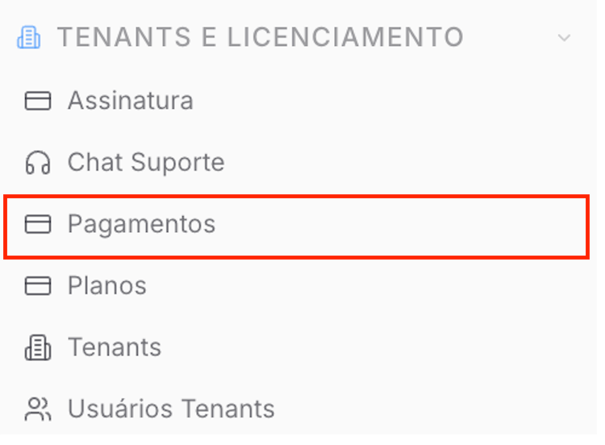
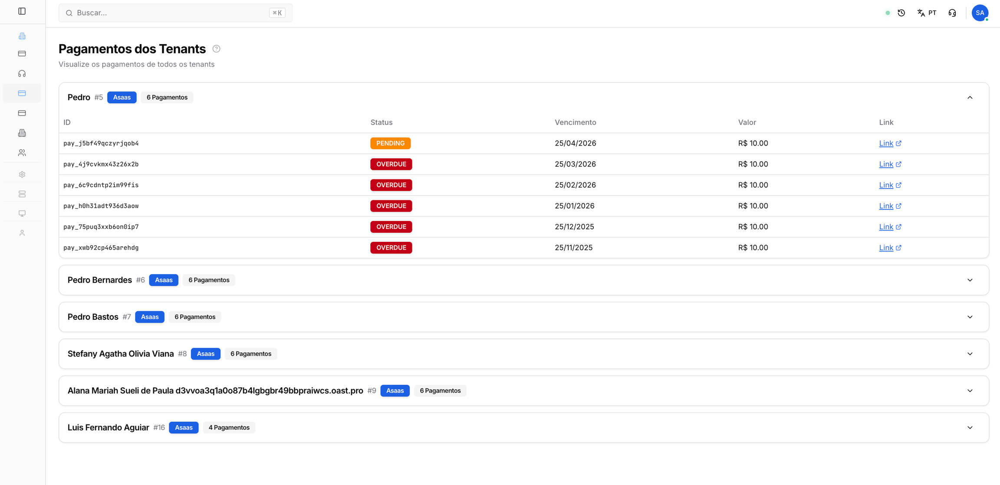

Copiar

Nesta página

1. [Configuração Superadmin](/configuracao-superadmin)
2. [Tenants e Licença](/configuracao-superadmin/tenants-e-licenca)

# Pagamentos dos Tenants

Visualize e gerencie os pagamentos de todos os tenants da plataforma, acompanhando valores, status de cobrança e datas de vencimento de forma centralizada.

**Disponível para o perfil: Superadministrador**

Esta página é uma central de visualização e gestão financeira dos seus clientes (tenants). Ela permite identificar rapidamente inadimplências e acessar links diretos para as faturas geradas pelos gateways de pagamento.

**Observação importante:** Esta tela destina-se apenas à visualização e gestão dos pagamentos individuais. Para configurar os gateways de pagamento (Asaas, Stripe, etc.) ou definir os valores e períodos de teste, acesse a documentação de [Planos](/configuracao-superadmin/tenants-e-licenca/planos).

#### Acessando a Página de Pagamentos

No menu lateral do painel Superadmin, localize a sessão **"TENANTS E LICENCIAMENTO"** e selecione a aba **"Pagamentos"**.

---

#### Entendendo as Informações da Tela

A interface exibe os tenants em blocos expansíveis. Ao clicar no nome de um tenant, o sistema detalha o histórico de cobranças associado a ele.

**Cabeçalho do Tenant**

* **Nome do Tenant:** Nome do cliente/empresa.
* **Gateway:** Identifica por qual integrador a cobrança é processada (ex: Asaas).
* **Contador de Pagamentos:** Quantidade total de faturas registradas para aquele tenant.

**Tabela de Cobranças**

Dentro de cada tenant, você encontrará as seguintes colunas:

* **ID:** Código de identificação único da transação no gateway de pagamento.
* **Status:** Indica a situação atual da fatura:

  + `PENDING` (Laranja): Aguardando pagamento.
  + `OVERDUE` (Vermelho): Pagamento vencido e não identificado.
  + `RECEIVED/CONFIRMED`: Pagamento realizado com sucesso.
* **Vencimento:** A data limite para o pagamento da fatura.
* **Valor:** O valor bruto cobrado do tenant (Ex: R$ 10,00).
* **Link:** Atalho externo que redireciona para a página oficial da fatura no gateway, permitindo a visualização de boleto, linha digitável ou QR Code do Pix.

---

#### Gestão de Cobranças e Ações

A página de pagamentos deve ser utilizada para a rotina de monitoramento financeiro da sua operação:

1. **Identificação de Inadimplência:** As faturas com o status `OVERDUE` ficam destacadas em vermelho para facilitar a identificação imediata de tenants com pagamentos em atraso.
2. **Ações de Cobrança:** Utilize o campo **Link** para copiar o endereço da fatura e enviar diretamente ao cliente via WhatsApp ou E-mail, agilizando o processo de recebimento.
3. **Auditoria de Valores:** Verifique se o valor cobrado está em conformidade com o plano assinado pelo tenant.

[AnteriorUsuários por Tenant](/configuracao-superadmin/tenants-e-licenca/usuarios-por-tenant)[PróximoPlanos](/configuracao-superadmin/tenants-e-licenca/planos)

Atualizado há 2 meses

Isto foi útil?