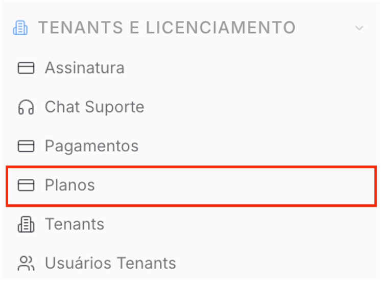
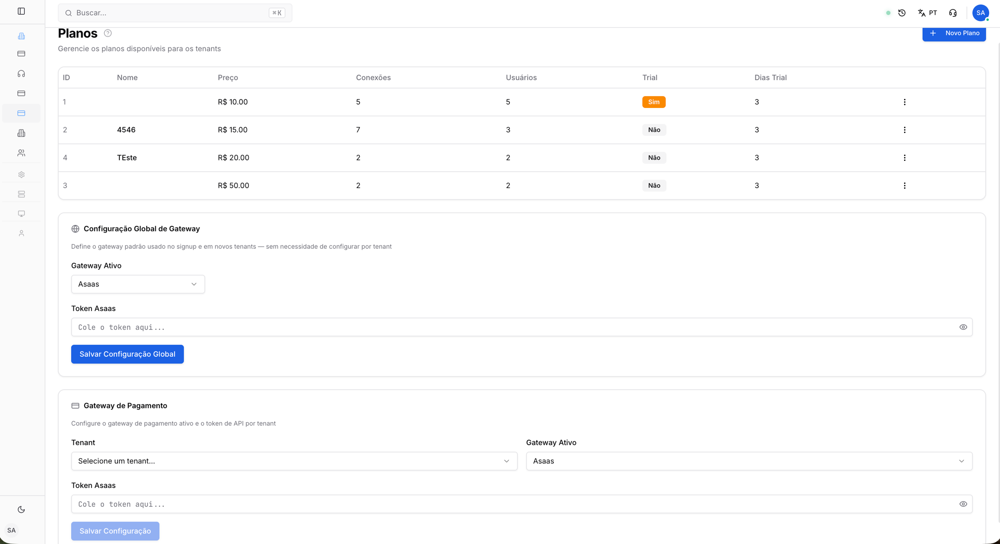
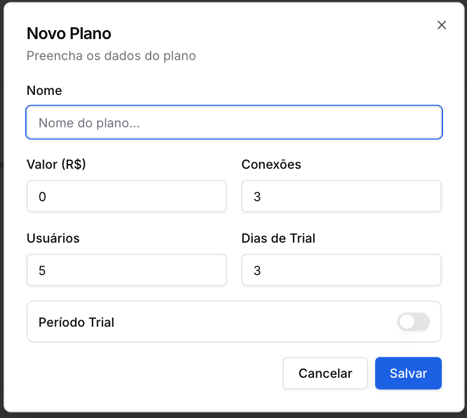
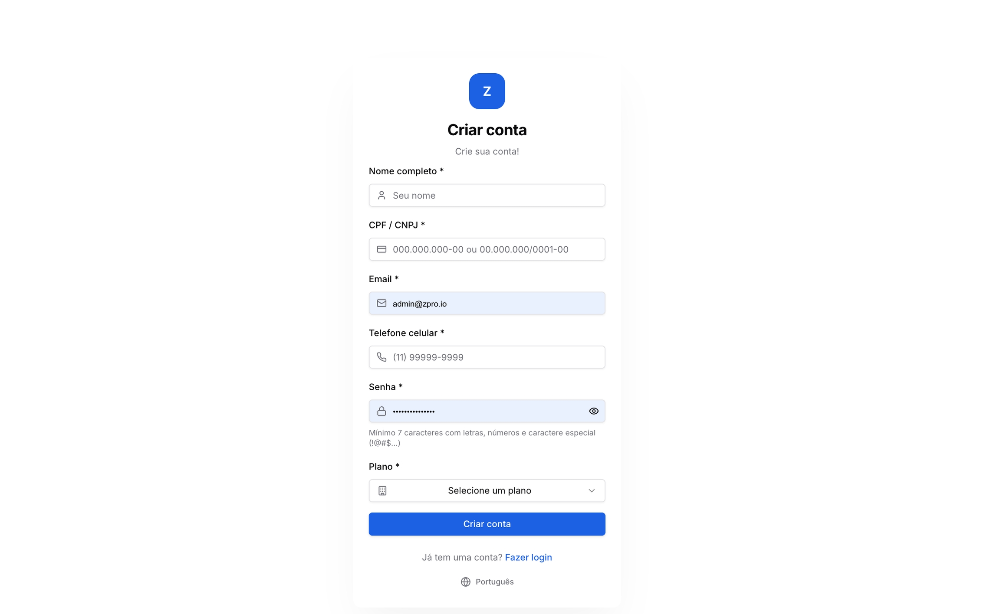

Copiar

Nesta página

1. [Configuração Superadmin](/configuracao-superadmin)
2. [Tenants e Licença](/configuracao-superadmin/tenants-e-licenca)

# Planos

Nesta seção, você aprenderá a gerenciar os planos comerciais disponíveis para os tenants do sistema, definindo limites de uso, períodos de teste (trial) e as configurações de integração com gateways d

**Disponível para o perfil: Superadministrador**

A página de Planos é fundamental para a monetização da plataforma, permitindo que o administrador estabeleça diferentes níveis de serviço e automatize a cobrança por meio de integradores financeiros.

#### Acessando a Página de Planos

No menu lateral do painel Superadmin, localize a sessão **"TENANTS E LICENCIAMENTO"** e entre na aba **"Planos"**.

Visão geral da página:

---

#### 1. Criando um Novo Plano

Para disponibilizar uma nova opção de assinatura para seus clientes:

1. Clique no botão **"+ Novo Plano"** localizado no canto superior direito.
2. Na janela pop-up, preencha os seguintes campos:

   * **Nome:** Identificação do plano (ex: Plano Start, Plano Pro).
   * **Valor (R$):** Preço que será cobrado do tenant.
   * **Conexões:** Limite máximo de instâncias/canais de WhatsApp que o tenant pode conectar.
   * **Usuários:** Limite máximo de atendentes que podem ser cadastrados no tenant.
   * **Período Trial:** Acione a chave (switch) caso deseje oferecer um tempo de uso gratuito.
   * **Dias de Trial:** Defina a quantidade de dias para o teste gratuito antes da primeira cobrança.
3. Clique em **"Salvar"**. O novo plano ficará imediatamente disponível para ser atribuído a novos tenants.

---

#### 2. Gerenciando Planos Existentes

Na listagem principal, você visualiza o resumo de todos os planos criados, incluindo ID, limites e status do trial. Cline no ícone de 3 pontos para:

* **Editar Plano:** Ao ajustar preços ou limites de um plano existente, as alterações serão aplicadas para novas contratações.
* **Excluir Plano:** Planos excluídos deixam de estar disponíveis para novos tenants, mas os usuários já vinculados a eles permanecem ativos até uma alteração manual.

---

#### 3. Configuração Global de Gateway

Esta seção define o gateway de pagamento padrão utilizado no momento do cadastro (signup) de novos tenants, eliminando a necessidade de configurar individualmente cada cliente, a menos que haja uma exceção.

**Gateways suportados:**

* [Asaas](/configuracao-superadmin/tenants-e-licenca/planos/como-gerar-a-chave-api-no-asaas)
* Stripe
* Pagarme
* Mercado Pago

**Como configurar:**

1. No bloco **"Configuração Global de Gateway"**, selecione o **Gateway Ativo** desejado.
2. Insira o **Token/API Key** fornecido pela sua conta no gateway escolhido.
3. Clique em **"Salvar Configuração Global"**.

---

#### 4. Gateway de Pagamento por Tenant

Caso precise definir uma conta de recebimento específica para um cliente determinado (diferente da configuração global):

1. Vá até o bloco **"Gateway de Pagamento"**.
2. No campo **Tenant**, selecione o cliente desejado na lista.
3. Escolha o **Gateway Ativo** para este cliente específico.
4. Insira o **Token** correspondente à conta que deve receber os pagamentos deste tenant.
5. Clique em **"Salvar Configuração"**.

---

### Utilizando a Página de Signup

Após criar os planos, você terá uma página pública para que seus clientes possam se cadastrar sozinhos.

* **URL da Página:** O endereço é o seu domínio de frontend, seguido por `/signup`.

  + *Exemplo:* `app.suaempresa.com.br/signup`
* **Como Funciona o Fluxo do Cliente:**

  1. O cliente acessa a sua página de signup.
  2. Ele preenche os dados cadastrais (nome, e-mail, telefone, senha).
  3. Ele seleciona um dos planos que você criou.
  4. Ao finalizar, o sistema realiza as seguintes ações automaticamente:

     + Cria um novo **Tenant** (cliente) no seu Prismabot.
     + Cria um novo **Usuário Admin** para este tenant.
     + Cria um novo **Cliente** na sua conta do Gateway global.
     + Gera a primeira **cobrança de assinatura** para este cliente no Gateway global.

Página de signup:

[AnteriorPagamentos dos Tenants](/configuracao-superadmin/tenants-e-licenca/pagamentos-dos-tenants)[PróximoComo gerar a Chave API no Asaas](/configuracao-superadmin/tenants-e-licenca/planos/como-gerar-a-chave-api-no-asaas)

Atualizado há 4 meses

Isto foi útil?