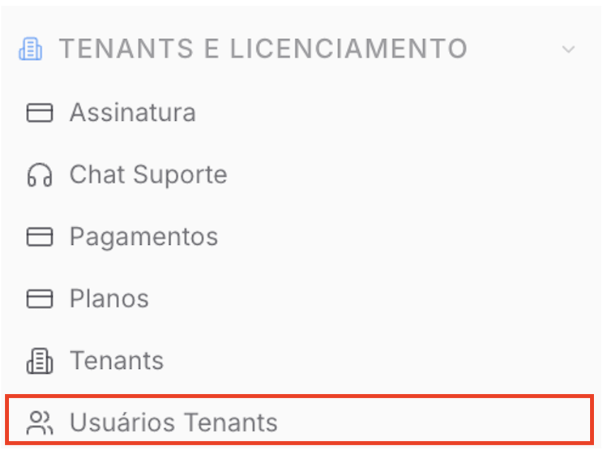
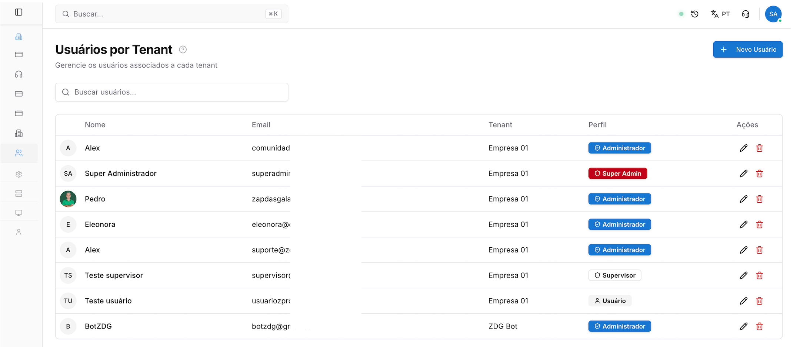
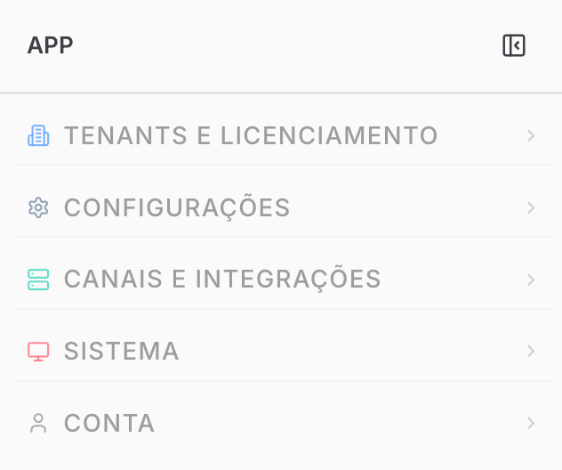
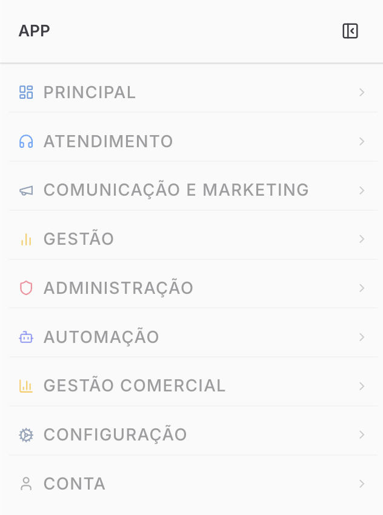
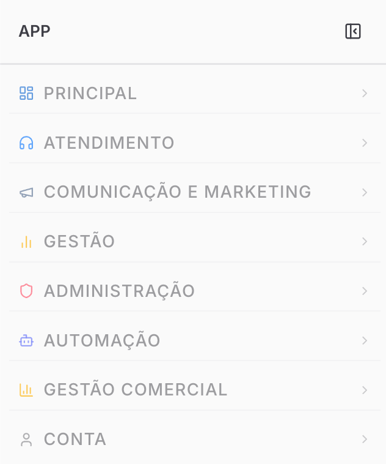
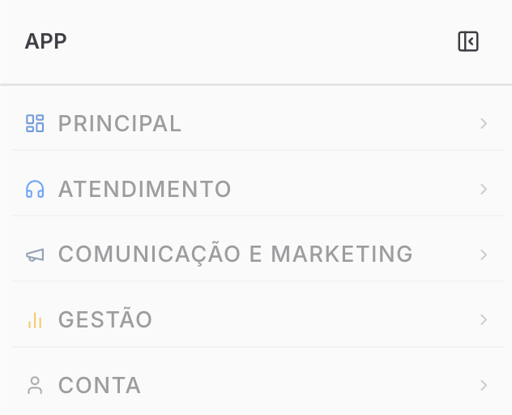
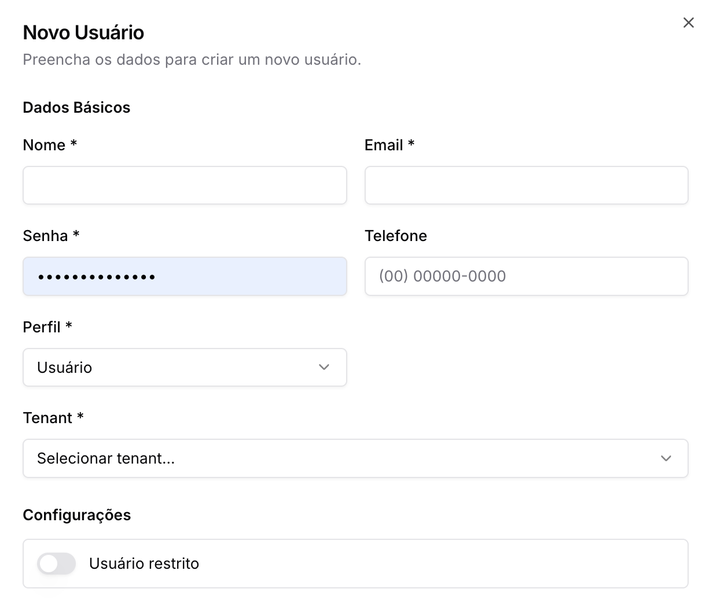
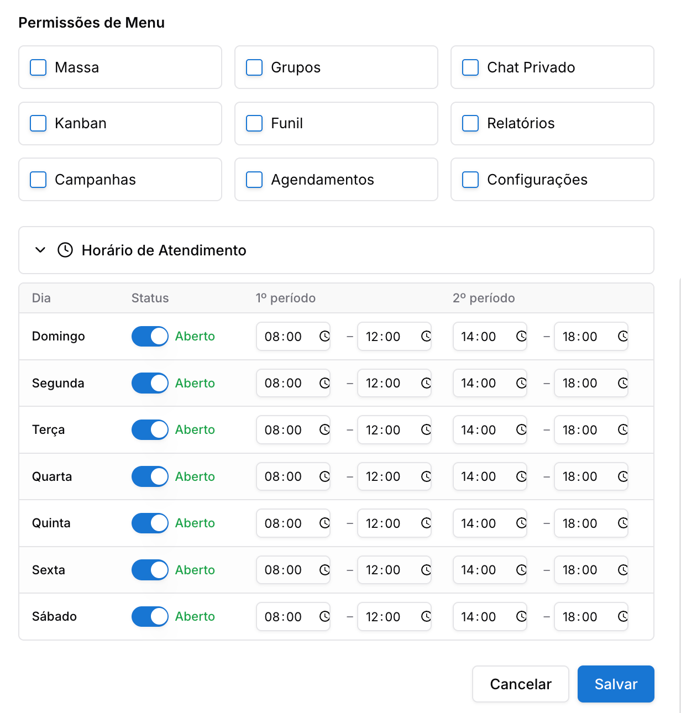

Copiar

Nesta página

1. [Configuração Superadmin](/configuracao-superadmin)
2. [Tenants e Licença](/configuracao-superadmin/tenants-e-licenca)

# Usuários por Tenant

Gestão de Usuários

Nesta página, o Superadministrador realiza a gestão centralizada de todos os usuários cadastrados na plataforma, independentemente do tenant ao qual pertencem. É possível definir perfis de acesso, permissões específicas de menu e horários de atendimento individuais.

**Disponível para os perfis: Superadministrador**

Esta documentação detalha os procedimentos para criação, edição e controle de permissões de usuários.

---

#### Acessando a Página de Usuários

No menu lateral do painel Superadmin, localize a sessão **"TENANTS E LICENCIAMENTO"** e entre na aba **"Usuários Tenants"**.

#### Visão Geral da Listagem

A tela exibe uma tabela com todos os usuários do sistema:

* **Nome e Email:** Identificação básica do usuário.
* **Tenant:** Indica a qual empresa (instância) o usuário está vinculado.
* **Perfil:** Exibe o nível de acesso (ex: Administrador, Super Admin, Supervisor, Usuário).
* **Ações:** Ícones para editar dados ou excluir o registro.

---

#### Entendendo os Perfis de Usuário

A plataforma Prismabot utiliza uma hierarquia de perfis para garantir a segurança dos dados e a organização das funções operacionais. Cada perfil possui níveis de permissão distintos:

* **Super Admin:** Este é o nível mais alto de acesso. Possui permissão global para gerenciar a infraestrutura do sistema, incluindo a criação de tenants, gestão de licenças, configuração de planos e gateways de pagamento globais.

* **Administrador:** Possui controle total dentro de um **tenant específico**. Pode criar e editar usuários da sua empresa, configurar conexões (instâncias de WhatsApp), ajustar fluxos de chatbot e acessar todas as configurações e relatórios do painel do cliente.

* **Supervisor:** Perfil com foco gerencial sobre a operação de atendimento. O Supervisor pode visualizar os chats de outros atendentes, acompanhar relatórios de desempenho e monitorar o Kanban, mas possui restrições de acesso a configurações estruturais do sistema e faturamento.

* **Usuário (Atendente):** Nível estritamente operacional. O acesso é limitado às ferramentas de comunicação direta, como o Chat, Kanban e Tarefas. Geralmente, este perfil visualiza apenas os atendimentos vinculados a ele ou aos seus departamentos, sem permissão para alterar configurações do tenant.

---

#### Criando um Novo Usuário

Para adicionar um colaborador a um tenant específico:

1. Clique no botão **"+ Novo Usuário"**.
2. Preencha os **Dados Básicos**:

   * **Nome e Email:** Dados de identificação e login.
   * **Senha:** Código de acesso (mínimo de 7 caracteres).
   * **Telefone:** Número de contato do usuário.
3. Defina o **Perfil**: Selecione entre as opções de hierarquia mencionadas acima.
4. Selecione o **Tenant**: Escolha a qual empresa este usuário pertence.
5. **Configurações Adicionais:** Use a chave **"Usuário restrito"** para limitar funcionalidades específicas, caso necessário.

---

#### Configurações de Permissões e Horários

Dentro da tela de criação ou edição, o sistema permite um ajuste fino das capacidades do usuário:

**1. Permissões de Menu**

Selecione quais módulos o usuário terá permissão para visualizar e operar dentro do sistema:

* Disparos em massa.
* Gestão de Grupos.
* Chat Privado.
* Kanban e Funil.
* Relatórios e Campanhas.
* Agendamentos e Configurações.

**2. Horário de Atendimento**

Define em quais períodos o usuário poderá realizar atendimentos no sistema:

* **Status:** Define se o usuário está "Aberto" ou "Fechado" para atendimento em cada dia da semana.
* **Períodos:** Permite configurar até dois turnos de trabalho por dia (ex: 08:00–12:00 e 14:00–18:00).

---

#### Gestão e Manutenção

* **Edição:** Permite ajustar permissões de menu, alterar a senha ou trocar o perfil de acesso a qualquer momento.
* **Desativação:** Para impedir o acesso de um usuário sem excluí-lo definitivamente, o administrador pode alterar o status ou remover as permissões de menu.
* **Busca:** Utilize o campo de pesquisa no topo da página para localizar rapidamente usuários por nome ou e-mail.

Após preencher todas as informações e ajustar as permissões desejadas, clique no botão **SALVAR** no canto inferior direito para finalizar o cadastro. O usuário já poderá acessar a plataforma!

[AnteriorGestão de Tenants (clientes)](/configuracao-superadmin/tenants-e-licenca/gestao-de-tenants-clientes)[PróximoPagamentos dos Tenants](/configuracao-superadmin/tenants-e-licenca/pagamentos-dos-tenants)

Atualizado há 4 meses

Isto foi útil?