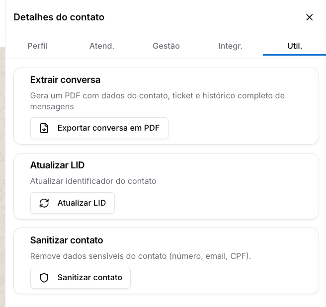
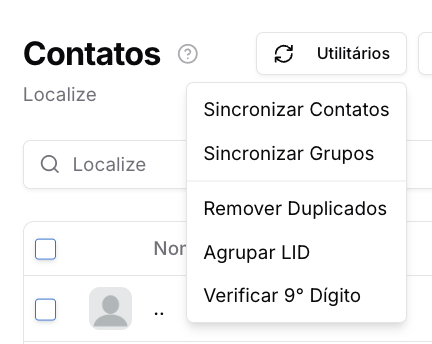
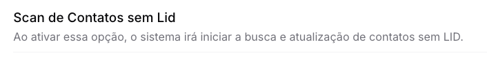
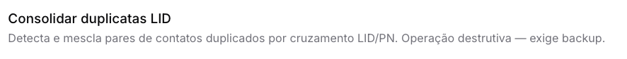
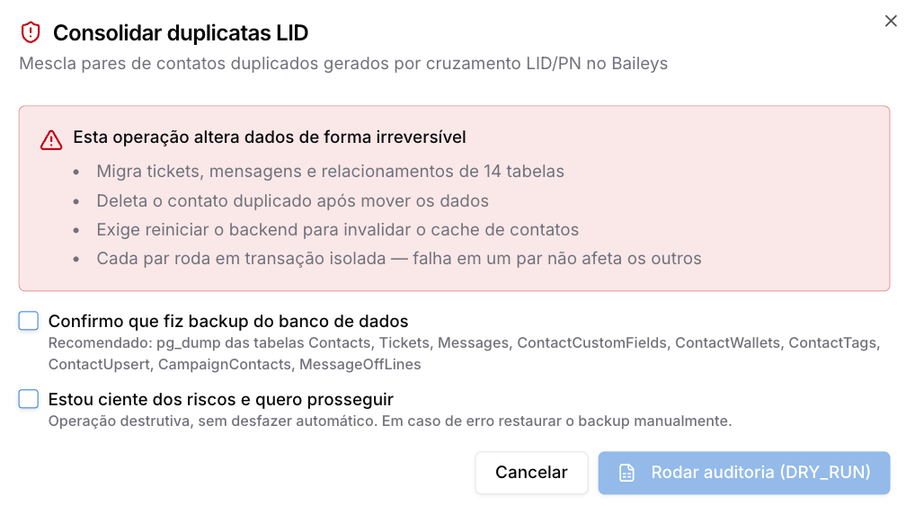
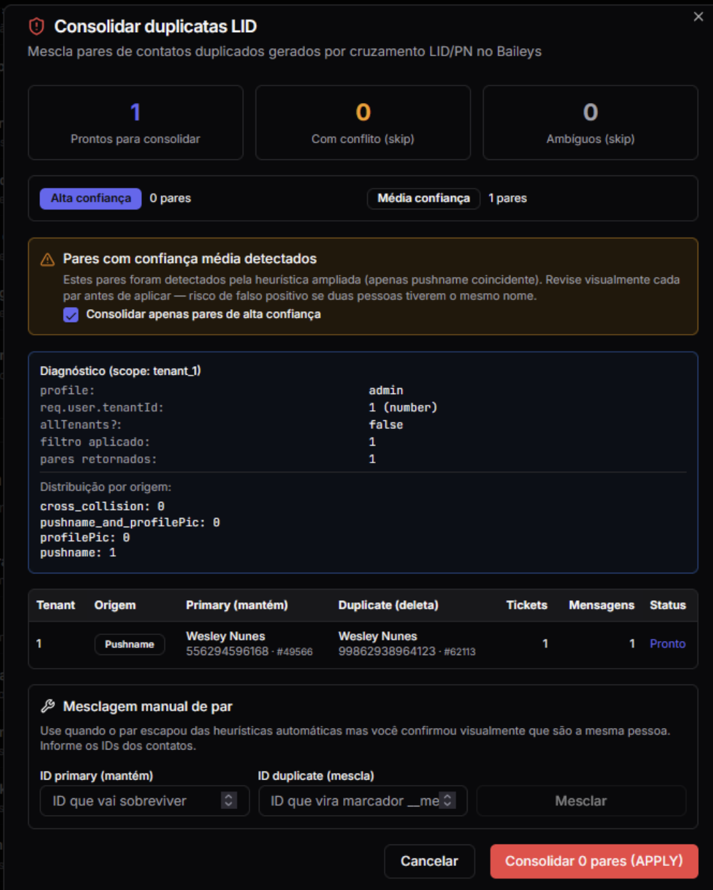

# LID do WhatsApp

O WhatsApp implementou mudanças de privacidade na forma como os números de telefone são exibidos em novas conversas, introduzindo um identificador interno chamado **LID**. Isso pode gerar a criação de contatos duplicados na plataforma.

Esta documentação explica o que é o LID, por que a duplicação acontece e como utilizar as ferramentas do Prismabot para gerenciar e unificar sua base de contatos.

---

### 1. O que é o LID e por que cria duplicatas?

O LID é um identificador privado/interno do WhatsApp, usado para representar o usuário sem expor diretamente o número de telefone. Enquanto o sistema só tiver o LID e não conseguir resolver o número real ou mapear corretamente o contato, podem ocorrer limitações para responder, vincular histórico ou evitar duplicidade

Quando um cliente (que não está na sua lista ou possui privacidade restrita) inicia uma conversa, o WhatsApp pode enviar o LID em vez do número real. O Prismabot exibe o LID recebido. Quando o WhatsApp libera o número real, o sistema tenta atualizar o contato.

**O problema:** O sistema pode manter, temporariamente, dois registros para a mesma pessoa:

1. Um registro antigo/correto com o **número de telefone**.
2. Um registro novo/temporário com o **LID**.

Até que o sistema consiga vincular os dois, eles aparecem separados, dividindo o histórico de conversas.

> **Nota sobre a API Oficial (WABA):** A instabilidade de LID ocorre apenas em APIs não oficiais (Baileys, WWebJS, Uazapi, Evolution, etc.). Na API Oficial (WABA), esse problema não existe, pois a integração utiliza o BSUID (Business-Scoped User ID), garantindo a resolução consistente dos contatos.

---

### 2. Ferramentas para Correção e Agrupamento de LID

O Prismabot disponibiliza quatro ferramentas para resolver essas inconsistências, localizadas em diferentes áreas do sistema, dependendo da necessidade (ação individual, em massa ou manual avançada).

#### Ferramenta 1: Atualizar LID (Ação Individual)

* **Localização:** Tela de Atendimento > Conversa com o contato > Informações do Contato (Detalhes) > Aba "Util." > Botão Atualizar LID
* **Como funciona:** Ideal para corrigir um contato que você está atendendo no momento. Ao clicar em "Atualizar LID", o sistema atualiza o identificador e une as mensagens daquele contato específico.

#### Ferramenta 2: Agrupar LID (Ação em Massa)

* **Localização:** Menu Contatos > Botão "Utilitários" > "Agrupar LID".
* **Como funciona:** Executa a mesma lógica da ferramenta individual, mas em massa. O sistema varre o tenant e une todas as mensagens relacionadas aos respectivos contatos que possuem o mesmo LID, limpando as duplicidades básicas da base.

#### Ferramenta 3: Scan de Contatos sem LID

* **Localização:** Menu Configurações> Configurações Gerais > Ações do Sistema
* **Como funciona:** Ao ativar essa opção, o sistema inicia uma busca para atualizar os contatos do seu tenant que ainda não possuem o LID registrado no banco de dados.

**Atenção:** Este processo varre toda a sua base de dados. Em caso de bancos de dados muito grandes, a operação pode demorar consideravelmente ou até mesmo acionar o bloqueio da conta no WhatsApp devido ao alto volume de requisições à API.

#### Ferramenta 4: Consolidar duplicatas LID (Avançado)

* **Localização:** Menu Configurações> Configurações Gerais > Ações do Sistema

* **Como funciona:** Detecta e mescla pares de contatos duplicados gerados por cruzamento de LID e Pushname (Nome). Essa função serve para juntar dois contatos repetidos manualmente, quando o sistema não consegue detectar sozinho que são a mesma pessoa ou possui um contato "envenenado" (com problemas) que precisa ser substituído por um contato saudável.

**Operação Destrutiva:** Existe remoção de contatos e alteração irreversível em cerca de 14 tabelas do banco de dados. **É obrigatório confirmar que você realizou o backup do banco de dados** antes de prosseguir. O sistema permite rodar uma auditoria (Dry Run) antes de aplicar as mudanças reais.

**Como fazer a Mesclagem Manual na Ferramenta 4:**

Na tela de diagnóstico, se o sistema não uniu automaticamente, você olha os dados, constata que são a mesma pessoa e indica manualmente os IDs para o sistema uní-los.

* **ID primary (mantém):** Insira o ID da entrada "boa". É o contato que vai sobreviver (geralmente a ficha que tem o número certo, o nome certo e o histórico mais completo).
* **ID duplicate (mescla):** Insira o ID da entrada "errada" ou repetida. Esta é a ficha que será desativada.

**O que acontece ao clicar em Mesclar?**

1. O sistema pega todas as conversas, mensagens, tags e anotações que estavam na ficha duplicada.
2. Move todos esses dados para a ficha principal (Primary).
3. Aposenta a entrada duplicada (ela não é apagada do banco para fins de auditoria, mas fica guardada como histórico, deixa de aparecer nas buscas e não recebe mais mensagens).

**Resultado prático:** O contato fica 100% unificado, com um único histórico de conversa, e as mensagens futuras passam a ser entregues para a pessoa certa, em vez de "se perderem" na ficha errada.

---

### 3. Detalhamento Técnico: Por que a fusão automática falha às vezes?

Quando você utiliza as opções simples (Ferramentas 1 e 2), o sistema busca um *Contato Original* e um *Contato Duplicado* para fundir. A fusão automática só ocorre se a seguinte condição exata for atendida:

* Deve existir um **Contato Original** com o número de telefone correto no campo `number`.
* Deve existir um **Contato Duplicado** cujo campo `lid` seja *exatamente igual* ao `number` do Contato Original.

Se o LID no contato duplicado for diferente do número no contato original, o sistema não consegue garantir que são a mesma pessoa de forma segura. É exatamente nestes casos (onde a ferramenta 1 e 2 falham) que você deve utilizar a **Ferramenta 4 (Consolidar duplicatas LID)** para forçar a união manualmente.

Atualizado há 2 meses

Isto foi útil?