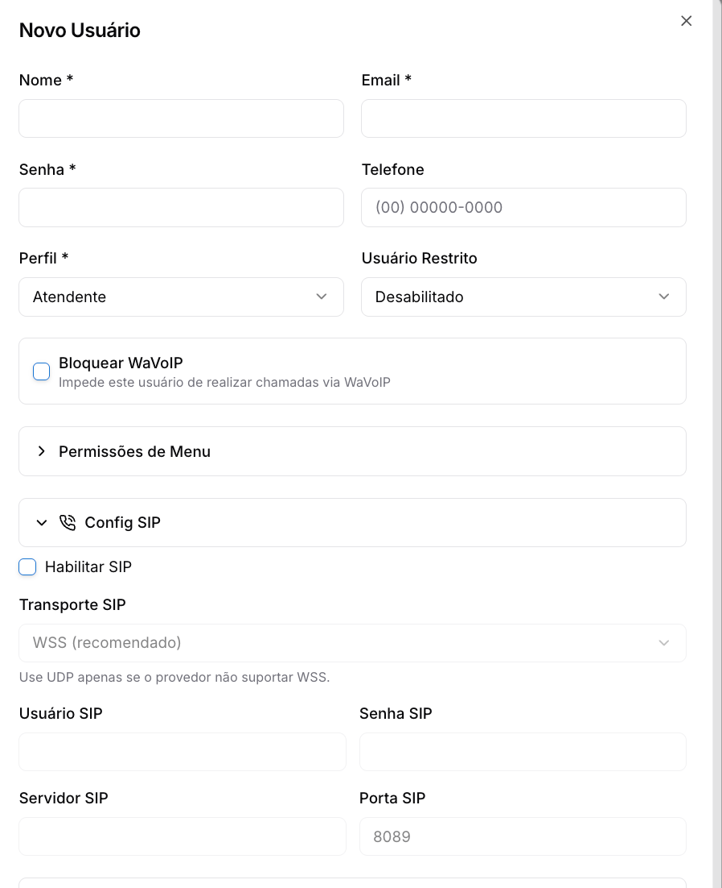

# Ligações no Prismabot (Telefonia e Voz)

SIP e Wavoip

O Prismabot funciona como **centralizador** das operações de voz — você atende e realiza chamadas diretamente pelo painel, sem trocar de ferramenta. A plataforma não é um provedor de telefonia: ela se conecta a serviços externos que fornecem a infraestrutura de voz.

Existem três modalidades de ligação disponíveis:

Modalidade

Tecnologia

Indicado para

**API Oficial (WABA)**

WebRTC nativo Meta

Quem usa canal WhatsApp Oficial — sem ferramentas externas

**WaVoIP**

WhatsApp não oficial (Baileys)

Quem usa conexões não oficiais e já tem conta WaVoIP

**Telefonia SIP**

Trunk SIP / PABX corporativo

Quem tem infraestrutura de telefonia VoIP própria

**Escopo de suporte:** o suporte do Prismabot cobre apenas a integração (configuração do token/credenciais dentro do sistema). Problemas na infraestrutura do **WaVoIP**, configuração do **servidor SIP/PABX** ou do **App Meta** são de responsabilidade do assinante ou do profissional de TI responsável pelo serviço.

---

### [1. Ligações via API Oficial (WABA)](../api-oficial-waba/ligacoes-de-voz-na-api-oficial-waba.md)

A modalidade mais completa para quem usa o canal WhatsApp Oficial. As chamadas acontecem dentro do próprio WhatsApp do cliente — sem aplicativos externos — e são gerenciadas diretamente pelo painel do Prismabot.

**Quem pode usar:** assinantes com canal WABA ativo. Quem conecta pelo App nativo da Prisma Telecom (OAuth) já tem a permissão de chamadas aprovada automaticamente.

#### Como funciona

* **Receber ligações:** ative as chamadas WebRTC nas configurações do canal. As chamadas recebidas tocam para os atendentes conforme a regra de roteamento configurada.
* **Fazer ligações:** é necessário primeiro solicitar uma **permissão de chamada** ao contato. O contato autoriza pelo WhatsApp, e a permissão vale por **72 horas**. Após o aceite, clique em **Ligar** no painel do atendimento.

#### Roteamento de chamadas

Regra

Comportamento

**Tocar para todos os atendentes**

Toca para todos; o primeiro que atender assume

**Apenas o atendente do ticket**

Toca somente para o atendente do ticket daquele contato

**Rodízio na fila**

Distribui conforme as regras da fila do canal

**Fallback escalonado**

Toca para um usuário por vez, escalando se não houver atendimento

#### Configuração

1. Acesse **Configurações → Integrações → Meta → WhatsApp** e selecione o canal WABA
2. Ative as **chamadas WebRTC** nas especificações do canal
3. Configure o roteamento em **Configurações → Roteamento de chamadas WABA**
4. Para fazer uma ligação: abra o atendimento → **Detalhes do contato → Telefonia → WABA** → envie a solicitação de permissão → aguarde o aceite → **Ligar**

Para o detalhamento completo, acesse a página [Ligações de voz na API Oficial (WABA).](../api-oficial-waba/ligacoes-de-voz-na-api-oficial-waba.md)

---

### [2. Ligações via WhatsApp (WaVoIP)](../configuracao-administrador/gestao-comercial/analises-e-registros/wavoip.md)

Permite fazer e receber chamadas de voz do WhatsApp diretamente na interface do Prismabot, usando conexões **não oficiais (Baileys)**. Requer uma conta ativa no serviço externo **WaVoIP**.

**WaVoIP é um serviço pago e independente do Prismabot.** Contrate um plano diretamente em [wavoip.com](https://wavoip.com/) antes de configurar a integração.

#### Configuração

1. Acesse [wavoip.com](https://wavoip.com/), crie ou acesse sua conta e adicione um **dispositivo**
2. Copie o **Token** gerado para o dispositivo
3. No Prismabot, acesse **Canais**, edite a conexão Baileys desejada e cole o token no campo **WaVoIP**
4. Clique em **Salvar** — um ícone de telefone aparece no card do canal
5. Clique no ícone, escaneie o QR Code com o celular (**WhatsApp → Aparelhos Conectados → Conectar um aparelho**)

Após a conexão, atendentes podem fazer e receber chamadas pelo ícone **WaVoIP** no menu do atendimento.

Para o passo a passo completo de configuração, acesse [WaVoIP — Ligações pelo WhatsApp.](wavoip-ligacoes-pelo-whatsapp.md)

#### Gerenciamento e histórico WaVoIP

Em **Gestão Comercial → WaVoIP**, o administrador pode autenticar a conta e consultar o histórico de chamadas com gravações. Acesse com login/senha ou por token.

Para detalhes, acesse [WaVoIP — Gestão Comercial.](../configuracao-administrador/gestao-comercial/analises-e-registros/wavoip.md)

#### Envio em massa de voz (WaVoIP)

Também é possível realizar **chamadas de voz em massa** enviando um arquivo de áudio para uma lista de números via conexão Baileys. Acesse em **Comunicação e Marketing → Envio em Massa → WaVoIP**.

Para detalhes, acesse [Envio em Massa — WaVoIP.](../ferramentas-do-atendimento/comunicacao-e-marketing/envio-em-massa/envio-em-massa-wavoip.md)

---

### [3. Telefonia SIP (PABX / Trunk VoIP)](https://prismatelecomservicos.com/)

Conecta o Prismabot ao sistema de telefonia corporativo da empresa via protocolo SIP, habilitando um **Webphone** integrado para cada atendente fazer e receber chamadas do trunk diretamente pelo painel.

#### Pré-requisitos do servidor SIP

O servidor de telefonia **precisa obrigatoriamente** suportar:

* **WebRTC** — para comunicação em tempo real pelo navegador
* **WSS (WebSocket Secure)** — geralmente na porta **8089**

Instalações padrão do Asterisk já suportam WSS na porta 8089. Verifique com o responsável pelo servidor se os dois recursos estão habilitados antes de prosseguir.

#### Configuração por usuário

A telefonia SIP é configurada **individualmente por usuário**. Cada atendente recebe um ramal específico:

1. Acesse **Usuários** no painel Admin e edite o usuário desejado
2. Expanda a seção **Config SIP**
3. Habilite o toggle **Habilitar SIP**
4. Preencha os campos:

Campo

Descrição

**Transporte SIP**

Protocolo de conexão — use **WS** (padrão) ou **UDP** se o provedor não suportar WSS

**Usuário SIP**

Ramal ou usuário SIP fornecido pelo servidor

**Senha SIP**

Senha do ramal SIP

**Servidor SIP**

Endereço do servidor SIP (IP ou domínio)

**Porta SIP**

Porta WSS do servidor (padrão: **8089**)

1. Salve — o **SIP Webphone** ficará disponível para aquele usuário no painel do atendimento

#### Como usar no atendimento

Com o SIP configurado, o atendente verá as opções de telefonia disponíveis no painel do atendimento (**WaVoIP**, **SIP**, **SMS**). Ao abrir o SIP Webphone, o sistema já popula o número do contato para discagem.

**SMS** só aparece como opção se houver um gateway de SMS configurado em **Configurações → Integrações**.

---

### Registro e histórico de chamadas

Independentemente da modalidade usada, todas as ligações são registradas em **Gestão Comercial → Log Ligações**.

Filtro disponível

Para que serve

Data início / Data fim

Delimita o período consultado

Status

Filtra por Encerrada, Chamando, Falhou, Perdida

Agente

Filtra ligações por atendente específico

Número Origem / Destino

Localiza chamadas de um número específico

Use o botão **Exportar CSV** para baixar o histórico filtrado para análise em planilha.

Para detalhes, acesse [Log Ligações.](../configuracao-administrador/gestao-comercial/analises-e-registros/log-ligacoes.md)

---

### Avisos e precauções

**Escopo de suporte — WaVoIP:** o suporte do Prismabot não cobre problemas no serviço WaVoIP (conta, dispositivo, qualidade de chamada). Em caso de falha, acesse o painel do WaVoIP ou contate o suporte deles diretamente.

**Escopo de suporte — Telefonia SIP:** a configuração do servidor SIP/PABX (Asterisk ou similar), criação de ramais e troubleshooting de conexão não fazem parte do escopo de suporte do Prismabot. Consulte o profissional de TI responsável pela infraestrutura de telefonia.

**Prismabot não é um provedor de telefonia.** A plataforma centraliza e exibe as chamadas, mas a infraestrutura de voz (número de telefone, trunk, minutos) é fornecida pelo serviço de terceiro escolhido.

Atualizado há 1 mês

Isto foi útil?