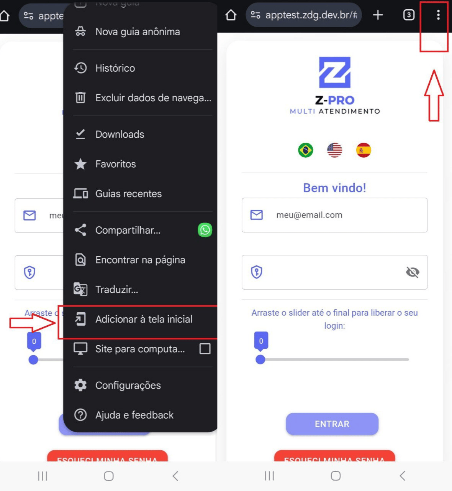
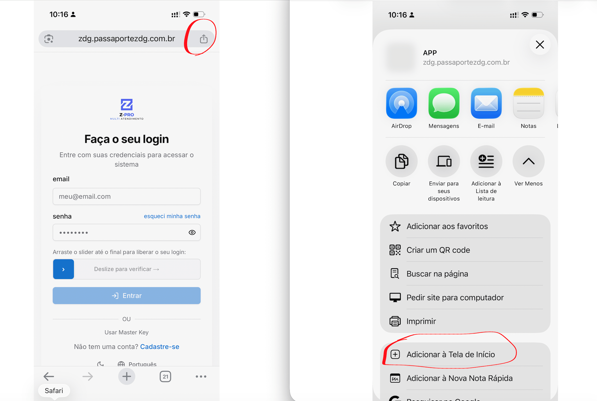
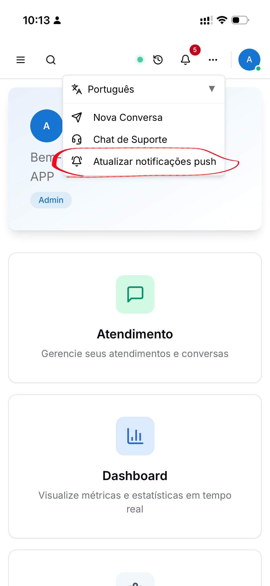
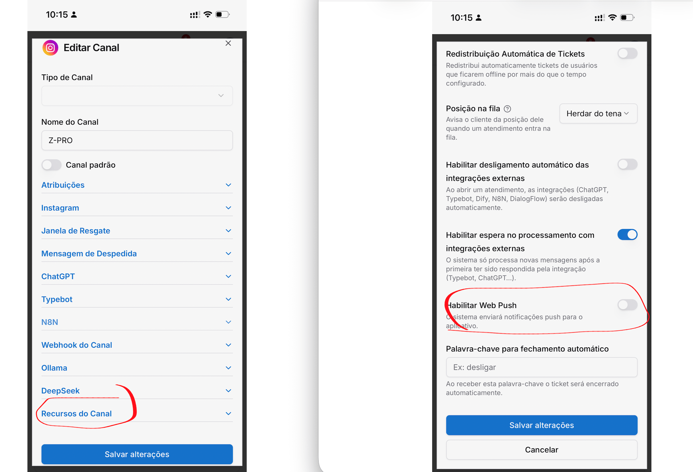
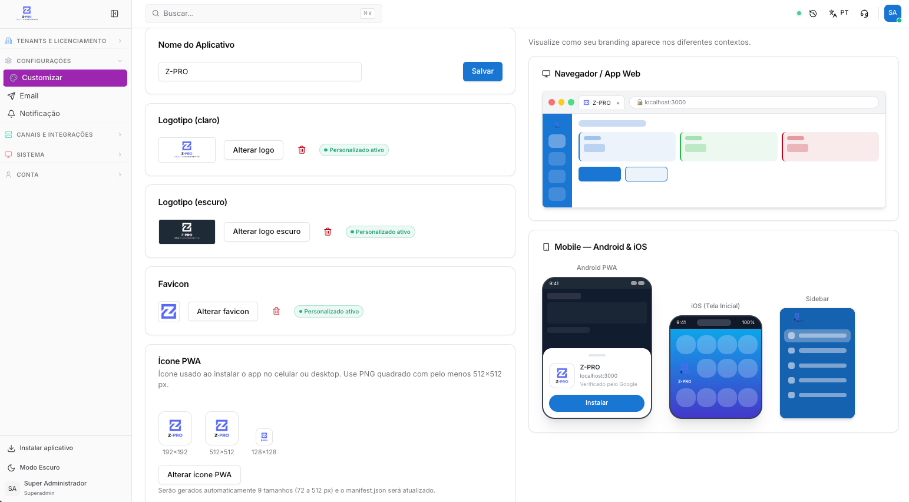

Copiar

Nesta página

1. [Ferramentas Adicionais e Integrações](/ferramentas-adicionais-e-integracoes)

# Notificações Aplicativo (web push)

Como adicionar o Prismabot como App na tela inicial do celular e acionar o WebPush

**O Aplicativo Prismabot**
O Prismabot utiliza a moderna tecnologia PWA (Progressive Web App), o que proporciona uma experiência de aplicativo completa diretamente no seu celular ou computador, sem a necessidade de baixar em lojas como App Store ou Play Store. Ao instalá-lo na sua tela inicial, o Prismabot opera como um app nativo: rodando em tela cheia, com navegação fluida e suporte a notificações em tempo real.
Como funcionam as Notificações Web Push

**Notificações Web Push**
Para manter você sempre atualizado, o sistema utiliza notificações Web Push. Essa tecnologia permite que seu dispositivo receba alertas de novos atendimentos e mensagens mesmo quando o aplicativo não estiver ativamente aberto na tela. Para garantir o recebimento desses alertas, basta seguir uma configuração rápida em três etapas.

### 1. Adicione o App na tela inicial do celular

O primeiro passo é adicionar o atalho (ícone) do Prismabot no seu celular (Android ou iOS). **É obrigatório abrir o Prismabot por esse ícone** — no iOS, as notificações Web Push só funcionam quando o app é aberto pelo atalho instalado, e não pelo navegador.

#### **Para Android (Google Chrome):**

1. Abra o endereço do seu Prismabot no **Chrome**.
2. Toque no menu **⋮** (três pontos) no canto superior direito.
3. Selecione **"Instalar app"** ou **"Adicionar à tela inicial"** e confirme.
4. Abra o Prismabot pelo **ícone** que foi criado na tela inicial.

#### **Para iPhone (iOS) — pelo Safari:**

1. Confirme que o iPhone está no **iOS 16.4 ou superior** (versões anteriores não suportam Web Push em PWA).
2. Abra o endereço do seu Prismabot no **Safari**.
3. Toque no botão **Compartilhar** (o quadrado com a seta para cima).
4. Selecione **"Adicionar à Tela de Início"** e confirme.
5. Abra o Prismabot pelo **ícone** criado na tela inicial — **não** pelo Safari.

### 2. Passo a Passo para Ativar as Notificações

#### Ative as Notificações no Aplicativo PWA

Primeiro, você precisa habilitar a recepção de notificações dentro do próprio PWA.

* Localize e acione o **botão (...)** (ao lado do ícone de sino).

Este botão só é visível quando o Prismabot é executado a partir do celular, com atalho na tela inicial (PWA).

#### Habilite o Web Push no Canal Desejado

Em seguida, você precisa dizer ao Prismabot para qual canal você quer receber os alertas.

* No painel do Prismabot, acesse **Canais**.
* Edite o canal para o qual deseja receber notificações.
* Marque a opção **"Habilitar WebPush"** e salve as alterações.

### 3. Customizações do ícone e nome do App

**Disponível no perfil: Super-Administrador**

#### Alterando o Nome do Aplicativo

O nome definido aqui aparecerá no título da aba do navegador, nas telas de instalação do aplicativo e nos menus do sistema.

1. No campo **Nome do Aplicativo**, apague o nome atual e digite o nome da sua empresa.
2. Clique no botão azul **Salvar**.

#### Configurando o Ícone do Aplicativo (PWA)

Para que o ícone do seu app fique com a sua marca na tela inicial dos celulares dos clientes:

1. Vá até a seção **Ícone PWA**.
2. Clique em **Alterar ícone PWA**.
3. Envie a imagem da sua logo.

Para evitar distorções ou erros na instalação, a imagem enviada deve ser obrigatoriamente no formato **PNG quadrado**, com o tamanho mínimo de **512x512 pixels**.

Ao enviar esta única imagem, o sistema trabalhará de forma inteligente: ele gerará automaticamente 9 tamanhos diferentes (de 72px a 512px) e atualizará o arquivo interno (manifest.json) necessário para a instalação em qualquer dispositivo.

#### 4. Solução de Problemas

**Não estou recebendo as notificações. O que verificar?**

1. Você abriu o Prismabot pelo **ícone instalado** na tela inicial (e não pelo navegador)? Esse é o erro mais comum — sem isso, o push não dispara (obrigatório no iOS).
2. Tocou no **botão (...)** ao lado do sino, **dentro do app**, para ativar as notificações? Ativar apenas nas configurações do celular **não basta** (Etapa 2).
3. A opção **"Habilitar WebPush"** está marcada no **canal** desejado (Configurações do Prismabot → Canais)?
4. As **permissões de notificação** estão concedidas ao app/navegador nas configurações do celular?
5. Os modos **"Não Perturbe" / "Foco"** estão desativados?

**Específico do iPhone (iOS):** o Web Push exige **iOS 16.4 ou superior** e que o app seja **aberto pelo ícone da tela inicial**. Pelo Safari normal, as notificações não funcionam.

**Específico do Android:** a **otimização de bateria** e a **economia de dados** costumam bloquear notificações em segundo plano. Em **Configurações → Apps → (Prismabot/Chrome) → Bateria**, deixe **"Sem restrições"**, e libere o uso de **dados em segundo plano**. Mantenha também o **Chrome atualizado**.

[AnteriorLigações no Prismabot (Telefonia e Voz)](/ferramentas-adicionais-e-integracoes/ligacoes-no-z-pro-telefonia-e-voz)[PróximoWavoip - Ligações pelo WhatsApp](/ferramentas-adicionais-e-integracoes/wavoip-ligacoes-pelo-whatsapp)

Atualizado há 1 mês

Isto foi útil?