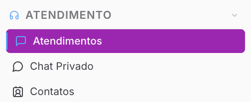
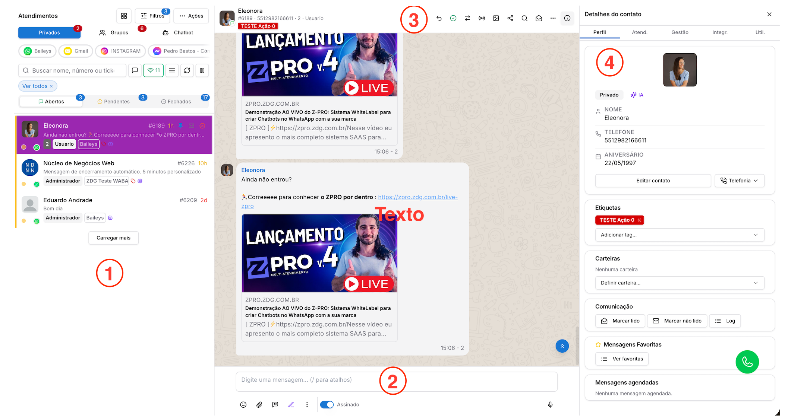

Copiar

Nesta página

1. [Ferramentas do atendimento](/ferramentas-do-atendimento)
2. [Atendimento](/ferramentas-do-atendimento/atendimento)

# Tela de Atendimento

Painel de Atendimentos

**Disponível para o perfil: Administrador, supervisor e usuário**

Essa é uma das seções mais importantes da plataforma. é a tela principal onde sua equipe irá interagir com os clientes no dia a dia. Esta é a sua caixa de entrada unificada, projetada para gerenciar diferentes tipos de conversas em um único lugar.

### Como acessar

No menu lateral esquerdo, clique no Menu **Atendimento** e selecione a aba **Atendimentos**.

#### Você verá a seguinte tela:

A tela de atendimento é dividida em quatro blocos principais de controle:

[**1. Menu dos Atendimentos (Lado Esquerdo)**](/ferramentas-do-atendimento/atendimento/tela-de-atendimento/menu-dos-atendimentos)

Esta sessão centraliza a listagem de todas as conversas ativas e pendentes, permitindo ao usuário navegar entre chats privados ou de grupos, aplicar filtros avançados por etiquetas, filas ou conexões, e gerenciar o fluxo de entrada através das abas de status "Abertos", "Pendentes" e "Fechados".

[**2. Barra de Mensagem (Inferior)**](/ferramentas-do-atendimento/atendimento/tela-de-atendimento/barra-de-mensagem)

Localizada no rodapé do chat, concentra as ferramentas de interação direta com o cliente, incluindo a inserção de emojis, o envio de anexos multimídia, o uso de mensagens rápidas por atalhos e o acesso a recursos de Inteligência Artificial para reescrita ou resumo de textos durante o atendimento.

[**3. Ícones de Acesso Rápido (Topo Direito)**](/ferramentas-do-atendimento/atendimento/tela-de-atendimento/acesso-rapido-atendimento)

Barra de ferramentas superior que agrupa os comandos de gestão do ticket, permitindo retornar a conversa para a fila, resolver o atendimento, transferir o contato entre departamentos, usuários ou canais, além de fornecer acesso rápido à galeria de mídias, busca de mensagens e agendamentos.

[**4. Detalhes do Contato (Painel Lateral Direito)**](/ferramentas-do-atendimento/atendimento/tela-de-atendimento/detalhes-do-contato)

Exibe a ficha cadastral completa do cliente em tempo real, fornecendo contexto ao atendente por meio da visualização de fotos, dados de aniversário, etiquetas de segmentação, carteiras de responsáveis e o histórico de logs de comunicação e mensagens favoritas vinculadas ao perfil.

[AnteriorAtendimento](/ferramentas-do-atendimento/atendimento)[PróximoMenu dos atendimentos](/ferramentas-do-atendimento/atendimento/tela-de-atendimento/menu-dos-atendimentos)

Atualizado há 2 meses

Isto foi útil?