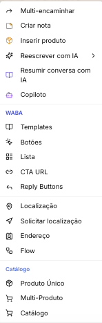
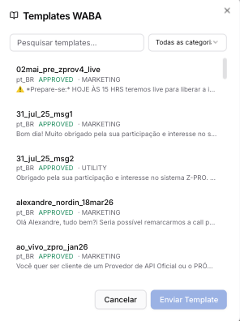
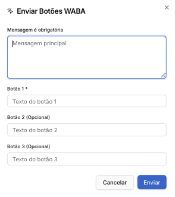
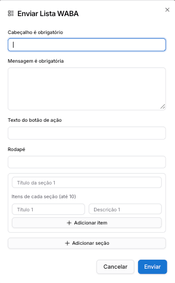
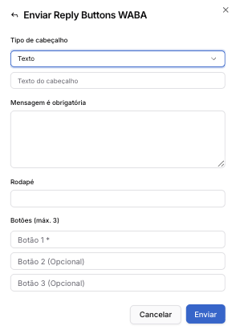
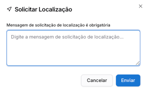
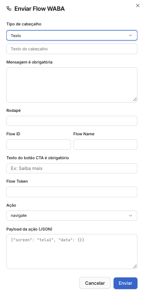
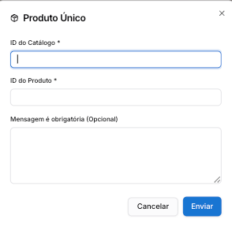
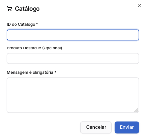

# Atendimento WABA (Api Oficial)

Painel de Atendimentos

O canal **WhatsApp Business API (WABA)** possui recursos exclusivos na tela de atendimento. A API Oficial não permite iniciar conversas com mensagens aleatórias — a plataforma recebe as mensagens e você pode respondê-las dentro da **janela de 24 horas** a partir da última interação do cliente.

Após esse período, a janela se fecha e só é possível iniciar uma nova conversa enviando um **template pré-aprovado**.

**Onde criar templates?** Os templates WABA são criados e enviados para aprovação da Meta em **Configurações → Integrações Meta → Templates**. Consulte [Templates — Integrações Meta](../../../configuracao-administrador/configuracao/integracoes-meta/templates-integracoes-meta.md) para o passo a passo.

---

#### Opções exclusivas WABA

Na barra inferior da conversa, clique em **⋯ (três pontos)** para acessar as opções exclusivas do canal WABA, divididas em dois grupos:

---

### Grupo WABA

#### Templates

Abre o seletor de templates aprovados. Pesquise por nome, filtre por categoria e selecione o template desejado para enviar ao cliente.

A listagem mostra: nome, idioma, status (`APPROVED`, `PENDING`) e categoria (MARKETING, UTILITY). Clique em **Enviar Template** para enviar.

Apenas templates com status **APPROVED** podem ser enviados.

---

#### Botões

Envia uma mensagem com até 3 botões de resposta rápida.

Campo

Descrição

**Mensagem**

Texto principal da mensagem (obrigatório)

**Botão 1**

Texto do primeiro botão (obrigatório)

**Botão 2**

Texto do segundo botão (opcional)

**Botão 3**

Texto do terceiro botão (opcional)

---

#### Lista

Envia um menu de lista interativa com seções e itens clicáveis.

Campo

Descrição

**Cabeçalho**

Título da mensagem (obrigatório)

**Mensagem**

Texto principal (obrigatório)

**Texto do botão de ação**

Rótulo do botão que abre a lista

**Rodapé**

Texto complementar abaixo da mensagem

**Título da seção**

Nome de cada seção da lista

**Itens**

Título e descrição de cada item — até 10 itens por seção

Use **+ Adicionar item** para incluir itens e **+ Adicionar seção** para criar novas seções.

---

#### CTA URL

Envia uma mensagem com um botão de link externo (Call to Action).

Campo

Descrição

**Tipo de cabeçalho**

Texto, imagem, vídeo ou documento

**Texto do cabeçalho**

Conteúdo do cabeçalho (quando tipo = Texto)

**Mensagem**

Texto principal (obrigatório)

**Texto do botão**

Rótulo do botão CTA (obrigatório)

**URL do botão**

URL de destino (obrigatório — ex.: `https://...`)

**Rodapé**

Texto complementar (opcional)

---

#### Reply Buttons

Envia uma mensagem estruturada com cabeçalho e até 3 botões de resposta rápida.

Campo

Descrição

**Tipo de cabeçalho**

Texto, imagem, vídeo ou documento

**Mensagem**

Texto principal (obrigatório)

**Rodapé**

Texto complementar (opcional)

**Botões**

Até 3 botões — Botão 1 é obrigatório

---

#### Localização

Envia um pin de localização no mapa.

Campo

Descrição

**Latitude**

Latitude do local (obrigatório — ex.: `-23.5505`)

**Longitude**

Longitude do local (obrigatório — ex.: `-46.6333`)

**Nome do local**

Nome de exibição (ex.: Escritório Central)

**Endereço**

Endereço completo (opcional)

---

#### Solicitar Localização

Envia uma mensagem solicitando que o cliente compartilhe a localização dele.

Campo

Descrição

**Mensagem**

Texto de solicitação (obrigatório)

---

#### Endereço

Envia um cartão de endereço estruturado.

Campo

Descrição

**Endereço linha 1**

Logradouro (obrigatório)

**Endereço linha 2**

Complemento (opcional)

**Cidade**

Cidade (obrigatório)

**Estado**

Estado (opcional)

**CEP**

CEP (opcional)

**País**

País (obrigatório)

**Tipo**

Residencial, Comercial etc.

---

#### Flow

Envia um WhatsApp Flow — formulário interativo nativo do WhatsApp.

Campo

Descrição

**Tipo de cabeçalho**

Texto, imagem, vídeo ou documento

**Mensagem**

Texto principal (obrigatório)

**Rodapé**

Texto complementar (opcional)

**Flow ID**

ID do Flow criado no Meta Business

**Flow Name**

Nome do Flow

**Texto do botão CTA**

Rótulo do botão de abertura (obrigatório — ex.: Saiba mais)

**Flow Token**

Token de autenticação do Flow (opcional)

**Ação**

Tipo de ação ao abrir o Flow (ex.: `navigate`)

**Payload da ação (JSON)**

Dados iniciais enviados ao Flow (ex.: `{"screen": "tela1", "data": {}}`)

---

### Grupo Catálogo

#### Produto Único

Envia um único produto do catálogo vinculado à conta WABA.

Campo

Descrição

**ID do Catálogo**

ID do catálogo no Meta Business (obrigatório)

**ID do Produto**

ID do produto (obrigatório)

**Mensagem**

Texto opcional que acompanha o produto

---

#### Multi-Produto

Envia múltiplos produtos do catálogo em uma única mensagem.

Campo

Descrição

**ID do Catálogo**

ID do catálogo no Meta Business (obrigatório)

**Cabeçalho**

Título da mensagem (obrigatório)

**Mensagem**

Texto principal (obrigatório)

**Título da Seção**

Nome da seção de produtos (opcional)

**ID dos Produtos**

IDs separados por vírgula (obrigatório — ex.: `id1,id2,id3`)

**Rodapé**

Texto complementar (opcional)

---

#### Catálogo

Envia o catálogo completo com produto em destaque.

Campo

Descrição

**ID do Catálogo**

ID do catálogo no Meta Business (obrigatório)

**Produto Destaque**

ID do produto a destacar (opcional)

**Mensagem**

Texto que acompanha o catálogo (obrigatório)

---

#### Template Carrossel

Envia um template do tipo carrossel com múltiplos cards interativos.

Campo

Descrição

**Nome do Template**

Nome do template carrossel aprovado (obrigatório)

**Idioma**

Idioma do template (ex.: `pt_BR`)

**Cards (JSON)**

Array JSON com os cards — cada card tem `headerMediaId` e `buttons` (obrigatório)

---

#### Páginas relacionadas

* [Templates — Integrações Meta — criar e gerenciar templates WABA e Facebook](../../../configuracao-administrador/configuracao/integracoes-meta/templates-integracoes-meta.md)
* [Contas Meta — WhatsApp — conectar o número WABA](../../../configuracao-administrador/administracao-painel-admin/canais-de-comunicacao/whatsapp-oficial-oauth-app-prismabot-com-coexistencia.md)
* [Cobranças da Meta — WhatsApp Business Platform — entender os custos por template e conversa](../../../api-oficial-waba/cobrancas-da-meta-whatsapp-business-platform.md)

 1 mês
