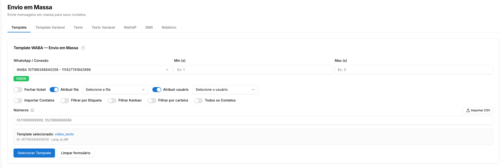
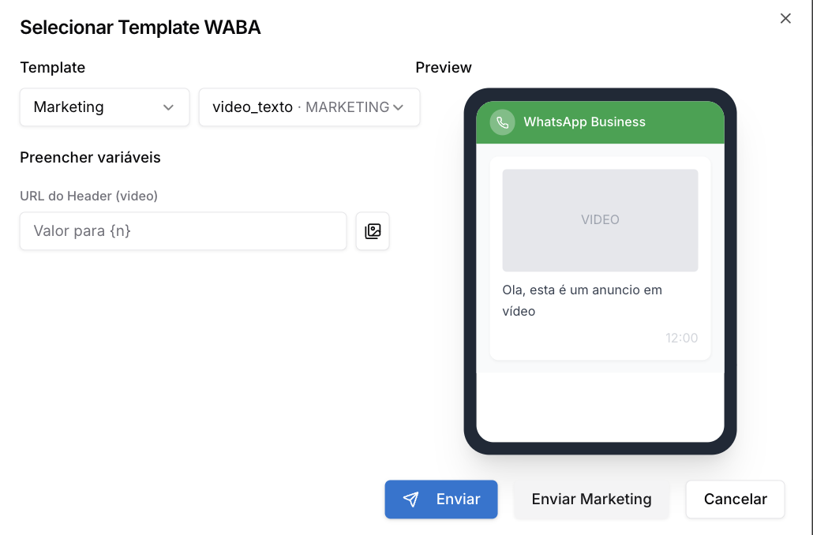

# Envio em Massa - Template API Oficial

**Disponível para o perfil: Administrador, Supervisor e Usuário**

Use esta aba para disparar templates WABA aprovados pela Meta para uma lista de contatos. É a modalidade recomendada para campanhas oficiais, pois não depende da janela de 24h e garante maior entregabilidade.

Esta aba requer uma conexão via **API Oficial (WABA)**. Conexões por QR Code não são compatíveis com envio de templates.

Esta página detalha o funcionamento desta aba específica. Para uma visão geral da funcionalidade, tutoriais em vídeo e orientações de uso, [acesse Envio em Massa.](../envio-em-massa.md)

### Configurando o disparo

1. Em **WhatsApp / Conexão**, selecione a conexão WABA que realizará o envio
2. Defina o intervalo entre envios nos campos **Min (s)** e **Max (s)** — o sistema sorteará um valor aleatório entre os dois para cada mensagem
3. Configure as opções de pós-envio: **Fechar ticket**, **Atribuir fila** ou **Atribuir usuário**, conforme a sua operação

### Selecionando os destinatários

Você pode informar os números de destino de três formas: manualmente, por importação de arquivo ou ativando um dos filtros de contato abaixo.

**Inserção manual e importação:**

* **Campo Números** — cole os números diretamente, separados por vírgula (formato: `5511999999999, 5521888888888`)
* **Importar CSV** — clique no botão e suba um arquivo com os números na primeira coluna

**Filtros de contato (toggles):**

Filtro

O que faz

**Importar Contatos**

Abre a seleção de contatos já cadastrados no sistema para escolher os destinatários

**Grupos**

Envia para os grupos de WhatsApp em que o número conectado está presente

**Filtrar por Etiqueta**

Filtra e envia para todos os contatos que possuem uma etiqueta específica

**Filtrar Kanban**

Filtra e envia para os contatos vinculados a uma coluna específica do Kanban

**Filtrar por Carteira**

Filtra e envia para os contatos pertencentes a uma carteira de atendimento

**Todos os Contatos**

Envia para toda a base de contatos cadastrada no sistema

Os filtros são excludentes entre si — ative apenas um por disparo. Ao ativar um filtro, o campo de números manuais é ignorado.

Ao usar **Todos os Contatos**, revise o tamanho da sua base antes de disparar e defina intervalos adequados entre envios para evitar bloqueios.

### Selecionando o template

1. Clique em **Selecionar Template**
2. Escolha a categoria e o template aprovado
3. Preencha as variáveis do template, se houver
4. Confirme o preview antes de prosseguir

### Realizando o envio

* Clique em **Enviar** para disparar normalmente (dentro da janela de 24h)
* Clique em **Enviar Marketing** para campanhas fora da janela de 24h — este botão utiliza a categoria de template Marketing da Meta

Não feche a página durante o envio. O progresso é processado pelo navegador e o disparo pode ser interrompido se a aba for fechada.

Use sempre o formato internacional: `DDI + DDD + Número` (Ex: `5511999999999`).

Atualizado há 1 mês

Isto foi útil?