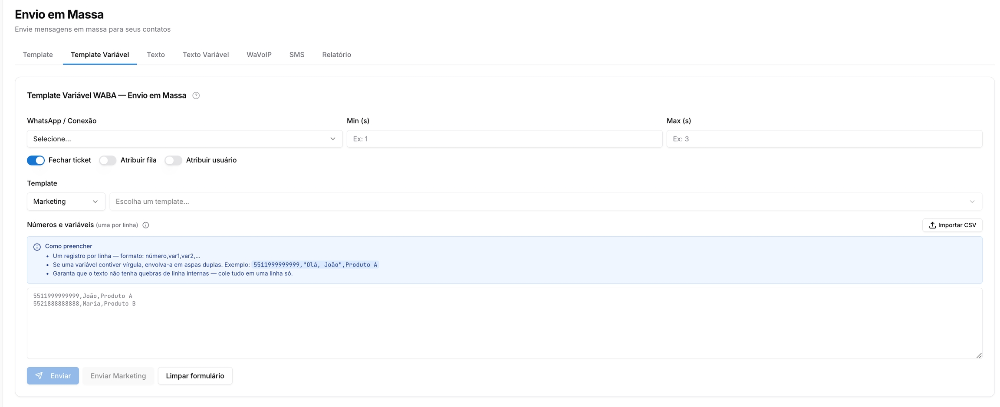

Copiar

Nesta página

1. [Ferramentas do atendimento](/ferramentas-do-atendimento)
2. [Comunicação e marketing](/ferramentas-do-atendimento/comunicacao-e-marketing)
3. [Envio em Massa](/ferramentas-do-atendimento/comunicacao-e-marketing/envio-em-massa)

# Envio em Massa - Template Variável API Oficial

**Disponível para o perfil: Administrador, Supervisor e Usuário**

Use esta aba para disparar templates WABA com variáveis dinâmicas individuais por destinatário. Cada contato recebe a mensagem com seus próprios dados — ideal para personalizar campanhas em escala.

Esta aba requer uma conexão via **API Oficial (WABA)**.

Esta página detalha o funcionamento desta aba específica. Para uma visão geral da funcionalidade, tutoriais em vídeo e orientações de uso, [acesse Envio em Massa.](/ferramentas-do-atendimento/comunicacao-e-marketing/envio-em-massa)

### Configurando o disparo

1. Selecione a **conexão WABA** em WhatsApp / Conexão
2. Defina o intervalo entre envios em **Min (s)** e **Max (s)** — o sistema sorteia um valor aleatório entre os dois para cada mensagem
3. Configure **Fechar ticket**, **Atribuir fila** ou **Atribuir usuário** conforme necessário
4. Selecione o **Template** aprovado — as variáveis do template devem corresponder às colunas do seu arquivo (var1, var2...)

### Preparando os dados

Preencha o campo **Números e variáveis** com uma entrada por linha, no formato:

número,var1,var2,...

Regras de preenchimento:

* Um registro por linha, sem linhas em branco
* Se uma variável contiver vírgula, envolva-a em aspas duplas: `5511999999999,"Olá, João",Produto A`
* Garanta que o texto não tenha quebras de linha internas — cole tudo em uma linha só

Você também pode clicar em **Importar CSV** para subir um arquivo já formatado com as colunas de número e variáveis.

### Regra do 9º dígito (Brasil)

O sistema valida os números conforme a regra brasileira de telefonia. Entender essa regra evita envios para números errados ou a criação de contatos duplicados no banco.

Tipo de número

DDD

Formato correto

Telefone fixo (1º dígito após DDD = 1 a 4)

qualquer

Sem o 9º dígito

Celular — capitais e regiões metropolitanas

DDD < 30

**Com** o 9º dígito

Celular — interior

DDD ≥ 30

Sem o 9º dígito

**Comportamento do sistema ao importar:**

* **Duplicatas** — após a normalização, números duplicados são mesclados automaticamente e o sistema exibe quais foram agrupados
* **Números divergentes da regra** — são marcados com um aviso, mas o envio prossegue com o número como foi digitado
* **Variantes do mesmo contato** — um número com e sem o 9º dígito pode gerar um contato novo no banco caso não esteja em conformidade com a regra; verifique antes de disparar para evitar duplicidade na base

Padronize os números antes de importar: normalize o 9º dígito conforme o DDD e remova espaços, traços ou parênteses. Isso evita avisos de validação e duplicidades no banco de contatos.

### Realizando o envio

* Clique em **Enviar** para disparar dentro da janela de 24h
* Clique em **Enviar Marketing** para campanhas fora da janela de 24h da Meta — este botão utiliza a categoria de template Marketing

Não feche a página durante o envio. O progresso é processado pelo navegador e o disparo pode ser interrompido se a aba for fechada.

[AnteriorEnvio em Massa - Template API Oficial](/ferramentas-do-atendimento/comunicacao-e-marketing/envio-em-massa/envio-em-massa-template-api-oficial)[PróximoEnvio em massa - Texto](/ferramentas-do-atendimento/comunicacao-e-marketing/envio-em-massa/envio-em-massa-texto)

Atualizado há 1 mês

Isto foi útil?