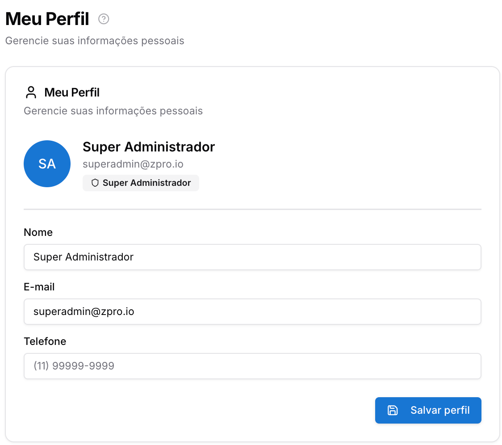
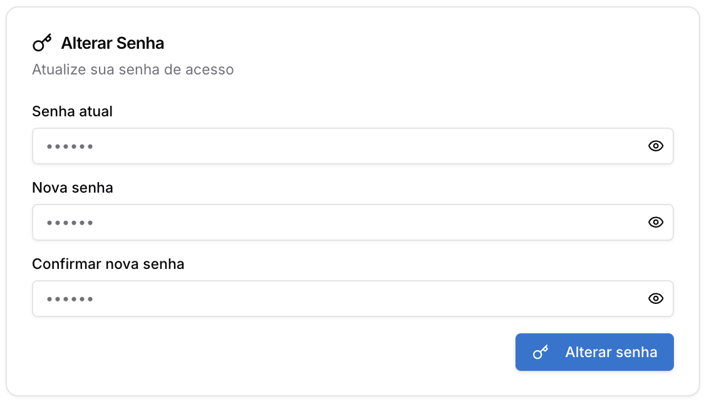

Copiar

Nesta página

1. [Ferramentas do atendimento](/ferramentas-do-atendimento)

# Conta - Meu perfil

Gerencie suas informações pessoais, foto de perfil e senha de acesso ao sistema.

### Atualizando o perfil

* Edite seu nome, e-mail e telefone na seção Meu Perfil
* Clique na foto para atualizar sua imagem de perfil (máximo 5MB)
* Clique em Salvar perfil para confirmar as alterações

### Alterando a senha

* Informe a senha atual e a nova senha com no mínimo 6 caracteres
* Confirme a nova senha e clique em Alterar senha

[AnteriorTarefas](/ferramentas-do-atendimento/gestao/tarefas)[PróximoVisão geral - Ferramentas Adicionais e Integrações](/ferramentas-adicionais-e-integracoes/visao-geral-ferramentas-adicionais-e-integracoes)

Atualizado há 4 meses

Isto foi útil?