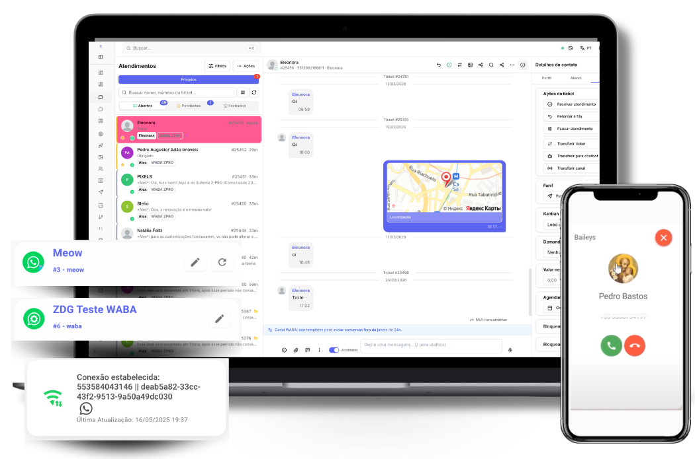

# Central de Ajuda Prismabot

Documentação oficial do Prismabot: tutoriais, configurações, canais, automação, atendimento e API — tudo para operar e administrar sua plataforma omnichannel.

O **Prismabot** é uma plataforma de atendimento e automação omnichannel — WhatsApp, Instagram, Messenger e mais — instalada no seu próprio servidor, no modelo plataforma de atendimento. Ideal para agências, empresas de software e empreendedores que querem oferecer atendimento profissional com a própria marca.

---

### Conhecendo o Prismabot

Para quem está avaliando a plataforma ou quer entender como ela funciona.

[Como funciona o Prismabot](como-funciona-o-prismabot.md)[API Oficial vs API Não Oficial](diretrizes-e-politicas/api-oficial-vs-api-nao-oficial.md)[Pré-requisitos de instalação e utilização](diretrizes-e-politicas/pre-requisitos-de-instalacao-e-utilizacao.md)

---

### Novo por aqui?

Acabou de assinar ou está instalando pela primeira vez.

[Onboarding - novos assinantes](primeiro-acesso/onboarding-novos-assinantes.md)[Instalar Prismabot](primeiro-acesso/primeiro-acesso-ao-sistema.md)[Primeiro Acesso ao Sistema](primeiro-acesso/primeiro-acesso-ao-sistema.md)

---

### Já sou assinante

Recursos e referências para o dia a dia da operação.

[Changelog (4.0.x última versão)](central-do-assinante/atualizacoes-e-status-do-prismabot/changelog-4.0.x-ultima-versao.md)[Política de Suporte Técnico](diretrizes-e-politicas/politica-de-suporte-tecnico.md)[Referência da API](central-do-assinante/referencia-da-api.md)[Manutenção e Segurança](diretrizes-e-politicas/manutencao-e-seguranca.md)

---

### Overview em vídeo

---

### Políticas e Termos

[Termos e Condições Gerais de Uso e Licenciamento](diretrizes-e-politicas/termos-e-condicoes-gerais-de-uso-e-licenciamento.md)[Aviso de Privacidade](diretrizes-e-politicas/aviso-de-privacidade.md)

Atualizado há 26 dias

Isto foi útil?