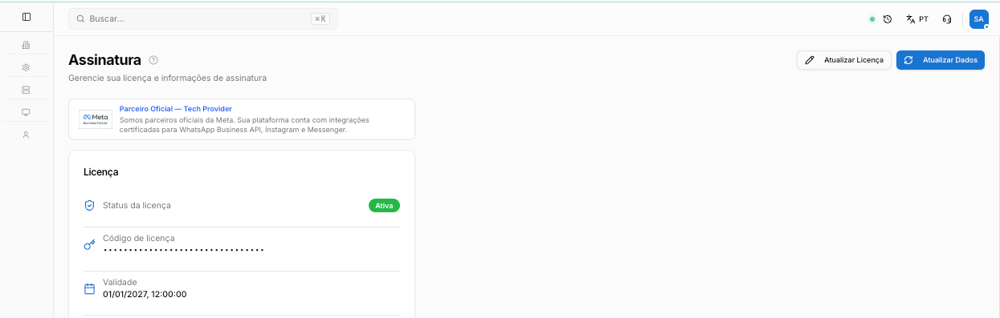
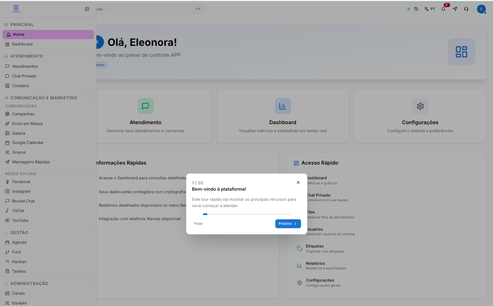

Copiar

Nesta página

1. [Primeiro Acesso](/primeiro-acesso)

# Primeiro Acesso ao Sistema

Este guia orienta você em seu primeiro acesso à plataforma Prismabot após a conclusão da instalação. O objetivo é apresentar a estrutura dos dois painéis principais.

Seu sistema está instalado e a licença ativada. Esta página mostra os primeiros passos dentro do Prismabot — da tela de login até receber a primeira mensagem de um cliente.

---

### Os dois painéis do Prismabot

O Prismabot tem dois ambientes com funções distintas. É importante entender qual é o de cada um antes de começar:

Painel

Quem acessa

Para que serve

**Superadmin**

Dono da instância

Gerenciar licença, configurar plataforma de atendimento, criar tenants e usuários de empresa

**Admin**

Administrador da operação

Conectar canais, criar equipes, cadastrar atendentes, configurar chatbot e acompanhar atendimentos

Na maioria das operações, o dia a dia acontece no **painel Admin** — não no Superadmin. O Superadmin é usado pontualmente para gestão da instância.

---

### Passo 1 — Faça o primeiro login

Acesse a **URL do front-end** da sua instância (recebida ao final da instalação) e faça login com as credenciais de **Superadmin**.

Após o login, você verá o painel do Superadmin com os menus de gestão da plataforma.

---

### Passo 2 — Ative a licença

No painel Superadmin, acesse **Gestão de Assinatura** e insira a chave de licença recebida por e-mail após a compra.

[Gerenciar Licença Prismabot](/configuracao-superadmin/tenants-e-licenca/gerenciar-licenca-z-pro)

---

### Passo 3 — Crie um usuário Administrador

Ainda no Superadmin, acesse **Usuários** e crie um novo usuário com o perfil **Administrador**. Este será o usuário utilizado para a operação diária — conectar canais, criar equipes e gerenciar atendimentos.

[Usuários por Tenant](/configuracao-superadmin/tenants-e-licenca/usuarios-por-tenant)

---

### Passo 4 — Acesse o painel Admin

Faça logout do Superadmin e entre com as credenciais do usuário Administrador que você acabou de criar. O painel muda: agora você está na área operacional do sistema, onde toda a operação de atendimento acontece.

---

### Passo 5 — Conecte o primeiro canal

No painel Admin, acesse **Administração → Canais** e conecte o primeiro número ou conta. O tipo de canal depende da sua operação — WhatsApp Oficial (WABA), Baileys, Instagram, entre outros.

[Canais de comunicação](/configuracao-administrador/administracao-painel-admin/canais-de-comunicacao)

---

### Passo 6 — Receba a primeira mensagem

Com o canal conectado, acesse **Atendimento → Atendimentos** no menu lateral. Esta é a central de atendimento onde todas as conversas chegam. Envie uma mensagem de teste para o número conectado e veja o ticket aparecer na tela.

[Tela de Atendimento](/ferramentas-do-atendimento/atendimento/tela-de-atendimento)

---

### O que fazer depois

Com o sistema funcionando, os próximos passos naturais são:

* **Criar equipes** — organize os canais e atendentes por departamento (Comercial, Suporte, etc.)

[Equipes](/configuracao-administrador/administracao-painel-admin/equipes)

* **Adicionar atendentes** — cadastre os usuários que vão operar o sistema

[Usuários](/configuracao-administrador/administracao-painel-admin/usuarios)

* **Configurar o ChatFlow** — crie um bot para recepcionar os clientes automaticamente

[ChatFlow (chatbot)](/configuracao-administrador/automacao/chat-flow)

[Anterior2. Processo de instalação do Prismabot](/primeiro-acesso/instalar-z-pro/2.-instalacao-automatica)[PróximoVisão geral Superadmin](/configuracao-superadmin/visao-geral-super-admin)

Atualizado há 1 mês

Isto foi útil?